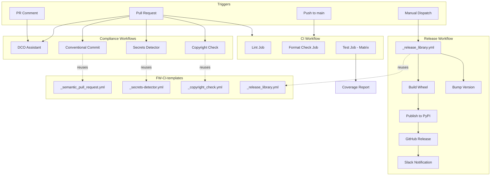

# GitHub Actions Workflows

This directory contains GitHub Actions workflows for CI/CD automation.

## Workflows Overview

| Workflow | Trigger | Description |
|----------|---------|-------------|
| [ci.yml](ci.yml) | Push to `main`, PRs | Lint, format check, and tests with coverage |
| [conventional-commit.yml](conventional-commit.yml) | PRs | Validates PR titles follow conventional commit format |
| [copyright-check.yml](copyright-check.yml) | PRs | Validates NVIDIA copyright headers on Python files |
| [dco-assistant.yml](dco-assistant.yml) | PRs, Comments | Manages DCO signing via PR comments |
| [release.yml](release.yml) | Manual dispatch | Builds and publishes package to PyPI |
| [secrets-detector.yml](secrets-detector.yml) | PRs | Scans for accidentally committed secrets |

## Workflow Diagram



## CI Workflow

The main CI workflow runs on every push to `main` and on pull requests:

- **Lint**: Runs `ruff check` and `ty` type checks
- **Format Check**: Verifies code formatting with `ruff format --check`
- **Test**: Runs pytest with coverage across Python 3.11, 3.12, and 3.13

### Coverage Requirements

Tests must maintain at least 80% code coverage. Coverage reports are uploaded as artifacts.

## Compliance Workflows

### Conventional Commit

PR titles must follow [Conventional Commits](https://www.conventionalcommits.org/) format:

- `feat:` - New features
- `fix:` - Bug fixes
- `docs:` - Documentation changes
- `style:` - Code style changes
- `refactor:` - Code refactoring
- `perf:` - Performance improvements
- `test:` - Test changes
- `build:` - Build system changes
- `ci:` - CI configuration changes
- `chore:` - Maintenance tasks
- `revert:` - Reverts
- `cp:` - Cherry-picks

### DCO Assistant

Contributors must sign the Developer Certificate of Origin. Sign by adding to commit messages:

```text
Signed-off-by: Your Name <your.email@example.com>
```

Or comment on the PR: `I have read the DCO Document and I hereby sign the DCO`

### Secrets Detector

Scans PRs for accidentally committed secrets. False positives can be added to `.github/workflows/config/.secrets.baseline`.

### Copyright Check

Validates that Python files have proper NVIDIA copyright headers.

## Release Workflow

The release workflow uses the [FW-CI-templates `_release_library.yml`](https://github.com/NVIDIA-NeMo/FW-CI-templates) reusable workflow.

### How to Release

1. Go to **Actions** > **Release NeMo Safe Synthesizer**
2. Click **Run workflow**
3. Fill in the required inputs:
   - `release-ref`: Full SHA or tag of the commit to release
   - `dry-run`: Set to `false` for production release (publishes to PyPI)
   - `create-gh-release`: Whether to create a GitHub release
   - `version-bump-branch`: Branch to push the version bump PR (usually `main`)

### Release Process

The workflow performs the following steps:

1. **Dry-run build** - Validates the wheel can be built
2. **Version bump** - Creates a PR to bump the version in `package_info.py`
3. **Build wheel** - Builds the production wheel
4. **Publish to PyPI** - Uploads to PyPI (or test PyPI for dry runs)
5. **Create GitHub release** - Creates a tagged release with changelog
6. **Notify** - Sends Slack notification

### Version Management

Version is managed in [`src/nemo_safe_synthesizer/package_info.py`](../../src/nemo_safe_synthesizer/package_info.py):

```python
MAJOR = 0
MINOR = 0
PATCH = 0
PRE_RELEASE = ""
```

The release workflow automatically bumps the PATCH version (or PRE_RELEASE for release candidates).

## Required Secrets

The following secrets must be configured in GitHub repository settings:

| Secret | Purpose |
|--------|---------|
| `TWINE_USERNAME` | PyPI username |
| `TWINE_PASSWORD` | PyPI API token |
| `SLACK_WEBHOOK_ADMIN` | Slack admin notifications |
| `SLACK_RELEASE_ENDPOINT` | Slack release notifications |
| `PAT` | GitHub Personal Access Token |
| `SSH_KEY` | GPG signing key |
| `SSH_PWD` | GPG key passphrase |
| `BOT_KEY` | GitHub App private key |

| Variable | Purpose |
|----------|---------|
| `BOT_ID` | GitHub App ID |

## Reusable Workflows

All compliance and release workflows reuse templates from [NVIDIA-NeMo/FW-CI-templates](https://github.com/NVIDIA-NeMo/FW-CI-templates) (pinned to `v0.66.6`):

- `_semantic_pull_request.yml` - Conventional commit validation
- `_secrets-detector.yml` - Secrets scanning
- `_copyright_check.yml` - Copyright header validation
- `_release_library.yml` - Full release automation

## Configuration Files

| File | Purpose |
|------|---------|
| `config/.secrets.baseline` | False positives for secrets detector |
| `../../.python-version` | Python version for uv packaging |
| `../../src/nemo_safe_synthesizer/package_info.py` | Version information |
