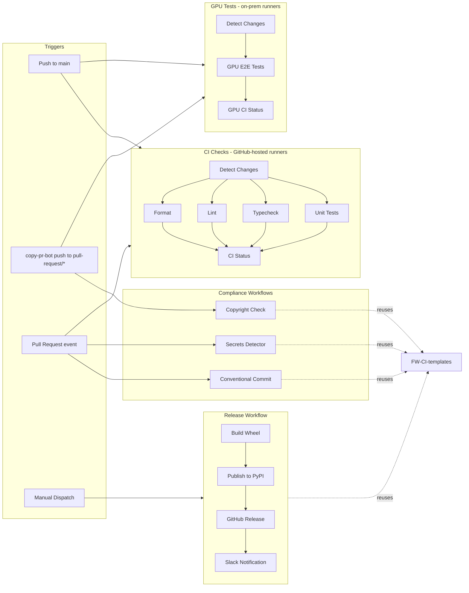

# GitHub Actions Workflows

This directory contains GitHub Actions workflows for CI/CD automation.

## Workflows Overview


| Workflow                                           | Trigger                               | Description                                          |
| -------------------------------------------------- | ------------------------------------- | ---------------------------------------------------- |
| [ci-checks.yml](ci-checks.yml)                     | Push to `main`, PRs, manual           | Format, lint, typecheck, and unit tests (CPU)        |
| [gpu-tests.yml](gpu-tests.yml)                     | Push to `main`/`pull-request/*`, manual | GPU E2E tests (A100)                               |
| [conventional-commit.yml](conventional-commit.yml) | PRs                                   | Validates PR titles follow conventional commit format |
| [copyright-check.yml](copyright-check.yml)         | Push to `main`/`pull-request/*`        | Validates NVIDIA copyright headers on Python files   |
| [docs.yml](docs.yml)                               | Push to `main` (docs paths)           | Builds and deploys documentation to GitHub Pages     |
| [release.yml](release.yml)                         | Manual dispatch                       | Builds and publishes package to PyPI                 |
| [secrets-detector.yml](secrets-detector.yml)       | PRs                                   | Scans for accidentally committed secrets             |


## Pull Request Testing (copy-pr-bot)

GPU tests (`gpu-tests.yml`) run on NVIDIA self-hosted runners, which block `pull_request`-triggered jobs. They use the [copy-pr-bot](https://docs.gha-runners.nvidia.com/platform/apps/copy-pr-bot/) pattern instead:

1. When a PR is opened by a trusted user with trusted changes, `copy-pr-bot` automatically copies the code to a `pull-request/<number>` branch
2. The push to `pull-request/<number>` triggers the GPU workflow
3. Untrusted PRs require a vetter to comment `/ok to test <SHA>` before GPU tests run
4. Draft PRs do **not** auto-sync (`auto_sync_draft: false`), saving GPU resources

Configuration: [`.github/copy-pr-bot.yaml`](../copy-pr-bot.yaml)

CPU checks (`ci-checks.yml`) run on GitHub-hosted `ubuntu-latest` runners and use standard `pull_request` triggers.

## Workflow Diagram



## CI Checks Workflow

The `ci-checks.yml` workflow runs on every push to `main` and on pull requests:

- **Detect Changes**: Uses `dorny/paths-filter` to skip jobs when only non-source files change
- **Format**: Verifies code formatting with `ruff format --check`
- **Lint**: Runs `ruff check` linting
- **Typecheck**: Runs `ty` type checks
- **Unit Tests**: Runs pytest with coverage
- **CI Status**: Aggregation job -- single required check for branch protection

All jobs run on `ubuntu-latest` (GitHub-hosted).

## GPU Tests Workflow

The `gpu-tests.yml` workflow runs on pushes to `main` and `pull-request/*` branches (via copy-pr-bot):

- **GPU E2E Tests**: Runs end-to-end tests on `linux-amd64-gpu-a100-latest-1` (A100) with a 60-minute job timeout and 45-minute step timeout
- **GPU CI Status**: Aggregation job -- single required check for branch protection

### Runners

| Workflow | Job | Runner Label | Type |
| --- | --- | --- | --- |
| CI Checks | All jobs | `ubuntu-latest` | GitHub-hosted |
| GPU Tests | GPU E2E Tests | `linux-amd64-gpu-a100-latest-1` | NVIDIA self-hosted GPU (A100) |
| GPU Tests | Detect Changes, GPU CI Status | `linux-amd64-cpu4` | NVIDIA self-hosted CPU (4-core) |

### Coverage

Coverage reports are uploaded as artifacts from both workflows.

## Compliance Workflows

### Conventional Commit

PR titles must follow [Conventional Commits](https://www.conventionalcommits.org/) format:

- `feat:` - New features
- `fix:` - Bug fixes
- `docs:` - Documentation changes
- `style:` - Code style changes
- `refactor:` - Code refactoring
- `perf:` - Performance improvements
- `test:` - Test changes
- `build:` - Build system changes
- `ci:` - CI configuration changes
- `chore:` - Maintenance tasks
- `revert:` - Reverts
- `cp:` - Cherry-picks

### DCO Assistant

Contributors must sign the Developer Certificate of Origin. Sign by adding to commit messages:

```text
Signed-off-by: Your Name <your.email@example.com>
```

Or comment on the PR: `I have read the DCO Document and I hereby sign the DCO`

### Secrets Detector

Scans PRs for accidentally committed secrets. False positives can be added to `.github/workflows/config/.secrets.baseline`.

### Copyright Check

Validates that Python files have proper NVIDIA copyright headers.

## Release Workflow

The release workflow uses the [FW-CI-templates `_release_library.yml](https://github.com/NVIDIA-NeMo/FW-CI-templates)` reusable workflow.

### How to Release

this is placeholder information until we do a real release. will update then.

1. Go to **Actions** > **Release NeMo Safe Synthesizer**
2. Click **Run workflow**
3. Fill in the required inputs:
  - `release-ref`: Full SHA or tag of the commit to release
  - `dry-run`: Set to `false` for production release (publishes to PyPI)
  - `create-gh-release`: Whether to create a GitHub release
  - `version-bump-branch`: Branch to push the version bump PR (usually `main`)

### Release Process

The workflow performs the following steps:

1. **Dry-run build** - Validates the wheel can be built
2. **Version bump** - Creates a PR to bump the version in `package_info.py`
3. **Build wheel** - Builds the production wheel
4. **Publish to PyPI** - Uploads to PyPI (or test PyPI for dry runs)
5. **Create GitHub release** - Creates a tagged release with changelog
6. **Notify** - Sends Slack notification

### Version Management

Version is managed in `[src/nemo_safe_synthesizer/package_info.py](../../src/nemo_safe_synthesizer/package_info.py)`:

```python
MAJOR = 0
MINOR = 1
PATCH = 0
PRE_RELEASE = ""
BUILD = 1
DEV_RELEASE = False
```

The release workflow automatically bumps the PATCH version (or PRE_RELEASE for release candidates).

## Required Secrets

The following secrets must be configured in GitHub repository settings:


| Secret                   | Purpose                      |
| ------------------------ | ---------------------------- |
| `TWINE_USERNAME`         | PyPI username                |
| `TWINE_PASSWORD`         | PyPI API token               |
| `SLACK_WEBHOOK_ADMIN`    | Slack admin notifications    |
| `SLACK_RELEASE_ENDPOINT` | Slack release notifications  |
| `PAT`                    | GitHub Personal Access Token |
| `SSH_KEY`                | GPG signing key              |
| `SSH_PWD`                | GPG key passphrase           |
| `BOT_KEY`                | GitHub App private key       |


| Variable | Purpose       |
| -------- | ------------- |
| `BOT_ID` | GitHub App ID |


## Reusable Workflows

All compliance and release workflows reuse templates from [NVIDIA-NeMo/FW-CI-templates](https://github.com/NVIDIA-NeMo/FW-CI-templates) (pinned to `v0.66.6`):

- `_semantic_pull_request.yml` - Conventional commit validation
- `_secrets-detector.yml` - Secrets scanning
- `_copyright_check.yml` - Copyright header validation
- `_release_library.yml` - Full release automation

## Configuration Files


| File                                              | Purpose                              |
| ------------------------------------------------- | ------------------------------------ |
| `config/.secrets.baseline`                        | False positives for secrets detector |
| `../../.python-version`                           | Python version for uv packaging      |
| `../../src/nemo_safe_synthesizer/package_info.py` | Version information                  |
