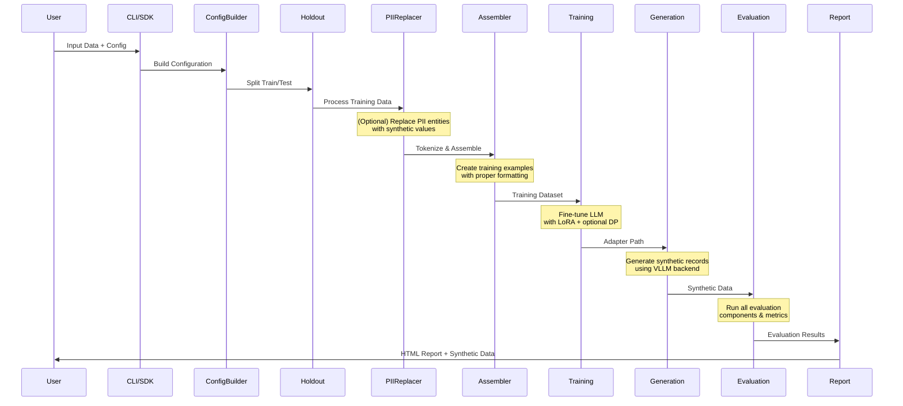
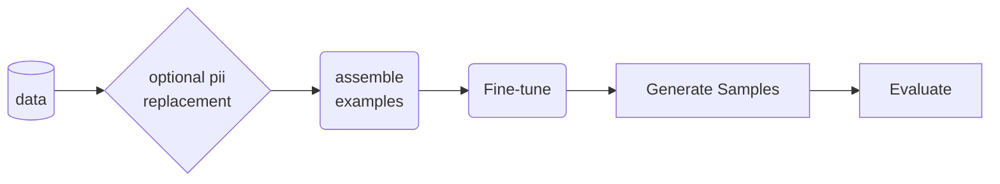

# NeMo Safe Synthesizer - Architecture Diagram

## Overview
NeMo Safe Synthesizer is a comprehensive package for generating safe synthetic data with privacy guarantees. The architecture follows a pipeline design with configurable stages for data processing, PII replacement, training, generation, and evaluation.

---

## High-Level Architecture

```mermaid
graph TB
    subgraph "Entry Points"
        CLI[CLI Interface<br/>main.py]
        SDK[SDK Interface<br/>SafeSynthesizer]
    end

    subgraph "Configuration Layer"
        ConfigBuilder[ConfigBuilder]
        SafeSynthesizerParams[SafeSynthesizerParameters]
        
        subgraph "Config Components"
            DataConfig[DataParameters]
            TrainConfig[TrainingHyperparams]
            GenConfig[GenerateParameters]
            EvalConfig[EvaluationParameters]
            PIIConfig[PiiReplacerConfig]
            DPConfig[DifferentialPrivacyHyperparams]
        end
    end

    subgraph "Data Processing Pipeline"
        DataSource[Input Data<br/>DataFrame/CSV]
        Holdout[Holdout<br/>Train/Test Split]
        PIIReplacer[PII Replacer<br/>NemoPII]
        DataActions[ActionExecutor<br/>Data Transformations]
        Assembler[ExampleAssembler<br/>Tokenization]
    end

    subgraph "Training Backend"
        TrainingBackend[TrainingBackend<br/>Abstract]
        HFBackend[HuggingFaceBackend<br/>LoRA + DP Support]
        UnslothBackend[UnslothBackend<br/>Optimized Training]
        
        subgraph "Training Components"
            ModelLoader[Model Loader<br/>AutoModel + Tokenizer]
            Quantization[Quantization<br/>4-bit/8-bit]
            LoRA[LoRA Config<br/>PEFT]
            DPTrainer[Differential Privacy<br/>OpacusDPTrainer]
            Callbacks[Training Callbacks]
        end
    end

    subgraph "Generation Backend"
        GenBackend[GeneratorBackend<br/>Abstract]
        VLLMBackend[VllmBackend<br/>Fast Inference]
        
        subgraph "Generation Components"
            RegexManager[RegexManager<br/>Structured Output]
            BatchGen[BatchGenerator]
            Processors[Processors<br/>Output Processing]
            Stopping[Stopping Criteria]
        end
    end

    subgraph "Evaluation System"
        Evaluator[Evaluator]
        
        subgraph "Evaluation Components"
            DataPrivacy[Data Privacy Score]
            PIIReplay[PII Replay Detection]
            MembershipInf[Membership Inference<br/>Protection]
            AttributeInf[Attribute Inference<br/>Protection]
            Distribution[Column Distributions]
            Correlation[Correlations]
            TextSimilarity[Text Semantic<br/>Similarity]
            StructureSimilarity[Text Structure<br/>Similarity]
            SQS[SQS Score]
        end
        
        subgraph "Reporting"
            ReportGen[Report Generator]
            HTMLReport[HTML Report<br/>Multi-modal]
        end
    end

    subgraph "Supporting Modules"
        Artifacts[Artifacts System<br/>Analyzers & Metadata]
        LLMUtils[LLM Utilities<br/>Model Management]
        Privacy[Privacy Module<br/>DP Transformers]
        Records[Records System<br/>JSON/Fragment]
        Stats[Statistics]
        Observability[Observability<br/>CategoryLogger + Tracing]
        Configurator[Configurator<br/>Pydantic→Click]
    end

    CLI --> ConfigBuilder
    SDK --> ConfigBuilder
    ConfigBuilder --> SafeSynthesizerParams
    SafeSynthesizerParams --> DataConfig
    SafeSynthesizerParams --> TrainConfig
    SafeSynthesizerParams --> GenConfig
    SafeSynthesizerParams --> EvalConfig
    SafeSynthesizerParams --> PIIConfig
    SafeSynthesizerParams --> DPConfig

    DataSource --> Holdout
    Holdout --> PIIReplacer
    PIIReplacer --> DataActions
    DataActions --> Assembler
    Assembler --> TrainingBackend

    TrainingBackend --> HFBackend
    TrainingBackend --> UnslothBackend
    HFBackend --> ModelLoader
    HFBackend --> Quantization
    HFBackend --> LoRA
    HFBackend --> DPTrainer
    HFBackend --> Callbacks

    HFBackend --> GenBackend
    GenBackend --> VLLMBackend
    VLLMBackend --> RegexManager
    VLLMBackend --> BatchGen
    VLLMBackend --> Processors
    VLLMBackend --> Stopping

    VLLMBackend --> Evaluator
    Evaluator --> DataPrivacy
    Evaluator --> PIIReplay
    Evaluator --> MembershipInf
    Evaluator --> AttributeInf
    Evaluator --> Distribution
    Evaluator --> Correlation
    Evaluator --> TextSimilarity
    Evaluator --> StructureSimilarity
    Evaluator --> SQS

    Evaluator --> ReportGen
    ReportGen --> HTMLReport

    TrainingBackend -.-> LLMUtils
    GenBackend -.-> LLMUtils
    TrainingBackend -.-> Privacy
    DataActions -.-> Records
    Evaluator -.-> Stats
    DataActions -.-> Artifacts
    TrainingBackend -.-> Observability
    GenBackend -.-> Observability
    Evaluator -.-> Observability
    ConfigBuilder -.-> Configurator
```



---

## Execution Flow




## Simple overview


---

## Component Details

### 1. Configuration Layer

Path: `src/nemo_safe_synthesizer/config/`

- `SafeSynthesizerParameters`: Main configuration class that aggregates all parameters
- `DataParameters`: Dataset and preprocessing configurations
- `TrainingHyperparams`: Training settings (learning rate, epochs, batch size, etc.)
- `GenerateParameters`: Generation settings (temperature, top_p, num_records, etc.)
- `EvaluationParameters`: Evaluation component toggles and settings
- `PiiReplacerConfig`: PII detection and replacement settings
- `DifferentialPrivacyHyperparams`: DP training parameters (epsilon, delta, clipping norm)

### 2. Data Processing Pipeline

Path: `src/nemo_safe_synthesizer/data_processing/`

#### Components:

- Holdout (`holdout/`): Splits data into train/test sets with stratification support
- `NemoPII` (`pii_replacer/`): 
  - Detects PII entities (names, emails, SSN, etc.)
  - Replaces with synthetic but realistic values
  - Maintains column statistics
- `ActionExecutor` (`actions/`): Executes data transformations (date normalization, distributions)
- `ExampleAssembler` (`assembler.py`): 
  - Converts records to JSON format
  - Tokenizes for model training
  - Handles truncation and padding

### 3. Training Backend

Path: `src/nemo_safe_synthesizer/training/`

#### Abstract Base:

- `TrainingBackend`: Defines interface for training implementations

#### Implementations:

- `HuggingFaceBackend`: 
  - Supports quantization (4-bit, 8-bit via bitsandbytes)
  - LoRA fine-tuning via PEFT
  - Differential Privacy via Opacus integration
  - Custom callbacks for monitoring
  
- `UnslothBackend`: Optimized training with Unsloth library

#### Key Features:

- Model loading from HuggingFace Hub
- Tokenizer configuration
- Training argument preparation
- Adapter saving (LoRA weights)

### 4. Generation Backend

Path: `src/nemo_safe_synthesizer/generation/`

#### Components:

- `VllmBackend`: 
  - Fast inference using VLLM
  - Loads base model + LoRA adapter
  - Batch generation support
  
- `RegexManager`: 
  - Enforces structured output (JSON format)
  - Validates generated records
  
- Processors: Post-processing of generated text
- `BatchGenerator`: Manages batch generation with retry logic
- Stopping Criteria: Custom stopping conditions for generation

### 5. Evaluation System

Path: `src/nemo_safe_synthesizer/evaluation/`

#### Core:

- Evaluator: Orchestrates all evaluation components

#### Evaluation Components (`components/`):

- Data Privacy Score: Overall privacy assessment
- PII Replay: Detects if original PII values appear in synthetic data
- Membership Inference Protection: Measures resistance to MI attacks
- Attribute Inference Protection: Measures resistance to AI attacks
- Column Distributions: Statistical similarity of distributions
- Correlations: Preservation of column relationships
- Text Semantic Similarity: Semantic similarity (embedding-based)
- Text Structure Similarity: Structural similarity
- SQS Score: Synthetic Quality Score
- Deep Structure: Deep structural analysis

#### Reporting (`reports/`, `render.py`):

- Multi-modal HTML report generation
- Interactive visualizations
- Jinja2 templates for customization
- CSS/JS assets for styling

### 6. Supporting Modules

#### LLM Utilities (`llm/`)

- LLM Definition: Model metadata and configuration
- Model Loading: Utilities for loading models
- Memory Management: VRAM optimization

#### Privacy Module (`privacy/dp_transformers/`)

- `[Opacus](https://opacus.ai/)DPTrainer`: Integration with Opacus for DP-SGD
- Privacy Arguments: DP hyperparameters
- Custom Layers: DP-compatible layers

#### Artifacts (`artifacts/`)

- Analyzers: Data quality checks and field analysis
- Metadata: Dataset metadata management
- Manifest: Artifact tracking

#### Records System (`data_processing/records/`)

- JSONRecord: JSON record representation
- Fragment: Record fragment handling
- `ValuePath`: Path-based value access

---

## Key Design Patterns

### 1. Builder Pattern

The `ConfigBuilder` and `SafeSynthesizer` classes use the builder pattern for fluent configuration:

```python
synthesizer = (
    SafeSynthesizer(config)
    .with_data_source(df)
    .with_train(learning_rate=0.0001)
    .with_generate(num_records=10000)
    .with_evaluate(enabled=True)
)
synthesizer.run()
```

### 2. Backend Abstraction

Training and generation backends use abstract base classes to allow multiple implementations:
- Training: HuggingFace, Unsloth
- Generation: VLLM (extensible to others)

### 3. Component-Based Evaluation

Evaluation uses a modular component system where each metric is a separate component that can be enabled/disabled.

### 4. Pipeline Architecture

The execution follows a clear pipeline: Data → PII Replacement → Training → Generation → Evaluation

---

## Technology Stack

- ML Frameworks: PyTorch, Transformers, PEFT (LoRA)
- Inference: VLLM for fast generation
- Privacy: Opacus for Differential Privacy
- Data: Pandas, Datasets (HuggingFace)
- Config: Pydantic for validation
- CLI: Click for command-line interface
- Visualization: Jinja2, HTML/CSS/JS for reports

---

## Entry Points

### CLI Usage

```bash
safe-synthesizer run \
  --config config.yaml \
  --data-source data.csv \
  --output-path synthetic.csv
```

### SDK Usage

```python
from nemo_safe_synthesizer.sdk.library_builder import SafeSynthesizer
from nemo_safe_synthesizer.config import SafeSynthesizerParameters

config = SafeSynthesizerParameters.from_yaml("config.yaml")
synthesizer = SafeSynthesizer(config).with_data_source(df)
synthesizer.run()
results = synthesizer.results
```

---

## Data Flow

1. Input: Raw CSV/DataFrame with potentially sensitive data
2. Holdout: Split into train/test sets
3. PII Replacement: Detect and replace PII in training set only
4. Data Assembly: Convert to JSON format and tokenize
5. Training: Fine-tune LLM with LoRA (+ optional DP)
6. Generation: Generate synthetic records using trained adapter
7. Evaluation: Compute privacy and quality metrics
8. Output: 
   - Synthetic data CSV
   - HTML evaluation report
   - Timing and summary statistics

---

## Privacy Guarantees

### PII Protection

- Named Entity Recognition (NER) to detect PII
- Deterministic replacement with synthetic values
- Preserves column statistics and distributions

### Differential Privacy (Optional)

- DP-SGD training with Opacus
- Configurable privacy budget (epsilon, delta)
- Gradient clipping and noise injection

### Membership Inference Protection

- Evaluated through empirical attacks
- Metrics included in evaluation report

---

## Output Artifacts

```text
safe-synthesizer-artifacts/
└── <config>---<dataset>/
    └── <run_name>/
        ├── safe-synthesizer-config.json
        ├── train/
        │   ├── safe-synthesizer-config.json
        │   ├── cache/                          # training checkpoints and tokenized data
        │   └── adapter/                        # trained PEFT adapter
        │       ├── adapter_config.json
        │       ├── adapter_model.safetensors
        │       ├── metadata_v2.json
        │       └── dataset_schema.json
        ├── generate/
        │   ├── logs.jsonl                      # generate-only workflow
        │   ├── synthetic_data.csv
        │   ├── evaluation_report.html
        │   └── evaluation_metrics.json         # machine-readable metrics
        ├── dataset/
        │   ├── training.csv
        │   ├── test.csv
        │   ├── validation.csv                  # when training.validation_ratio > 0
        │   └── transformed_training.csv        # when PII replacement transforms the data
        └── logs/
            └── <phase>.jsonl                   # e.g. end_to_end.jsonl or train.jsonl
```

---

## Extension Points

1. Custom Training Backend: Implement `TrainingBackend` abstract class
2. Custom Generation Backend: Implement `GeneratorBackend` abstract class
3. Custom Evaluation Component: Extend `Component` base class
4. Custom Data Actions: Add to `data_processing/actions/`
5. Custom PII Detectors: Extend NER pipeline

---

## Performance Considerations

- Quantization: 4-bit/8-bit quantization for memory efficiency
- `LoRA`: Low-rank adaptation for efficient fine-tuning
- VLLM: Optimized inference with PagedAttention
- Batch Processing: Configurable batch sizes for generation
- GPU Memory Management: Automatic cleanup and optimization

---

Last updated: 2026-02-19
