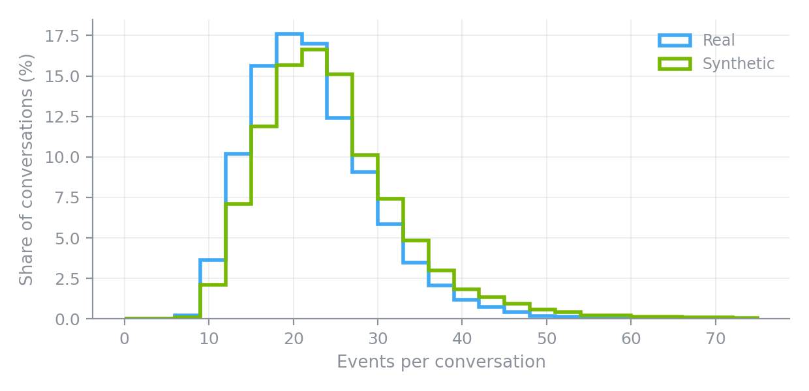
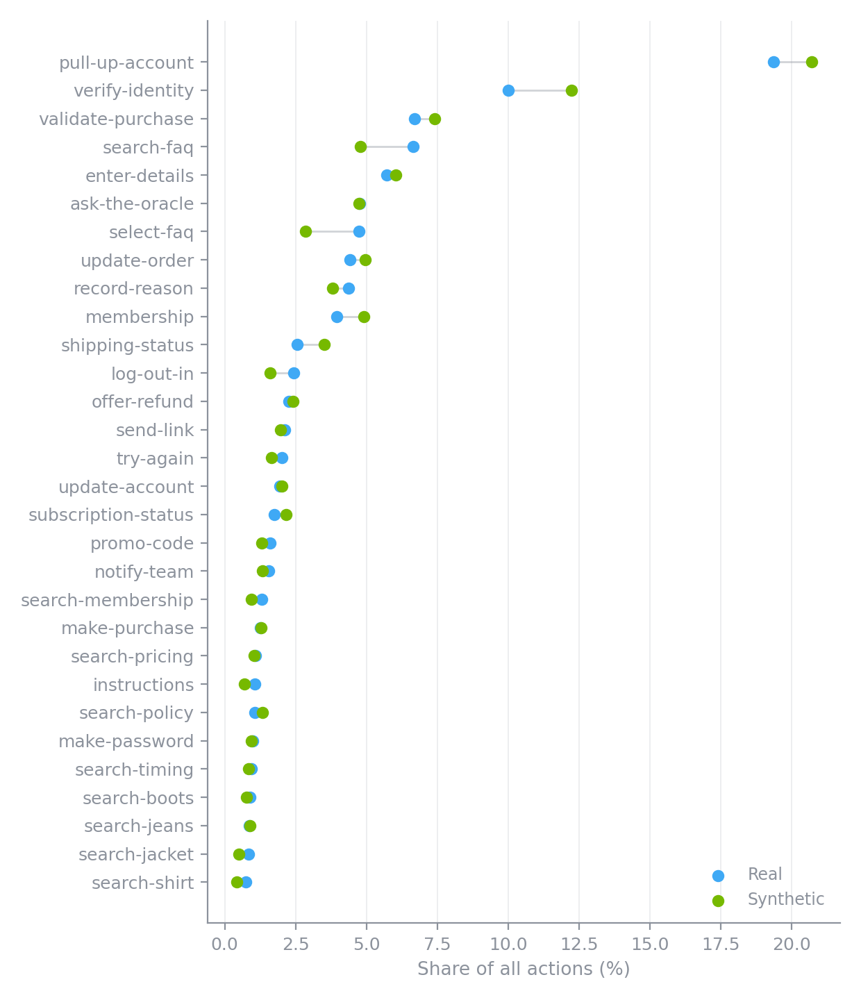
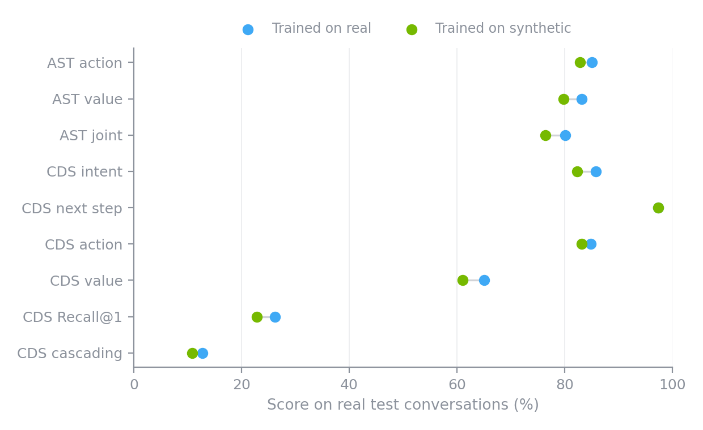
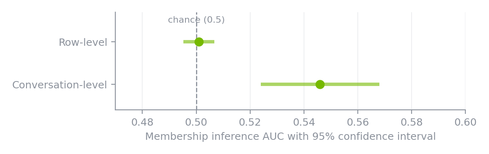

# Synthesizing Agent Conversations with NeMo Safe Synthesizer (Part 1)

Every time a customer chats with a support agent, or a user asks an AI assistant to get something done, a detailed trace is left behind. It captures what the person wanted, how the agent replied, and which actions it took along the way. As agentic applications take off, these traces are quickly becoming some of the most valuable data a team can learn from. They are also some of the most sensitive, since a single conversation can mix personal details with the internal playbook a business runs on.

That combination makes conversation data a natural candidate for synthetic data, but it raises a practical question. NeMo Safe Synthesizer learns from tables, and a conversation is not a table. Fortunately, it does not need to start as one. With a little reshaping, chat transcripts, event logs, transaction histories, and many other ordered records fit the format NeMo Safe Synthesizer expects.

<!-- more -->

In this two-part series, we walk through that process on a public customer-service dataset, as a first step toward agentic use cases. We then use the synthetic conversations to train two downstream models, one that predicts the agent's next action and one that predicts how the conversation continues, and test both on real conversations.

Models trained only on the synthetic conversations kept 90.4% of the downstream utility of models trained on the real data, and no complete training conversation appeared in the synthetic output.

Part 1 covers the full journey:

1. What the data looks like
2. Reshaping conversations into rows
3. Training and generating
4. What the synthetic conversations look like
5. Whether they power useful downstream models
6. What they reveal about the training data

## Step 1. Meet the Data

The [Action-Based Conversations Dataset (ABCD)](https://github.com/asappresearch/abcd) contains 10,042 human-to-human customer-service conversations for a fictional online retailer, split into 8,034 training, 1,004 development, and 1,004 test conversations. In each conversation, one person plays a customer with a scripted scenario and another plays an agent who follows the company's written policies. The agent clicks workflow actions, such as pulling up an account or validating a purchase, and those actions are logged in order alongside the chat.

Here is a real conversation from the training split. A customer wants to return jeans that are the wrong size.

```text
Agent:    hi!
Agent:    how can i help you?
Customer: hi! i need to return an item, can you help me with that?
Agent:    sure, may i have your name please?
Customer: crystal minh
Agent:    thanks, may i ask the reason for the return?
[action: pull-up-account]    account has been pulled up for crystal minh.   ["crystal minh"]
Customer: i got the wrong size.
Agent:    ok, may i have your username, email address and order id please?
Customer: username: <username>
Customer: <email>
Customer: order id: <order_id>
[action: validate-purchase]  purchase validation in progress ...   ["cminh730", "cminh730@email.com", "3348917502"]
Agent:    thanks so much! what is your membership level crystal?
Customer: i'm a bronze
Agent:    ok, was the purchase made in the last 90 days?
Customer: no, i bought it in november.
Agent:    ok, unfortunately because it has been more than 90 days we cannot accept the return. would there be anything else i can help you with?
Customer: what if i ask really, really nicely?
Agent:    i can escalate to my manager if you'd like
Agent:    i'd just need your phone number.
Customer: <phone>
[action: enter-details]      details of <phone> have been entered.   ["(977) 625-2661"]
[action: notify-team]        the manager has been notified.   ["manager"]
Customer: i'll look forward to hearing from them.
Customer: thanks for trying to help.
Agent:    ok, i have let my manager know, they will give you a call. sorry i couldn't be of more assistance!
Agent:    have a great night!
Customer: that's it. take care.
```

A few things to notice:

- **Actions carry values.** `validate-purchase` records a username, email, and order ID. Those values must line up with what the customer said earlier.
- **Order matters.** The agent cannot validate a purchase before pulling up the account, and the escalation only makes sense after the return is denied.
- **Every conversation has one intent.** This one is `return_size`. ABCD has 55 intents and 30 action types.
- **Text placeholders.** ABCD ships a version of each message in which `<email>` and `<phone>` stand in for the values the customer typed. The action values keep the scenario's values.

All customer profiles in ABCD are fictional, so none of these values belong to a real person.

To be useful, synthetic data has to preserve all three layers at once, the natural language, the workflow order, and the labels attached to each event.

## Step 2. Reshape Conversations into Rows

In its raw form, each ABCD conversation is one nested JSON record. Here is a trimmed version of the conversation above, showing two of its 29 turns.

```json
{
  "convo_id": 3592,
  "scenario": { "personal": {}, "order": {}, "product": {}, "flow": "", "subflow": "" },
  "original": [["agent", "Hi!"], ["agent", "How can I help you?"], "..."],
  "delexed": [
    "...",
    {
      "speaker": "agent",
      "text": "thanks, may i ask the reason for the return?",
      "turn_count": 6,
      "targets": ["return_size", "retrieve_utterance", null, [], 62],
      "candidates": [25834, 38107, 21335, "... 97 more"]
    },
    {
      "speaker": "action",
      "text": "account has been pulled up for crystal minh.",
      "turn_count": 7,
      "targets": ["return_size", "take_action", "pull-up-account", ["crystal minh"], -1],
      "candidates": []
    },
    "..."
  ]
}
```

The turns live in a list, and each turn packs its labels into a five-slot `targets` list. The slots hold the intent, the next-step type, the action button, the action values, and the position of the correct response among 100 candidates.

NeMo Safe Synthesizer needs a table instead, so we flattened every conversation into one row per turn. Here are the first eight rows of the same conversation.

| group_id | t | speaker | event_type | historical_action_button | text | intent | next_step | action_values_json |
|---|---:|---|---|---|---|---|---|---|
| abcd_3592 | 0 | agent | utterance | | hi! | return_size | retrieve_utterance | [] |
| abcd_3592 | 1 | agent | utterance | | how can i help you? | return_size | retrieve_utterance | [] |
| abcd_3592 | 2 | customer | utterance | | hi! i need to return an item, can you help me with that? | return_size | | [] |
| abcd_3592 | 3 | agent | utterance | | sure, may i have your name please? | return_size | retrieve_utterance | [] |
| abcd_3592 | 4 | customer | utterance | | crystal minh | return_size | | [] |
| abcd_3592 | 5 | agent | utterance | | thanks, may i ask the reason for the return? | return_size | retrieve_utterance | [] |
| abcd_3592 | 6 | action | action | pull-up-account | account has been pulled up for crystal minh. | return_size | take_action | ["crystal minh"] |
| abcd_3592 | 7 | customer | utterance | | i got the wrong size. | return_size | | [] |

In plain terms, the transformation does four things:

- **One row per turn.** Every message and every action becomes its own row.
- **Actions sit in the same timeline as messages.** An action is a row whose speaker is `action`, so the table records exactly when the agent clicked each button.
- **The `targets` list becomes named columns.** Intent, next-step type, action button, and action values each get a column that NeMo Safe Synthesizer can learn from directly.
- **Two columns hold the structure together.** `group_id` says which conversation a row belongs to, and `t` says where it falls in that conversation. ABCD has no timestamps, so `t` is workflow order, not time.

We also kept two small helper columns derived from the action values. The result is a single table of 176,434 rows covering 8,034 conversations, each between 6 and 75 events long.

A few choices in this transformation are less obvious, so here is why we made them.

- **Why repeat the intent on every row?** The intent belongs to the whole conversation, but NeMo Safe Synthesizer reads rows. Copying it onto every row lets the model learn that it stays fixed for the entire conversation.
- **Why are some `next_step` cells empty?** The next-step type describes what the agent does next. ABCD labels it on agent and action turns only, so customer rows leave it blank.
- **Why store action values as a JSON list in one column?** An action can record zero to three values. `validate-purchase` records three. Keeping them in a single column preserves one row per event.
- **Why drop `candidates` and `scenario`?** The candidates are IDs into a bank of agent responses that are only used to score the response-prediction task, so we rebuild them at evaluation time instead of asking the model to generate them. The scenario is the script the customer followed, and the details that matter already appear in the conversation itself.
- **Why use the placeholder text?** ABCD's downstream tasks are defined on the placeholder version of each message, so we kept that version as the `text` column.

## Step 3. Train and Generate

With the table ready, the NeMo Safe Synthesizer configuration is short. You can use the Python SDK or the CLI, and both run the same job.

=== "Python SDK"

    ```python
    import pandas as pd
    from nemo_safe_synthesizer.sdk.library_builder import SafeSynthesizer

    df = pd.read_csv("abcd_train_grouped.csv")

    builder = (
        SafeSynthesizer()
        .with_data_source(df)
        .with_data(
            holdout=0,
            group_training_examples_by="group_id",
            order_training_examples_by="t",
        )
        .with_replace_pii(enable=False)
        .with_train(
            pretrained_model="HuggingFaceTB/SmolLM3-3B",
            num_input_records_to_sample=352_868,
        )
        .with_generate(num_records=176_434)
    )

    builder.run()
    synthetic = builder.results.synthetic_data
    ```

=== "CLI"

    ```yaml
    # abcd.yaml
    data:
      group_training_examples_by: group_id
      order_training_examples_by: t
      holdout: 0

    training:
      pretrained_model: HuggingFaceTB/SmolLM3-3B
      num_input_records_to_sample: 352868

    generation:
      num_records: 176434

    replace_pii: null
    ```

    ```bash
    safe-synthesizer run --config abcd.yaml --data-source abcd_train_grouped.csv
    ```

Here is what each setting does.

| Setting | Value | Purpose |
|---|---|---|
| `group_training_examples_by` | `group_id` | Keep each conversation intact |
| `order_training_examples_by` | `t` | Keep events in workflow order |
| `holdout` | `0` | Train on the full training split |
| `num_input_records_to_sample` | 352,868 | About two passes over the training rows |
| `num_records` | 176,434 | Match the size of the training split |
| `replace_pii` | off | Not needed for fictional profiles |

ABCD already provides separate development and test splits, so no holdout is needed. PII replacement stays off for two reasons. ABCD's profiles are fictional, and the current PII replacement does not swap an entity for the same stand-in everywhere it appears. On this data, that would break the link between what a customer types and the values the agent's actions record.

Under the hood, NeMo Safe Synthesizer fine-tunes a LoRA adapter on SmolLM3-3B so that the model learns to write whole conversations in this table's schema, then samples new conversations from it.

On one NVIDIA H100 80GB GPU, adapter training took 38.9 minutes and generation took 28.2 minutes, about 67 minutes in total, producing 176,637 rows of synthetic conversations.

While generating, NeMo Safe Synthesizer parses every record and discards ones with malformed JSON, missing fields, or invalid categorical values. In a larger 300,000-row generation run from the same adapter, 92.09% of generated records passed these checks. These checks confirm structure, not whether a workflow makes sense, so next we look at the conversations themselves.

## Step 4. What the Synthetic Conversations Look Like

Here is a synthetic conversation with the same intent as the real example. It was generated, not retrieved.

```text
Agent:    hello, how can i help you?
Customer: hello, i would like to return a pair of boots because they do not fit me.
Agent:    sure, i will happy to help you get them returned. could i have your name please?
Customer: alessandro phoenix
Agent:    thanks alessandro. do you want to print out a shipping label or return in store?
Customer: i will mail them back in
[action: pull-up-account]    account has been pulled up for alessandro phoenix.   ["alessandro phoenix"]
Agent:    okay, so i need to validate your purchase. i will need your username, email address and previous order id please.
Customer: <username>, <email>, <order_id>
[action: validate-purchase]  purchase validation in progress ...   ["ap436500", "ap436500@email.com", "8894899146"]
Agent:    thank you. and what is your membership level?
Customer: guest
[action: membership]         membership level of guest has been noted.   ["guest"]
Agent:    do you have the receipt?
Customer: i do have the receipt
Agent:    okay, you are able to return it. i will need your address to print the shipping label.
Customer: <street_address> monterey, ny <zip_code>
[action: enter-details]      details of <street_address> monterey, ny <zip_code> have been entered.   ["5238 lincoln ave monterey, ny 97243"]
Agent:    and do you want to return by mail, drop off at the store or at a drop off center?
Customer: mail
[action: update-order]       order has been updated with by mail.   ["by mail"]
Agent:    okay, your label has been sent. could i help with anything else?
Customer: that is all. thank you
Agent:    have a great day.
```

Compare it with the real conversation from Step 1.

| | Real conversation | Synthetic conversation |
|---|---|---|
| Item | Jeans | Boots |
| Outcome | Return denied (past 90 days), escalated to a manager | Return approved, shipping label sent |
| Actions | `pull-up-account` → `validate-purchase` → `enter-details` → `notify-team` | `pull-up-account` → `validate-purchase` → `membership` → `enter-details` → `update-order` |

The synthetic conversation follows the same policy skeleton. The agent identifies the customer, validates the purchase, checks membership and eligibility, and then completes the return. It takes a different branch through that policy, with a different item and a different outcome, and every action value matches what the customer said.

Customer names such as Alessandro Phoenix come from ABCD's small pool of fictional names, which recur across hundreds of training conversations. The account details are new. The username, email, order ID, and address in this conversation do not appear in any training conversation.

Not every synthetic conversation is this tidy. In the next one, the workflow is right but a couple of details slip.

```text
Agent:    hello, thank you for contacting acmebrand today. how may i help you?
Customer: hi, i need to return this shirt. it is the wrong size
Agent:    alright glad i can help. may i have your name please?
Customer: chloe
Agent:    alright chloe, may i also have your username, email and the order id number?
[action: pull-up-account]    account has been pulled up for chloe.   ["chloe"]
Customer: email address: <email> username: <username>
Customer: order id number is <order_id>
[action: validate-purchase]  purchase validation in progress ...   ["chloezh507", "chloezh507@email.com", "4110475626"]
Agent:    thank you chloe. and may i ask what your membership level is please?
Customer: guest
Agent:    alright and when was the purchase date made?
[action: membership]         membership level of guest has been noted.   ["guest"]
Customer: 05-12-18
Agent:    alright that was within the 90 day return period. and it is a paper checkout, not a credit or debit card so no issue with that.
[action: record-reason]      a reason of may 12, 2018 has been recorded.   ["may 12, 2018"]
Agent:    now to get started, may i ask for your address and email to get the return label?
Customer: <street_address>
Customer: fullerton, ny <zip_code>
Agent:    also may i ask for your address to place the return label.
Customer: <email>
Customer: <street_address> fullerton, ny <zip_code>
[action: enter-details]      details of <street_address> fullerton, ny <zip_code> have been entered.   ["6697 brushwick dr fullerton, ny 43058"]
Agent:    thanks. how would you like to process the return? through mail, drop off, or drop off center?
Customer: mail please
[action: update-order]       order has been updated with by mail.   ["by mail"]
Agent:    sorry that will be all. is there anything else i can help you with today?
Customer: no
Agent:    thanks for shopping with us chloe. have a great day!
```

The agent asks for the address twice, and the purchase date lands in the `record-reason` action where a return reason belongs. Real conversations have their share of typos and detours too, and as Step 5 shows, a corpus with this kind of noise still trains strong models.

### The whole corpus at a glance

Here is how the full synthetic corpus compares with the real training split.

| | Real training split | Synthetic |
|---|---:|---:|
| Rows | 176,434 | 176,637 |
| Conversations | 8,034 | 7,306 |
| Median events per conversation | 21 | 23 |
| Average actions per conversation | 3.63 | 3.91 |
| Share of rows that are actions | 16.5% | 16.2% |
| Intents present (of 55) | 55 | 55 |
| Action types present (of 30) | 30 | 30 |
| Conversations with a single intent | 100% | 99.95% |

The synthetic corpus covers every intent and action type, keeps almost every conversation on a single intent, and has a similar action mix. The conversation-length distributions nearly overlap. Synthetic conversations run slightly longer, so the same row budget yields slightly fewer of them.

{: style="max-width: 620px; width: 100%; display: block; margin: 1.25rem auto;"}

The action mix tracks the real data closely as well. Each row below is one action type, with its share of all actions in the real and synthetic corpora. Frequent actions stay frequent, rare actions stay rare, and most pairs nearly overlap.

{: style="max-width: 560px; width: 100%; display: block; margin: 1.25rem auto;"}

## Step 5. Check Whether They Power Useful Downstream Models

Next, we trained models on the synthetic conversations and tested them on real ones. ABCD defines two downstream tasks that mirror what an agent has to do.

- **Action State Tracking (AST)** predicts the next action and its value, given the conversation so far. *Joint accuracy* counts a prediction as correct only when both the action and the value are right.
- **Cascading Dialogue Success (CDS)** predicts the intent, next-step type, action, value, and the next agent response, ranked against 100 candidates. The *cascading score* rewards a model for getting consecutive future steps right, so it is the strictest measure.

We trained T5-Small with the [Workflow Discovery](https://github.com/ServiceNow/workflow-discovery) recipe twice, once on the real training split and once on the synthetic corpus with no real training rows. Both models were evaluated on the same untouched real test split. Each result is the mean of three training runs with different seeds.

{: style="max-width: 640px; width: 100%; display: block; margin: 1.25rem auto;"}

On every metric, the synthetic-trained model lands within 4.02 points of the real-trained one.

To summarize utility in one number, we divide each synthetic score by its real-data counterpart for the strictest metric of each task and average the two:

- AST joint accuracy is 76.46 / 80.13 = 95.4%.
- CDS cascading score is 10.86 / 12.71 = 85.4%.
- **Combined utility retention is 90.4%.**

## Step 6. Check What They Reveal About the Training Data

High utility would be easy to get by copying the training conversations, so we audited the synthetic corpus against the training split with five checks.

| Check | What it measures | Result |
|---|---|---:|
| Full-conversation copies | Exact copies of a training conversation | 0 |
| Exact rare-entity replay | Extracted entities that match a rare training entity | 3.30% |
| Linked-dialogue replay | Conversations that repeat a rare entity combination | 2.60% |
| Row-level membership inference | Attack AUC on single events | 0.501 |
| Conversation-level membership inference | Attack AUC on whole conversations | 0.546 |

A rare entity is a name, email, ID, or similar value that appears in at most three training conversations. Linked-dialogue replay counts synthetic conversations that reproduce a combination of rare entities that appeared together in one training conversation. The membership inference attacks try to tell training data from unseen data by its closeness to the synthetic corpus, where an AUC of 0.5 is a coin flip.

{: style="max-width: 600px; width: 100%; display: block; margin: 1.25rem auto;"}

How to read this:

- No complete conversation was copied.
- A small share of rare values did reappear, about 3 in every 100 extracted entities. About nine in ten of those exact replays were emails or long IDs.
- The row-level attack is at chance. Its 95% confidence interval (0.495–0.507) includes 0.5.
- The conversation-level attack shows a modest signal. Its interval (0.524–0.568) sits just above 0.5.

We are currently working on cross-row PII replacement, which swaps each recurring entity for the same consistent stand-in everywhere it appears before training. That should eliminate the kind of entity replay measured here, while keeping the values inside each conversation consistent with one another.

## What We Learned

- **Conversations fit naturally into NeMo Safe Synthesizer.** One row per event, grouped by conversation and ordered by position, was all the structure it needed. The same reshaping idea applies to many other ordered data types.
- **Synthetic-only training transferred to real data.** Models trained without any real training rows kept 90.4% of real-data utility and stayed within about 4 points on every metric.
- **The output was new, not copied.** No complete conversation was reproduced, and the synthetic conversations recombined the policy into new customers, items, and outcomes.

## Coming Up in Part 2

Part 1 used the default settings. In [Part 2](tuning-synthetic-conversations-abcd.md), we push on that baseline with three experiments.

- **Can prompting replace fine-tuning?** We skip training entirely and give the base model a few real conversations as examples. It does not work, and we look at why.
- **Which settings move the balance between utility and replay?** We sweep temperature, learning rate, LoRA rank, weight decay, and the number of passes over the data, try a larger backbone model, and show how to pick a setting for a given replay budget.
- **Can synthetic data fix rare actions?** Some actions appear only a few hundred times. We generate a larger pool from the same adapter, add targeted examples for those actions, and measure what changes downstream.

Have questions or want to share what you are building? Open a [GitHub discussion](https://github.com/NVIDIA-NeMo/Safe-Synthesizer/discussions) or file a [feature request](https://github.com/NVIDIA-NeMo/Safe-Synthesizer/issues).

*ABCD is Copyright (c) 2021 ASAPP Research and is used under the [MIT License](https://github.com/asappresearch/abcd/blob/master/LICENSE). The real conversation shown is from the official training split.*
