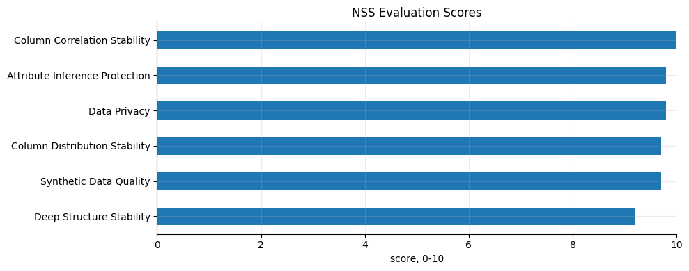
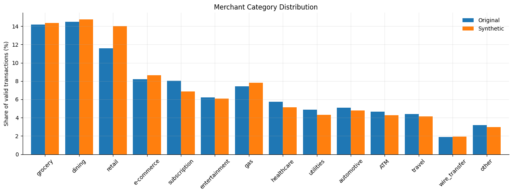
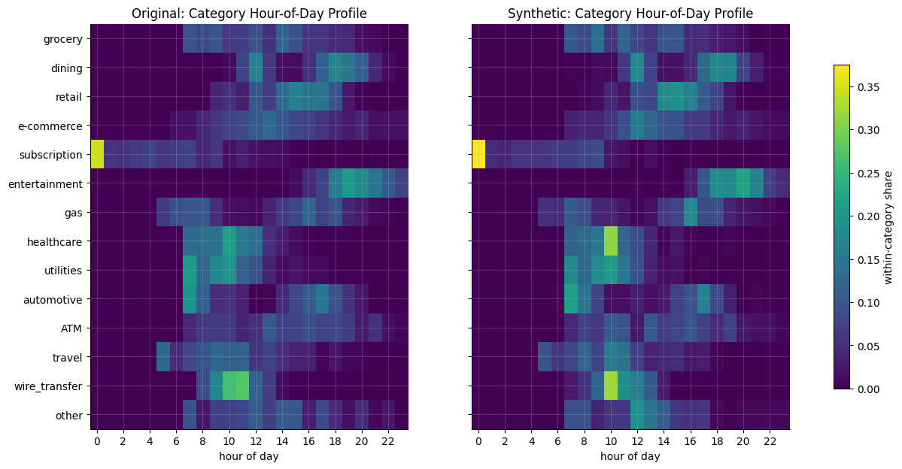
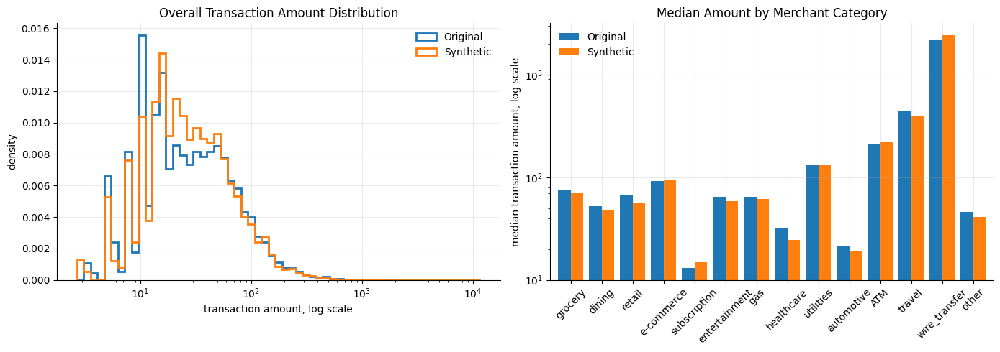

# Does NeMo Safe Synthesizer Actually Work?

NeMo Safe Synthesizer creates private, safe versions of sensitive tabular datasets: entirely synthetic data with no one-to-one mapping to the original records, while preserving enough statistical structure to remain useful for downstream AI and analytics.

That promise sounds simple, but it raises the question every synthetic data system eventually has to answer: does it actually work?

<!-- more -->

For NeMo Safe Synthesizer, "working" means satisfying two requirements at the same time:

1. Does the synthetic data avoid direct memorization of transaction rows?
2. Does it preserve the data structure and behavioral patterns that were intentionally built into the source data?

The tension between those two goals is the interesting part. A dataset that merely avoids copying records is private, but not necessarily useful. A dataset that captures every pattern too literally may be useful, but can become risky. In this dev note, we walk through a concrete financial transactions example and check both sides of that tradeoff.

## Dataset

The dataset is an account transaction ledger with 3,980 transaction detail rows. Each row represents a transaction, with columns such as:

- `acct_id`: account identifier used to group transactions into sequences
- `cardholder`: cardholder name
- `state`: US state
- `txn_index`: sequence order within the account
- `timestamp`: transaction time
- `merchant_cat`: merchant category
- `merchant`: merchant name
- `txn_amount`: transaction amount

Here is a preview of the source data:

| acct_id | cardholder | state | txn_index | timestamp | merchant_cat | merchant | txn_amount |
|---|---|---|---:|---|---|---|---:|
| `ACCT-013E4482` | Alexis Parsons | CA | 1 | 2025-01-02 21:20:56 | entertainment | AMC Theatres | 158.40 |
| `ACCT-013E4482` | Alexis Parsons | CA | 2 | 2025-01-03 09:55:05 | subscription | Spotify | 12.99 |
| `ACCT-013E4482` | Alexis Parsons | CA | 3 | 2025-01-03 10:49:25 | healthcare | Walgreens | 1529.73 |
| `ACCT-013E4482` | Alexis Parsons | CA | 4 | 2025-01-03 17:05:01 | retail | Best Buy | 94.89 |
| `ACCT-013E4482` | Alexis Parsons | CA | 5 | 2025-01-04 00:00:07 | subscription | Netflix | 12.99 |

## Running NeMo Safe Synthesizer

The walkthrough runs NeMo Safe Synthesizer through the Python SDK, using the original `transactions.csv` dataset as the only required input file. Because transaction history is inherently sequential, the configuration tells NeMo Safe Synthesizer to group rows by `acct_id` and order each account's transactions by `txn_index`.

```python
from nemo_safe_synthesizer.sdk.library_builder import SafeSynthesizer

builder = (
    SafeSynthesizer(save_path=ARTIFACT_ROOT)
    .with_data_source(source_df)
    .with_data(
        holdout=0,
        group_training_examples_by="acct_id",
        order_training_examples_by="txn_index",
    )
    .with_replace_pii(enable=True)
    .with_train(
        pretrained_model="HuggingFaceTB/SmolLM3-3B",
        num_input_records_to_sample=60000,
        learning_rate=5.0e-4,
        lora_r=32,
    )
    .with_time_series(is_timeseries=True, timestamp_column="txn_index")
    .with_generate(num_records=4500)
)

builder.run()
results = builder.results
```

This run produced 3,919 valid transaction detail rows. The original and synthetic datasets both contained 50 account groups, with a median of 79 valid transactions per original account and 80 valid transactions per synthetic account. In other words, NeMo Safe Synthesizer generated a dataset with roughly the same scale and sequence structure as the source.

Here is a sample of the synthetic output:

| acct_id | cardholder | state | txn_index | timestamp | merchant_cat | merchant | txn_amount |
|---|---|---|---:|---|---|---|---:|
| `ACCT-013E4482` | Nicholas Myers | CA | 4 | 2025-01-03 19:40:55 | dining | McDonald's | 46.79 |
| `ACCT-013E4482` | Nicholas Myers | CA | 5 | 2025-01-04 05:51:48 | subscription | Netflix | 4.99 |
| `ACCT-013E4482` | Nicholas Myers | CA | 6 | 2025-01-04 11:59:45 | travel | Delta Air Lines | 397.51 |
| `ACCT-013E4482` | Nicholas Myers | CA | 7 | 2025-01-04 18:03:35 | dining | Starbucks | 46.99 |
| `ACCT-013E4482` | Nicholas Myers | CA | 8 | 2025-01-05 21:31:36 | e-commerce | Amazon | 62.21 |

## Built-In Evaluation

NeMo Safe Synthesizer generates a built-in evaluation summary after generation:



Quality:

| Metric | Score |
|---|---:|
| Synthetic Data Quality Score | 9.7 |
| Column Correlation Stability | 10.0 |
| Deep Structure Stability | 9.2 |
| Column Distribution Stability | 9.7 |

Privacy:

| Metric | Score |
|---|---:|
| Data Privacy Score | 9.8 |
| Attribute Inference Protection | 9.8 |

The headline numbers are strong: quality and privacy scores are high. But the more useful question is whether those scores survive inspection. If we look past the summary and into the generated data with additional analysis, do we still see the same story?

## Question 1: Did NeMo Safe Synthesizer Memorize Rows?

The first test is whether synthetic records duplicate the source. The answer is no:

- Exact valid transaction row overlap: 0.0%
- Exact raw row overlap: 0.0%
- Cardholder value overlap: 0.0%

There were no duplicate transaction rows, and no cardholder names from the source appeared in the generated data. NeMo Safe Synthesizer produced novel rows rather than a row-for-row copy of the input.

## Question 2: Did NeMo Safe Synthesizer Preserve the Patterns?

Privacy alone is not enough. Synthetic data is useful only if it keeps the structure that downstream users care about: category mix, time-of-day behavior, amount distributions, and the relationships between those fields.

This is where the financial transactions example becomes a better test than a simple flat table. We intentionally care about sequences and behavioral patterns, not just whether each column looks plausible in isolation.

### Category Mix

The first target is merchant category mix:



The synthetic distribution tracks the intended shape. High-frequency categories remain high frequency, low-frequency categories remain low frequency, and wire transfers remain rare.

That matters because downstream users are not just looking for valid strings in the `merchant_cat` column. They need a plausible transaction portfolio. A model trained on a flattened or arbitrary category distribution would learn the wrong baseline behavior before it ever reached a more advanced task.

### Time-of-Day Behavior

Next, we checked whether category-specific time patterns survived. This is a stronger test than a simple column distribution because NeMo Safe Synthesizer must preserve a relationship between `merchant_cat` and `timestamp`.



The synthetic heatmap keeps the major temporal signatures:

- Dining is concentrated later in the day, with lunch/dinner behavior.
- Entertainment stays in the evening.
- Healthcare and wire transfers remain closer to business hours.
- Subscriptions remain much more likely to appear overnight than most other categories.

This is a good example of what "utility" means in practice. The goal is not merely to generate realistic timestamps. The goal is to preserve when different kinds of transactions tend to happen.

### Amount Distributions

Financial datasets are dominated by tails: most transactions are small, but a few categories create high-value transactions. Synthetic data needs to preserve that shape or downstream analytics will be misleading.



The overall distribution is close:

- Median amount: `$68.21` original vs. `$61.87` synthetic
- 90th percentile: `$278.16` original vs. `$249.64` synthetic
- 99th percentile: `$2,066.39` original vs. `$2,384.10` synthetic

The central mass is close, and the high-value tail remains in the right range. That is especially important for financial use cases, where risk models, anomaly detection, and forecasting workflows are often sensitive to rare but high-impact transactions.

## So, Does It Work?

I hope after reading this article, your answer is Yes!

NeMo Safe Synthesizer produced synthetic financial transactions that did not exactly memorize original transaction rows, achieved high privacy scores, and preserved the intentionally embedded behavioral patterns in the source data. The important point is not that every generated value is identical to the source distribution. It should not be. The point is that NeMo Safe Synthesizer preserved the structure that makes the dataset useful while breaking the direct link to individual source records.

That is the practical promise of safe synthetic data: not a perfect clone, and not random fake data, but a privacy-aware substitute that retains enough signal for meaningful development, analysis, and model experimentation.

## Next Steps

The full notebook contains the runnable NeMo Safe Synthesizer job, all analysis code, and the chart generation used in this dev note:

- [Financial Transactions Notebook](../../tutorials/time-series-financial-transactions.ipynb)
- [Safe Synthesizer 101 Tutorial](../../tutorials/safe-synthesizer-101.ipynb)

Have questions or want to share what you are building? Open a [GitHub discussion](https://github.com/NVIDIA-NeMo/Safe-Synthesizer/discussions) or file a [feature request](https://github.com/NVIDIA-NeMo/Safe-Synthesizer/issues).
