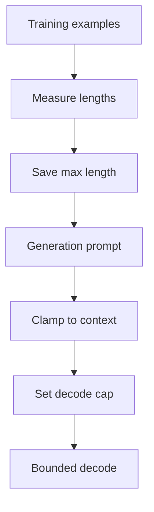
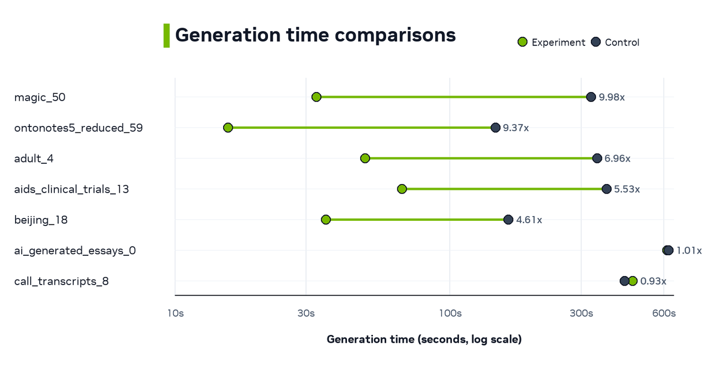
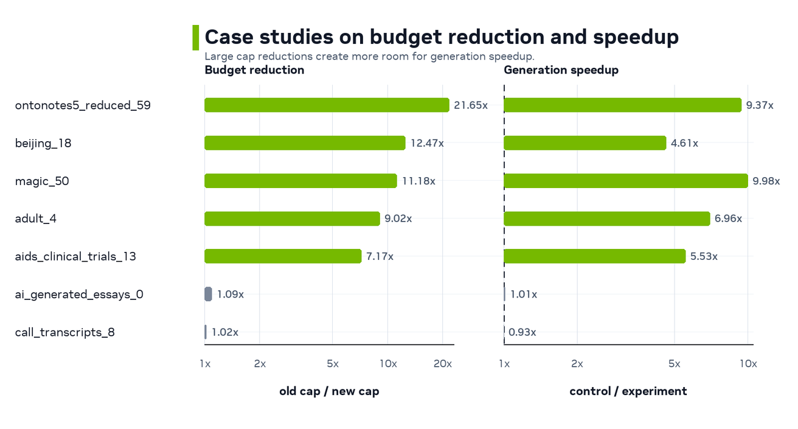
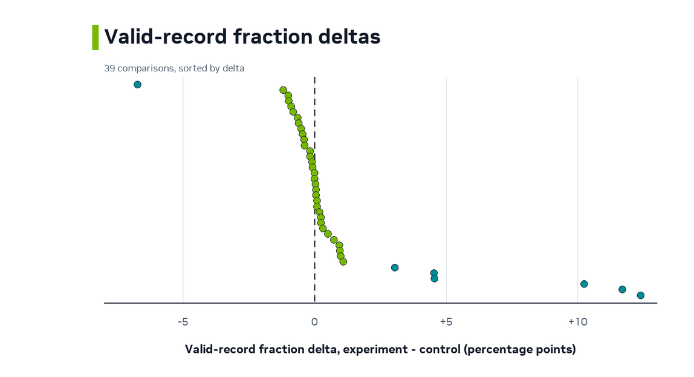

# Speeding Up NeMo Safe Synthesizer Generation with Prompt-Aware Token Budgets

NeMo Safe Synthesizer has expanded to more models and larger context windows. That flexibility helps with longer rows, richer text columns, and time-series groups. However, it also exposed a generation bottleneck. Small jobs and short-row datasets could still pay for decode budgets sized for the full context window.

The updated generation path removes that waste in two places. It starts with a small prompt probe before scaling up the batch size, and it replaces full-context decode caps with prompt-aware caps derived from token lengths observed during assembly.

In a Slurm analysis of `HuggingFaceTB/SmolLM3-3B` runs, the generation phase showed four clear signals.

- Up to 10.0x generation speedup.
- 1.62x median generation speedup across 39 control/experiment comparisons (3 comparisons per dataset).
- Faster generation in 34 out of 39 comparisons.
- More than 5x generation speedup in 8 comparisons.

This note focuses on generation-phase speed. End-to-end runtime includes training and evaluation, which this implementation does not optimize.

<!-- more -->

## The Discovery

The first clear signal came from a small `adult.csv` generation job. The target was roughly 1,000 records, but one run produced 7,871 valid records from 100 prompts. That was a 7.9x overshoot, and generation alone took 338.4 seconds.

That log exposed two related inefficiencies.

1. The first generation batch could be too large for small target jobs.
2. Each completion had an oversized maximum decode length.

The prompt-count problem came from starting too aggressively. A Safe Synthesizer prompt can produce more than one valid record, and some datasets produce many records per prompt. If generation sends a full initial batch before measuring that yield, a small target can overshoot by several multiples.

The token-count problem came from the decode cap. For the `HuggingFaceTB/SmolLM3-3B` runs in this experiment, the previous `SamplingParams.max_tokens` value was effectively 12,288 tokens. If a fine-tuned LoRA did not emit EOS promptly, vLLM could keep decoding until that full cap even when the model had only been trained to produce much shorter examples.

The new generation path addresses both pieces. The same `adult.csv` case dropped to 1,097 valid records, 1.1x overshoot, and 77.8 seconds of generation time once generation used a small initial probe and a tighter token budget.

## What Changed

### Adaptive First Batch

When no records-per-prompt history exists yet, generation now starts with a small 10-prompt probe. After it observes actual valid records per prompt, it sizes the next batch from the remaining record target plus a small prompt buffer.

That keeps small jobs from committing a full initial batch before the generator knows how productive each prompt is.

### Prompt-Aware Token Budget

During assembly, each training example is tokenized and the assembler records a `tokens_per_example` running statistic. Training now copies `tokens_per_example.max` into adapter metadata as `max_tokens_per_example`.

Generation then computes the cap with this rule.

```text
generation_cap_tokens =
  min(int(1.2 * max_tokens_per_example), max_seq_length - prompt_len)
```

The `1.2x` multiplier is a safety margin around the largest tokenized example seen during training. The prompt-length clamp prevents invalid vLLM requests where `prompt_len + max_tokens` would exceed the model's context window.



The vLLM backend calls `model_metadata.generation_max_tokens_for(prompt_len)` when it builds `SamplingParams`. The time-series backend uses the same helper, with the prompt length reflecting the longest active group prefill.

## Experiments

The new generation path changes how much decode budget vLLM can spend after each prompt. To measure that effect, we compared the new behavior against the previous generation path on a Slurm node using `HuggingFaceTB/SmolLM3-3B`.

The Slurm matrix compared two arms.

- `experiment` used prompt-aware token-budget behavior.
- `control` used the previous generation behavior.

### Hypothesis

The expected speedup was not uniform across datasets. The implementation can only remove unused decode budget, so the generation cap should predict where the speedup appears.

- Datasets with much smaller prompt-aware caps should see the largest generation speedups, especially when the control run would otherwise continue decoding toward the full 12,288-token cap.
- Datasets whose assembled examples already use most of the context window should keep a high generation cap and see little speedup.

The experiment includes 13 datasets. The mix is intentional. It spans short structured records, clinical and health records, NLP-style examples, free-text reviews, long-form essays, call transcripts, and sequence-style tabular data. That gives the experiment both sides of the hypothesis. Some datasets have a large decode budget to remove, while others have very little budget to remove.

The table orders the datasets by median generation cap.

| Dataset | Domain | Median generation cap | Median budget reduction |
|---|---|---:|---:|
| `ontonotes5_reduced` | NLP / dialogue | 582 tokens | 21.1x |
| `beijing` | Mixed tabular | 985 tokens | 12.5x |
| `magic` | Mixed tabular | 1,098 tokens | 11.2x |
| `adult` | Mixed tabular | 1,362 tokens | 9.0x |
| `aids_clinical_trials` | Clinical / health | 1,715 tokens | 7.2x |
| `amazon_reviews_25k` | Long-form text | 2,033 tokens | 6.0x |
| `ecommerce_reviews` | Long-form text | 2,179 tokens | 5.6x |
| `car_accident` | Mixed tabular | 4,904 tokens | 2.5x |
| `project_management_sequences` | Sequence-style tabular | 5,328 tokens | 2.3x |
| `online_news_popularity` | Mixed tabular | 5,885 tokens | 2.1x |
| `call_transcripts` | Long-form text | 10,488 tokens | 1.2x |
| `patient_events` | Clinical / health | 10,914 tokens | 1.1x |
| `ai_generated_essays` | Long-form text | 11,560 tokens | 1.1x |

## Experimental Results

First, we look at the raw generation time between the control and experiment groups.

{: style="max-width: 820px; width: 100%; display: block; margin: 1.25rem auto;"}

The chart shows two patterns.

1. The new generation path contributed to clear speedups in many datasets.
2. Generation time became more consistent across trials. The previous path could vary significantly within the same dataset.

Generation speedup uses this ratio.

```text
generation_speedup = control_generation_time / experiment_generation_time
```

Values greater than 1.0 mean the experiment arm was faster.


{: style="max-width: 820px; width: 100%; display: block; margin: 1.25rem auto;"}

Each circle is one control/experiment comparison. Color shows the old-to-new token budget reduction factor. Low values mean the new cap stayed close to the old full-context cap. High values mean the implementation removed much more unused decode budget. The experiment reached up to 10.0x generation speedup and a 1.62x median generation speedup.

Some datasets still have a wide speedup range because the control arm is not equally slow on every trial. The experiment arm is often stable within a dataset. The previous path can vary depending on first-batch overshoot and whether old full-context decode keeps running after the useful record content is already produced.

| Dataset | Speedup range | Run-level pattern |
|---|---:|---|
| `adult` | 1.66x-6.96x | Experiment generation stayed near 49s. The largest win came from a control trial where 100 initial prompts produced 11,769 valid records instead of stopping near the 3k target. |
| `beijing` | 1.17x-4.61x | Experiment generation stayed between 29.7s and 35.7s. The largest control overshoot produced 8,196 valid records from 100 prompts. |
| `ontonotes5_reduced` | 2.32x-9.37x | Prompt and valid-record counts were similar across arms, but control generation ranged from 34.2s to 146.4s while experiment generation stayed between 13.2s and 15.6s. This suggests variable EOS/full-cap decode behavior in the previous path rather than prompt-count overshoot. |


The highest dataset medians came from datasets where the implementation substantially reduced the decode budget.

| Dataset | Median generation speedup | Comparisons | Median generation cap |
|---|---:|---:|---:|
| `magic` | 9.10x | 3 | 1,098 tokens |
| `ontonotes5_reduced` | 8.38x | 3 | 582 tokens |
| `aids_clinical_trials` | 5.53x | 3 | 1,715 tokens |
| `beijing` | 3.96x | 3 | 985 tokens |
| `adult` | 2.90x | 3 | 1,362 tokens |

Long-sequence datasets stayed closer to parity because their assembler-observed examples were already near the context window. For example, `ai_generated_essays` had a median generation cap of 11,560 tokens and a 1.01x median generation speedup, while `call_transcripts` had a median cap of 10,488 tokens and a 0.93x median generation speedup.

## Why It Speeds Up

The main mechanism is token-budget reduction. The old generation cap was effectively the full 12,288-token context window. The new cap is based on the largest tokenized example that the assembler actually observed.

Each run uses this budget-reduction ratio.

```text
budget_reduction_factor = old_context_cap / new_generation_cap
```

Small values mean the implementation did not remove much decode budget. Large values mean an EOS-miss completion can retire much earlier than before.

{: style="max-width: 720px; width: 100%; display: block; margin: 1.25rem auto;"}

The result supports the expected mechanism. The largest generation speedups appear when the implementation removes a large amount of previously available decode budget and the control run pays for that extra budget. If a dataset needs most of the context window, the new cap stays high. If a dataset only trained on much shorter examples, generation stops paying for unused context on every EOS miss.

## Case Studies

The examples below show high-speedup cases directly.

{: style="max-width: 780px; width: 100%; display: block; margin: 1.25rem auto;"}

| Run | Control generation | Experiment generation | Speedup | New cap |
|---|---:|---:|---:|---:|
| `magic_50` | 326.1s | 32.7s | 9.98x | 1,099 tokens |
| `ontonotes5_reduced_59` | 146.4s | 15.6s | 9.37x | 568 tokens |
| `adult_4` | 342.5s | 49.2s | 6.96x | 1,362 tokens |
| `aids_clinical_trials_13` | 370.9s | 67.0s | 5.53x | 1,715 tokens |
| `beijing_18` | 163.4s | 35.4s | 4.61x | 985 tokens |

For comparison, long-sequence examples had much less decode budget to remove.

| Run | Control generation | Experiment generation | Speedup | New cap |
|---|---:|---:|---:|---:|
| `ai_generated_essays_0` | 623.4s | 616.1s | 1.01x | 11,279 tokens |
| `call_transcripts_8` | 431.8s | 462.2s | 0.93x | 12,048 tokens |

The case-study view connects the cap reduction to the observed speedup.

{: style="max-width: 820px; width: 100%; display: block; margin: 1.25rem auto;"}

`magic_50`, `ontonotes5_reduced_59`, `adult_4`, `aids_clinical_trials_13`, and `beijing_18` all reduce the old cap by roughly 7x to 22x and show large generation-speed gains. `ai_generated_essays_0` and `call_transcripts_8` reduce the old cap by only about 1x, so they stay close to parity.

## Quality and Validity Check

A generation-speed optimization is useful only if it does not trade away output quality or validity. Across these comparisons, quality stayed centered near parity overall.

{: style="max-width: 700px; width: 100%; display: block; margin: 1.25rem auto;"}

Quality score deltas are centered near zero.

- Median quality delta was 0.0.
- The middle 50% ranged from -0.1 to +0.05.

The valid-record fraction picture is similar.

{: style="max-width: 700px; width: 100%; display: block; margin: 1.25rem auto;"}

The median valid-record-fraction delta was +0.04 percentage points. The middle 50% of comparisons stayed within about -0.43 to +0.84 percentage points, with a wider positive tail.

## Takeaways

The prompt-aware generation path makes NeMo Safe Synthesizer generation faster by removing two sources of waste.

- It starts with a small prompt probe, then sizes later prompt batches from observed records-per-prompt yield.
- It caps decode with assembler-observed token lengths instead of defaulting to the full context window.

Across 39 comparisons, the experiment shows up to 10.0x generation speedup and a 1.62x median generation speedup. The largest gains appear when the assembler-observed generation cap is far below the old 12,288-token context cap.

The practical takeaway is simple. Prompt-aware token budgets make wasted generation decode less expensive.
