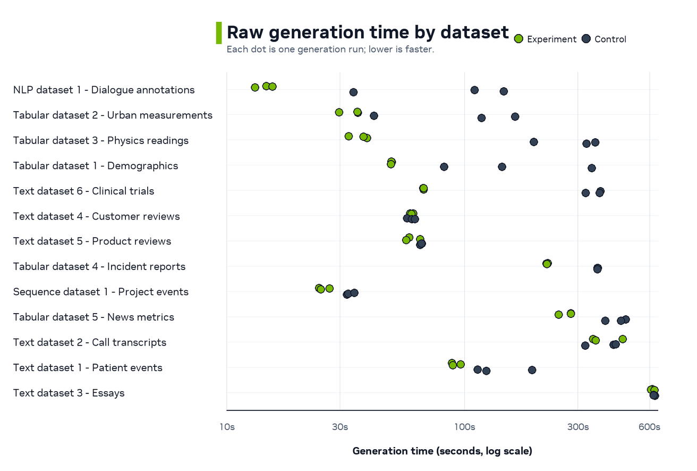
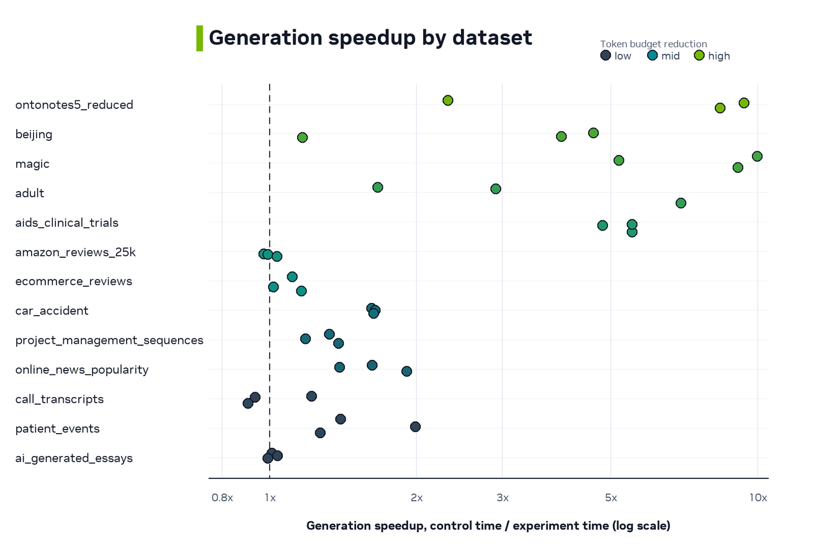
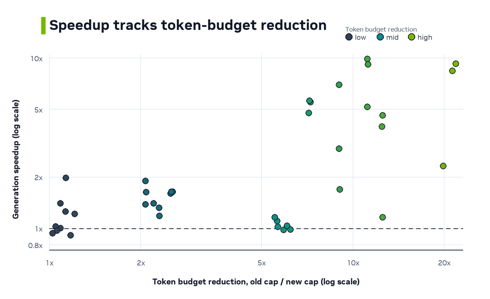
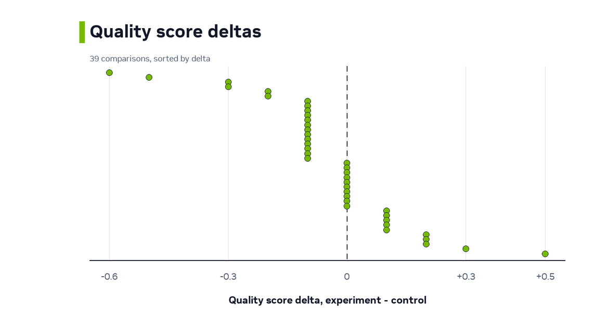

# Speeding Up NeMo Safe Synthesizer Generation with Prompt-Aware Token Budgets

NeMo Safe Synthesizer has expanded to more models and larger context windows. That flexibility helps with longer rows, richer text columns, and time-series groups. However, it also exposed a generation bottleneck. Small jobs and short-row datasets could still pay for decode budgets sized for the full context window.

The updated generation path removes that waste in two places. It starts with a small prompt probe before scaling up the batch size, and it replaces full-context decode caps with prompt-aware caps empirically derived from token lengths of the actual data.

Our experiments show up to 10.0x generation speedup, a 1.62x median speedup across 39 before/after comparisons, and more consistent generation times overall.

This improvement shipped in NeMo Safe Synthesizer `v0.0.6`.

<!-- more -->

## The Discovery

The first clear signal came from a small tabular generation job using the default target of 1,000 records. We only needed 1,000 synthetic records, but one run produced 7,871 valid records from 100 prompts. That was a 7.9x overshoot, and generation alone took 338.4 seconds.

Inspecting the log exposed two related inefficiencies.

1. Prompt-count: the first generation batch could be too large for small target jobs.
2. Token-count: each completion had an oversized maximum decode length.

The prompt-count problem came from starting too aggressively. A Safe Synthesizer prompt can produce more than one valid record, and some datasets produce many records per prompt. If generation uses a full initial batch of prompts before measuring that yield, a small target can overshoot by several multiples.

The token-count problem came from the decode cap. For our default `HuggingFaceTB/SmolLM3-3B` model, the vLLM `SamplingParams.max_tokens` value was effectively 12,288 tokens. If a fine-tuned LoRA did not emit EOS promptly, vLLM could keep decoding until that full cap even when the model had only been trained to produce much shorter examples.

The new generation path addresses both pieces. The same case dropped to 1,097 valid records, 1.1x overshoot, and 77.8 seconds of generation time once generation used a small initial probe and a tighter token budget, compared to 338.4 seconds before this improvement.

## What Changed

### Adaptive First Batch

Generation now starts with a 10-prompt probe to estimate how many valid records each prompt returns. After it observes actual valid records per prompt, it sizes future batches based on the remaining record target, plus a small buffer. The value 10 is intentionally small. It gives the generator a cheap yield estimate before larger batches, while explicit maximum prompt-batch settings are still honored.

### Prompt-Aware Token Budget

During assembly, we track statistics about the number of tokens in each example. The maximum observed, `max_tokens_per_example`, is now persisted in the metadata from training, so we can use this to compute a more realistic token cap for generation.

```text
generation_cap_tokens =
  max(0, min(int(1.2 * max_tokens_per_example), max_seq_length - prompt_len))
```

The `1.2x` multiplier is a safety margin around the largest tokenized example seen during training. The prompt-length clamp prevents decode requests where `prompt_len + max_tokens` would exceed the model's context window.

By using `generation_cap_tokens` for the vLLM sampling params, we restrict generation to completion lengths similar to the fine-tuning data, avoiding wasted time and tokens that are unlikely to be high quality.

## Experiments and Results

We compared the new generation path, the `experiment` arm, with the previous implementation, the `control` arm, across 13 benchmark datasets. We ran 3 replications for each dataset and arm, and focus our analysis on generation time.

The speedup is not expected to be uniform across datasets. The implementation can only remove unneeded decode budget, so the generation cap should predict where the speedup appears. Datasets with much smaller prompt-aware caps should benefit the most. Datasets whose examples already use most of the context window should stay closer to parity.

### Raw Time

The raw-time view shows absolute generation time for each control and experiment run. The experiment arm is often faster and more consistent, while the previous path can vary more within the same dataset.

{: style="max-width: 820px; width: 100%; display: block; margin: 1.25rem auto;"}

### Relative Speedup

The speedup view normalizes each comparison with this ratio.

```text
generation_speedup = control_generation_time / experiment_generation_time
```

Values greater than 1.0 mean the experiment arm was faster.


{: style="max-width: 820px; width: 100%; display: block; margin: 1.25rem auto;"}

Both dataset charts are ordered by median prompt-aware generation cap, from smallest cap to largest cap. Each circle is one before/after comparison. Color shows the old-to-new token budget reduction factor. Low values mean the new cap stayed close to the old full-context cap. High values mean the implementation removed much more unused decode budget.

The largest improvements in generation time come from datasets where the implementation substantially reduced the decode budget.

### Why It Speeds Up

The main mechanism is token-budget reduction. The old generation cap was effectively the full 12,288-token context window. The new cap is based on the largest tokenized example that the assembler actually observed. Each run uses this ratio.

```text
budget_reduction_factor = old_context_cap / new_generation_cap
```

{: style="max-width: 720px; width: 100%; display: block; margin: 1.25rem auto;"}

The result supports the expected mechanism. The largest generation speedups appear when the new implementation reduces the token budget the most. The control run pays for that extra budget on all datasets, while the new generation path adjusts the token cap based on the dataset.

## Quality and Validity Check

A generation-speed optimization is useful only if it does not trade away output quality or validity. Across these comparisons, quality and valid-record fraction stayed near parity overall.

{: style="max-width: 700px; width: 100%; display: block; margin: 1.25rem auto;"}

[Synthetic Quality Score](../../product-overview/evaluation.md#synthetic-quality-score-sqs) measures how well synthetic data matches the training data on a 10-point scale. The median quality delta was 0.0, and the middle 50% ranged from -0.1 to +0.05.

Valid-record fraction also stayed near parity. The median delta was +0.04 percentage points, and the middle 50% of comparisons stayed within about -0.43 to +0.84 percentage points.

## Takeaways

The prompt-aware generation path makes NeMo Safe Synthesizer generation faster by removing two sources of waste.

- It starts with a small prompt probe, then sizes later prompt batches from observed records-per-prompt yield.
- It caps decode with assembler-observed token lengths instead of defaulting to the full context window.

Across 39 comparisons, the experiment shows up to 10.0x generation speedup and a 1.62x median generation speedup. The largest gains appear when the assembler-observed generation cap is far below the old 12,288-token context cap.

This improvement is included in NeMo Safe Synthesizer `v0.0.6` and later.
