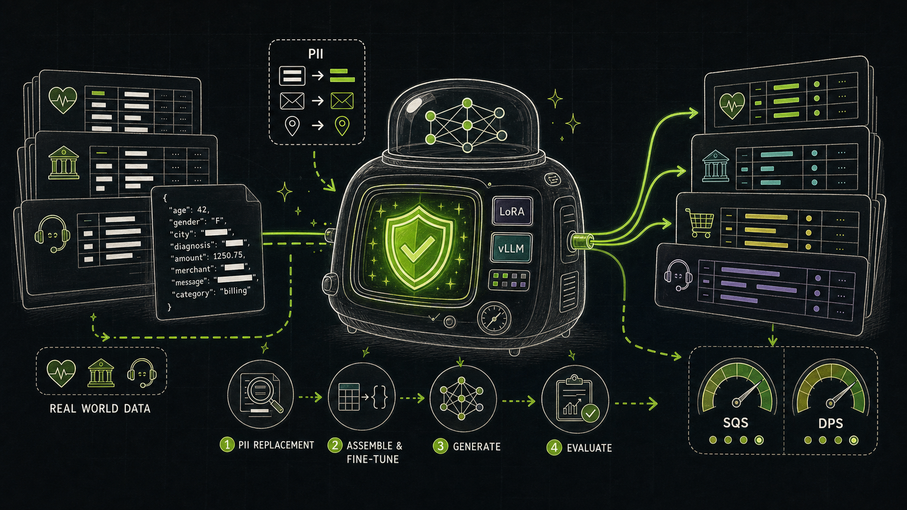
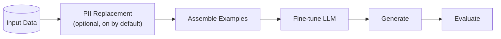

# Private by Design: Introducing NeMo Safe Synthesizer

Every organization working on AI faces the same challenge: the data that would make their models most useful is also proprietary data with the highest barriers to access. The data is right there: patient records, financial transactions, customer support logs, and datasets full of names, account numbers, and personal details. It is rich and perfectly suited to the task, but legal and compliance teams have marked it off-limits for good reason.

We built [NeMo Safe Synthesizer](https://github.com/NVIDIA-NeMo/Safe-Synthesizer) to break that deadlock by helping organizations create synthetic versions of sensitive tabular data.

<!-- more -->



## The Approach

The core insight behind Safe Synthesizer is that modern language models are remarkably good at learning the joint distribution of structured data, as long as you represent that data in a way they can understand. A row of a tabular dataset, serialized to JSON, is just text. An LLM fine-tuned on thousands of such rows can learn which field values co-occur, which correlations hold across columns, and which categorical distributions look realistic.

Instead of fitting an explicit statistical model, Safe Synthesizer fine-tunes an LLM to generate new rows that look like they came from the same distribution. The generated records are novel, with no one-to-one mapping to any original record. The model samples from what it has learned about the data distribution, not from the data itself.

That distinction matters for privacy: LLM-based synthesis is designed to maintain statistical utility while reducing exposure of specific individuals. For especially sensitive use cases, Safe Synthesizer also offers optional differential privacy through DP-SGD.

## What Makes Safe Synthesizer Different

- End-to-end pipeline: PII replacement, LLM fine-tuning, vLLM-powered generation, and evaluation ship together in one tool. No stitching together separate libraries.
- Defense in depth: PII replacement scrubs sensitive content before the model ever sees it. Optional differential privacy adds formal privacy guarantees on top.
- Mixed-type table support: LLM fine-tuning handles numeric, categorical, and free-text columns in the same dataset without separate architectures for different column types.
- Built-in evaluation: Every run produces a Synthetic Quality Score and a Data Privacy Score, plus additional charts and details in an HTML report.
- Flexible interfaces: Run from the CLI, integrate with Jupyter notebooks through the Python SDK, or configure jobs with YAML files and CLI flags.
- Sensible defaults, tunable depth: Autoconfigured model defaults and preflight checks get you running quickly, while documented parameters let you go deeper when needed.

## The Pipeline

NeMo Safe Synthesizer runs as a multi-stage pipeline. Point it at a CSV or DataFrame, provide a config, and it produces a synthetic dataset plus a detailed evaluation report.



### Stage 1: PII Replacement

Before the model sees any data, Safe Synthesizer can detect sensitive values and replace them with realistic synthetic alternatives. A name stays a name and a phone number stays a phone number, but neither maps to a real person.

The default entity set covers names, addresses, phone numbers, emails, SSNs, and credit card numbers. Dozens of additional entity types are supported, and custom entities are configurable. PII replacement is on by default and can be disabled when your data does not contain PII.

Safe Synthesizer uses NVIDIA's fine-tuned [GLiNER PII model](https://huggingface.co/nvidia/gliner-PII#evaluation-datasets) for free-text columns and LLM-based classification for whole-column entities. For the complete entity list and replacement modes, see [PII Replacement](../../product-overview/pii_replacement.md).

### Stage 2: Fine-Tuning

Records are serialized to JSON, tokenized, and used to LoRA fine-tune a pretrained LLM. Three models are supported out of the box:

- `HuggingFaceTB/SmolLM3-3B` (default)
- `TinyLlama/TinyLlama-1.1B-Chat-v1.0`
- `mistralai/Mistral-7B-Instruct-v0.3`

For use cases that require formal privacy assurances, differential privacy via DP-SGD is available as an opt-in training mode.

### Stage 3: Generation

The fine-tuned LoRA adapter is loaded onto the pretrained model and vLLM drives fast inference, sampling as many new records as you need. Each record is validated before it is accepted. Optional structured generation can constrain outputs to the expected record format when a pipeline needs stricter schema conformance.

### Stage 4: Evaluation

Every run produces an HTML report with two high-level scores:

- Synthetic Quality Score (SQS): aggregates column correlation stability, deep structure stability, column distribution stability, text structure similarity, and text semantic similarity into a single quality score out of 10.
- Data Privacy Score (DPS): uses empirical membership inference and attribute inference attacks to estimate privacy risk, also out of 10. PII replay is reported separately as an additional privacy signal.

Each score maps to concrete remediation guidance in the documentation. The [Product Overview](../../product-overview/pipeline.md) covers the full pipeline in more detail, and [Evaluation](../../product-overview/evaluation.md) explains the metrics.

## Getting Started

[Install](../../user-guide/getting-started/#installation) the package on a Linux machine with an NVIDIA GPU:

```bash
pip install "nemo-safe-synthesizer[cu129,engine]" \
  --extra-index-url https://download.pytorch.org/whl/cu129 \
  --extra-index-url https://flashinfer.ai/whl/cu129 \
  --extra-index-url https://wheels.vllm.ai/88d34c6409e9fb3c7b8ca0c04756f061d2099eb1/cu129
```

The quickest way to run your first pipeline is the CLI:

```bash
safe-synthesizer run --data-source data.csv
```

If you prefer a programmatic interface, the Python SDK lets you chain configuration with a fluent interface:

```python
from nemo_safe_synthesizer.sdk.library_builder import SafeSynthesizer

synthesizer = (
    SafeSynthesizer()
    .with_data_source("data.csv")
    .with_train(learning_rate="auto")
    .with_generate(num_records=5000)
    .with_evaluate(enabled=True)
)
synthesizer.run()
results = synthesizer.results
```

The [Safe Synthesizer 101 tutorial](../../tutorials/safe-synthesizer-101.ipynb) is the fastest path from zero to a running synthetic data job using a publicly available dataset.
For more details, read [Running Safe Synthesizer](../../user-guide/running/) or use the [Configuration Reference](../../user-guide/configuration.md) to learn about available parameters.

## Summary

NeMo Safe Synthesizer takes sensitive tabular data through a layered privacy pipeline: PII is detected and replaced before the model ever sees it, an LLM is fine-tuned on the anonymized data using LoRA, optional differential privacy can add formal guarantees, new records are generated through vLLM, and the synthetic data is evaluated for both quality and privacy in an automated HTML report.

The result is a synthetic dataset with no one-to-one mapping to your original records. It preserves statistical utility for downstream AI tasks while giving you quantitative, interpretable evidence about privacy protection.

## Key Resources

- [NeMo Safe Synthesizer on GitHub](https://github.com/NVIDIA-NeMo/Safe-Synthesizer)
- [Documentation](../../index.md)
- [Safe Synthesizer 101 Tutorial](../../tutorials/safe-synthesizer-101.ipynb)
- [Differential Privacy Tutorial](../../tutorials/differential-privacy.ipynb)
- [Evaluation Metrics Reference](../../product-overview/evaluation.md)

Have questions or want to share what you are building? Open a [GitHub discussion](https://github.com/NVIDIA-NeMo/Safe-Synthesizer/discussions) or file a [feature request](https://github.com/NVIDIA-NeMo/Safe-Synthesizer/issues).
