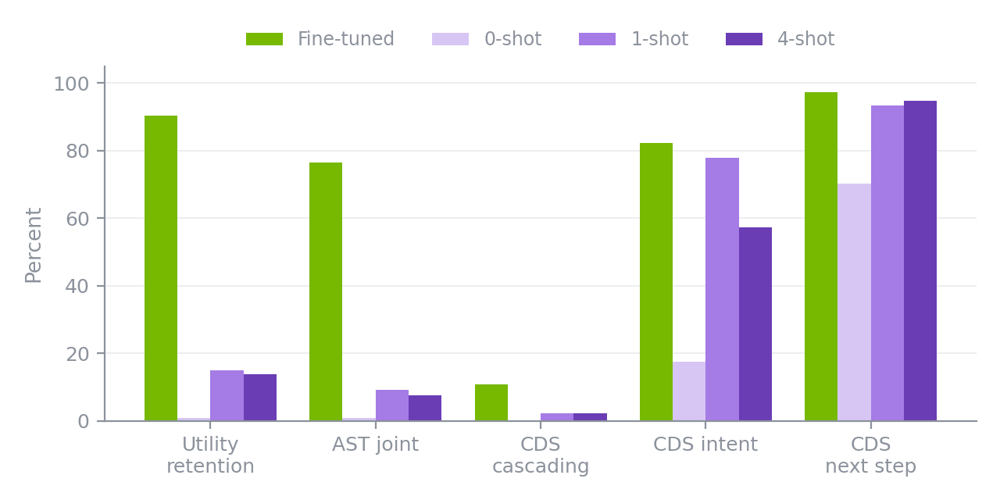
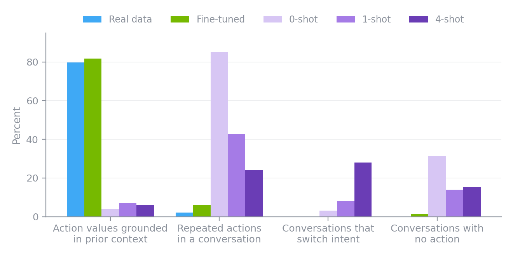
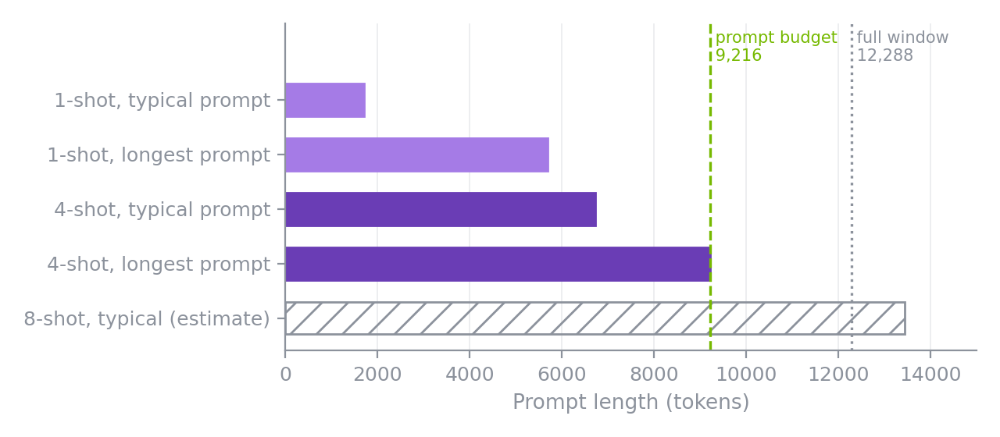
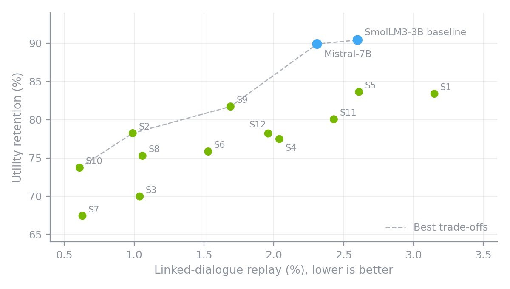
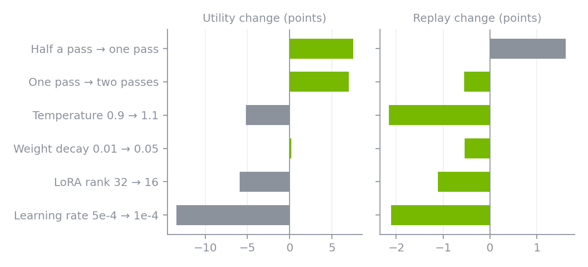
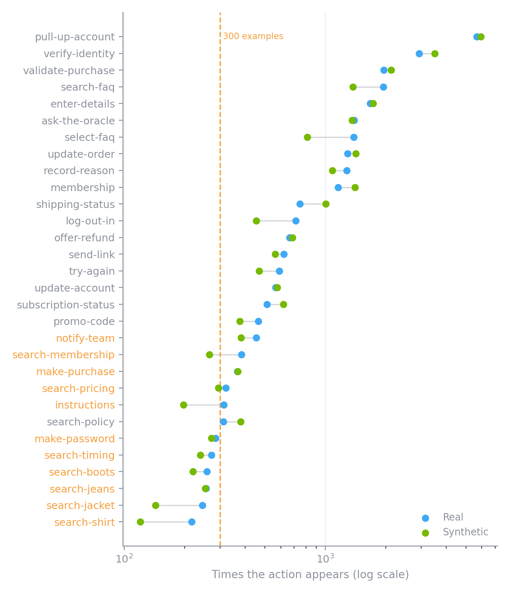
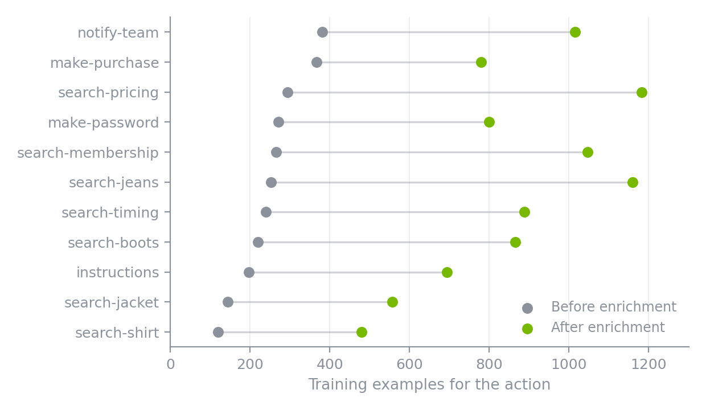
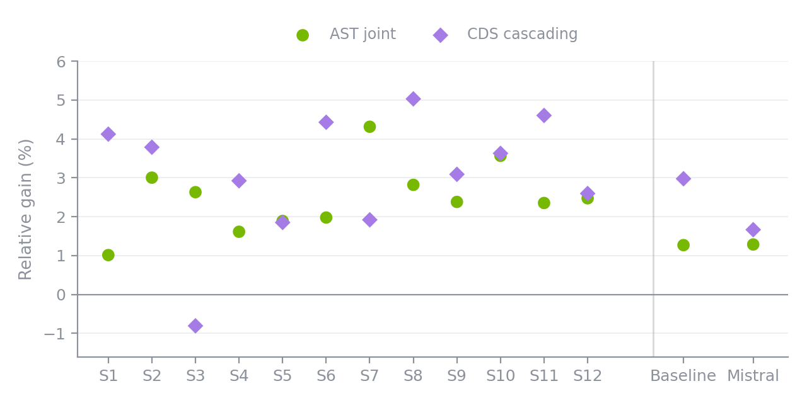

# Tuning NeMo Safe Synthesizer for Agent Conversations (Part 2)

In [Part 1](abcd-conversations-to-synthetic-training-data.md), we turned 8,034 customer-service conversations into synthetic training data with NeMo Safe Synthesizer, and models trained on it kept 90.4% of the utility of models trained on the real data. That result used the default settings, which raises some natural follow-up questions. Is fine-tuning really necessary, or would a few example conversations in a prompt be enough? Which settings shift the balance between utility and replay of the training data? And can synthetic data help with labels that barely show up?

Part 2 answers those questions with three experiments on the same dataset.

<!-- more -->

**TLDR**

- **Prompting alone did not work.** The best prompt-only setup kept 14.99% of real-data utility, while fine-tuning kept 90.4%.
- **A few settings move the utility–replay balance.** Across 12 related settings, utility ranged from 67.4% to 83.6% and linked-dialogue replay from 0.61% to 3.15%.
- **Extra generated examples helped rare actions.** Targeted enrichment improved action-state tracking in all 12 settings and dialogue success in 11 of 12.

## A Quick Recap of the Data, Baseline, and Metrics

**The data.** The [Action-Based Conversations Dataset (ABCD)](https://github.com/asappresearch/abcd) has 10,042 human-to-human customer-service conversations for a fictional online retailer. Each conversation mixes customer and agent messages with workflow actions, such as `pull-up-account` or `validate-purchase`, and the values those actions record. Every conversation has one intent, such as `return_size`, from a set of 55. All customer profiles are fictional.

**The input table.** Each conversation is flattened into one row per event, with `group_id` identifying the conversation and `t` giving the event's position. The training split becomes 176,434 rows in 8,034 conversations. [Part 1](abcd-conversations-to-synthetic-training-data.md) walks through this step by step.

**The baseline run.** NeMo Safe Synthesizer fine-tunes a LoRA adapter on SmolLM3-3B and generates a synthetic corpus of the same size. Here is the configuration we used.

```yaml
data:
  group_training_examples_by: group_id
  order_training_examples_by: t
  holdout: 0

training:
  pretrained_model: HuggingFaceTB/SmolLM3-3B
  num_input_records_to_sample: 352868   # about two passes over the training rows

generation:
  num_records: 176434
  temperature: 0.9

replace_pii: null
```

**How we score a synthetic dataset.** We train T5-Small on the synthetic data only and test it on the real ABCD test split, for two tasks:

- **Action State Tracking (AST)** predicts the next action and its value. *Joint accuracy* requires both to be right.
- **Cascading Dialogue Success (CDS)** predicts the intent, next-step type, action, value, and the next agent response. The *cascading score* rewards getting consecutive future steps right.

Two numbers summarize each run:

- **Utility retention** takes the synthetic-trained model's AST joint accuracy and CDS cascading score, divides each by the real-trained model's score, and averages the two. 100% would match training on real data.
- **Linked-dialogue replay** is the share of synthetic conversations that reproduce a combination of rare entities (names, emails, IDs, and similar values that appear in at most three training conversations) that appeared together in one training conversation. Lower means less replay.

Every utility number below is the mean of three T5-Small training runs, unless noted. The baseline run kept 90.4% utility with 2.60% linked-dialogue replay.

## Experiment 1. Can Prompting Replace Fine-Tuning?

ABCD has been public since 2021, so before giving fine-tuning the credit for Part 1's results, we wanted to rule out two simpler explanations. This experiment asks two questions.

1. **Did SmolLM3-3B already learn ABCD during pretraining?** We do not know whether ABCD was part of its pretraining data. If the base model had seen or memorized it, it might produce useful ABCD conversations with no help at all.
2. **Is fine-tuning with NeMo Safe Synthesizer necessary?** Large language models can often imitate a format from a few examples placed in the prompt. If in-context learning were enough, it would be a cheaper path.

To find out, we turned off adapter training and generated a full 176,434-row corpus three times from the base SmolLM3-3B model, with 0, 1, or 4 complete training conversations in each prompt. The zero-shot run tests what the base model already knows, and the one- and four-shot runs test in-context learning. Each prompt sampled its own example conversations, and we trained and tested T5-Small exactly as for the baseline. Whole-conversation prompting is an experimental capability that is not yet part of the released NeMo Safe Synthesizer.

### The results

{: style="max-width: 640px; width: 100%; display: block; margin: 1.25rem auto;"}

The zero-shot run answers the first question. With no examples, the base model produced almost no usable training signal, retaining 0.97% of real-data utility, which suggests it does not carry usable knowledge of ABCD's workflows from pretraining. Its exact rare-entity replay was also low, at 0.81%.

The one- and four-shot runs answer the second. One example conversation helped a lot with the easy parts, such as recognizing the intent and whether the agent should talk or act. It did not help with the hard part, which is choosing the right action and filling in the right values. One-shot retained 14.99% utility and four-shot 13.92%, and neither came close to the 90.4% from fine-tuning.

### What went wrong

To see why, we compared the prompt-only corpora with the real training data and with the fine-tuned synthetic corpus from Part 1.

{: style="max-width: 660px; width: 100%; display: block; margin: 1.25rem auto;"}

The fine-tuned corpus tracks the real data on every check, while the prompt-only corpora show three failure patterns:

- **Values come from nowhere.** In real data, an action like `validate-purchase` records the username and order ID the customer just typed, and 79.7% of non-empty action values appear in the preceding context. The fine-tuned corpus is at 81.8%. In the prompt-only corpora, only 3.9% to 7.2% did, so the downstream model was trained to produce values it could not have known. (The real-data rate is below 100% because some action values, such as membership levels, come from a fixed list rather than the dialogue.)
- **Workflows loop.** Repeated actions within a conversation make up 2.2% of action turns in real data and 6.1% in the fine-tuned corpus, but 24% to 85% in the prompt-only corpora.
- **More examples, more confusion.** With four example conversations in the prompt, 28% of generated conversations drifted between intents, as if the model blended the examples together. The fine-tuned corpus kept 99.95% of conversations on a single intent.

### Why we stopped at four

Each example is a complete conversation, and conversations are long. NeMo Safe Synthesizer caps the model's context window at 12,288 tokens and, in this experiment, reserved 3,072 tokens for the model's reply, which leaves 9,216 tokens for the prompt.

{: style="max-width: 640px; width: 100%; display: block; margin: 1.25rem auto;"}

The longest four-shot prompts reached 9,211 tokens, and 2.58% of prompts had to resample their examples to fit. At the four-shot median of 6,718 tokens, eight examples would need roughly 13,400 tokens, more than the entire window. SmolLM3-3B itself supports 65,536 tokens, so the limit comes from NeMo Safe Synthesizer's current cap, not from the model.

### Prompts leak, too

Putting real conversations in the prompt sends their contents straight to the model. We ran the same replay audit from Part 1 on every corpus.

| Replay check | Fine-tuned | 0-shot | 1-shot | 4-shot |
|---|---:|---:|---:|---:|
| Exact rare-entity replay | 3.30% | 0.81% | 14.18% | 6.69% |
| Complete training conversations copied | 0 | 0 | 12 | 0 |
| Longest run of copied consecutive events | 8 | 2 | 42 | 29 |
| Segments with 10 or more copied events | 0 | 0 | 335 | 22 |
| Conversations repeating an entity from their own prompt | n/a | n/a | 14.2% | 9.4% |

One-shot prompting replayed rare entities at more than four times the fine-tuned rate and reproduced 12 training conversations verbatim, from 16 to 29 events long. Fine-tuning copied no complete conversation and never more than 8 consecutive events. The last row is specific to prompting. In the one-shot run, 432 of 3,049 linkable generated conversations repeated at least one rare entity from the example conversation in their own prompt, and in the four-shot run, 288 of 3,079 did. Real examples in a prompt become a direct path from the training data to the output.

For workflow data like this, fine-tuning is what makes actions, values, and intents hold together. A base model with a few examples writes text that looks like a conversation but does not behave like one.

## Experiment 2. Turn the Knobs

Fine-tuning works, so the next question is how to tune it. We varied five settings around the baseline, each of which maps to a single configuration field.

| Knob | Config field | What it controls |
|---|---|---|
| Passes | `training.num_input_records_to_sample` | Training rows the adapter sees |
| Learning rate | `training.learning_rate` | How fast the adapter updates |
| LoRA rank | `training.lora_r` | Adapter capacity |
| Weight decay | `training.weight_decay` | Regularization on adapter weights |
| Temperature | `generation.temperature` | How adventurous sampling is |

Half a pass, one pass, and two passes correspond to 88,217, 176,434, and 352,868 sampled rows.

We ran 12 settings, plus the baseline and a second backbone, and scored each one for utility and replay.

### Reading the map

{: style="max-width: 600px; width: 100%; display: block; margin: 1.25rem auto;"}

Each dot is one synthetic dataset. Up is more useful, and left is less replay. The green dots are the 12 settings in the table below, labeled S1 to S12, and the blue dots are the two-pass baseline and the same recipe on Mistral-7B. The dashed line connects the settings that no other setting beats on both axes.

| Setting | LR | Rank | WD | Passes | Temp | Utility (%) | Replay (%) |
|---|---:|---:|---:|---:|---:|---:|---:|
| S1 | 5e-4 | 32 | 0.01 | 1 | 0.9 | 83.40 | 3.15 |
| S2 | 5e-4 | 32 | 0.01 | 1 | 1.1 | 78.24 | 0.99 |
| S3 | 1e-4 | 32 | 0.01 | 1 | 0.9 | 69.97 | 1.04 |
| S4 | 5e-4 | 16 | 0.01 | 1 | 0.9 | 77.48 | 2.04 |
| S5 | 5e-4 | 32 | 0.05 | 1 | 0.9 | 83.64 | 2.61 |
| S6 | 5e-4 | 32 | 0.01 | 0.5 | 0.9 | 75.84 | 1.53 |
| S7 | 1e-4 | 32 | 0.01 | 1 | 1.0 | 67.42 | 0.63 |
| S8 | 5e-4 | 16 | 0.01 | 1 | 1.0 | 75.28 | 1.06 |
| S9 | 5e-4 | 32 | 0.05 | 1 | 1.0 | 81.73 | 1.69 |
| S10 | 5e-4 | 32 | 0.01 | 0.5 | 1.0 | 73.72 | 0.61 |
| S11 | 1e-4 | 32 | 0.01 | 2 | 0.9 | 80.06 | 2.43 |
| S12 | 1e-4 | 32 | 0.01 | 2 | 1.0 | 78.20 | 1.96 |
| Baseline | 5e-4 | 32 | 0.01 | 2 | 0.9 | 90.43 | 2.60 |
| Mistral-7B | 1e-4 | 32 | 0.01 | 2 | 0.9 | 89.91 | 2.31 |

LR is the learning rate, Rank is the LoRA rank, WD is weight decay, and Temp is the generation temperature. Utility is utility retention, and Replay is linked-dialogue replay. The baseline uses SmolLM3-3B. Three utility means use two training runs instead of three, the AST result for S7 and the CDS results for S1 and S12. Mistral-7B's learning rate was chosen automatically by NeMo Safe Synthesizer.

### What each knob did

Several pairs of settings differ in only one knob, which makes their effects easy to read. In the chart below, green bars are improvements, meaning higher utility on the left and lower replay on the right.

{: style="max-width: 660px; width: 100%; display: block; margin: 1.25rem auto;"}

What we observed:

- **Passes were the biggest utility lever.** Every doubling of passes added 7 to 11 points of utility. Replay usually rose too, but not always. The two-pass baseline replayed less than the one-pass S1.
- **Temperature was the cleanest replay lever.** Raising it from 0.9 to 1.1 cut linked replay by about two-thirds for about 5 points of utility.
- **Weight decay was nearly free.** Raising it to 0.05 trimmed replay by about half a point with no loss of utility.
- **Smaller or slower adapters bought less replay with a lot of utility.** Lower rank and lower learning rate both reduced replay, but at a higher utility cost than temperature.

These are single runs of related settings, not a controlled ablation, so they point to directions rather than guaranteed effects on other data.

### Picking an operating point

There is no single best setting. The right one depends on how much replay a use case can tolerate. A simple recipe works well:

1. Pick a replay ceiling.
2. Among the settings under it, take the one with the highest utility.

The dashed line on the map makes this quick. With a 1% ceiling, S2 is the best choice at 78.24% utility. With a 2% ceiling, it is S9 at 81.73%. With a 2.5% ceiling, it is Mistral-7B at 89.91%.

### Swapping the backbone

Swapping the base model is a single configuration change to `training.pretrained_model`. Mistral-7B landed close to SmolLM3-3B, at 89.91% utility and 2.31% linked replay versus 90.43% and 2.60%. It was much slower in our runs. Adapter training took 92 minutes instead of 39, and generating the base corpus took about 4 hours instead of 28 minutes. On this dataset, the larger model traded a small drop in utility for a small drop in replay, at several times the compute.

## Experiment 3. Fill In Rare Actions

Real workflow data has a long tail. A few actions happen in almost every conversation, and others are rare. The synthetic corpus inherits that tail and makes parts of it a little thinner.

{: style="max-width: 560px; width: 100%; display: block; margin: 1.25rem auto;"}

Each row is one action type, and the orange labels mark the 11 actions we targeted. `search-shirt`, for example, appears 216 times in the real data but only 120 times in the synthetic corpus. A model trained on a few hundred examples of an action will struggle with it. Instead of collecting more real data, we generated more synthetic data and kept the parts we needed.

### Step 1. Finding the rare actions

We started by counting actions in the synthetic output.

```python
import pandas as pd

synthetic = pd.read_csv("synthetic.csv")
actions = synthetic.loc[synthetic["event_type"] == "action", "historical_action_button"]
counts = actions.value_counts()
print(counts[counts < 300])
```

```text
historical_action_button
search-pricing       294
make-password        271
search-membership    265
search-jeans         253
search-timing        239
search-boots         219
instructions         197
search-jacket        143
search-shirt         120
```

This finds 9 rare actions. Our experiment counted the examples the downstream task could actually use, which flagged two more, `make-purchase` and `notify-team`. That made 11 targeted actions.

### Step 2. Generating a larger pool from the same adapter

There is no need to retrain. We reused the adapter from the baseline run and generated a bigger pool with `run generate`.

```bash
safe-synthesizer run generate --config abcd.yaml \
  --data-source abcd_train_grouped.csv \
  --auto-discover-adapter \
  --generation__num_records 300000 \
  --output-file pool.csv
```

On one NVIDIA H100 80GB GPU, this produced 300,258 rows in 45.3 minutes.

### Step 3. Keeping the conversations that contain rare actions

From the pool, we kept every new occurrence of a targeted action, together with the full conversation up to and including that action. The preceding turns matter, because the downstream model needs to see the dialogue that leads to an action in order to learn when to take it and which values to fill in. We skipped pool conversations that duplicated a conversation already in the base corpus, and we appended the selected conversation prefixes to the base corpus.

For the baseline run, this added 4,160 conversation prefixes.

| | Before | After |
|---|---:|---:|
| AST training examples | 28,581 | 44,158 |
| Targeted-action share | 9.6% | 21.4% |

Every targeted action gained between 359 and 907 training examples.

{: style="max-width: 620px; width: 100%; display: block; margin: 1.25rem auto;"}

### Did it help?

{: style="max-width: 640px; width: 100%; display: block; margin: 1.25rem auto;"}

The chart shows each setting's relative change after enrichment, compared with the same setting before enrichment.

- **AST joint accuracy improved in all 12 sweep settings**, by 1.0% to 4.3%.
- **CDS cascading score improved in 11 of 12**, with changes from −0.8% to +5.0%.
- **The baseline improved on both**, with AST joint up 1.27% and CDS cascading up 2.98%. Its utility retention rose from 90.4% to 92.3%.
- **Mistral-7B improved too**, by 1.29% and 1.67%.

These are relative changes. For the baseline, the 1.27% AST gain is about one point of accuracy, from 76.46% to 77.44%.

Exact rare-entity replay barely moved. Across the 12 settings, it changed by at most 0.18 points in either direction after enrichment.

Enrichment did not lift every metric. For the baseline, CDS next-step accuracy dipped from 97.36% to 96.74%, CDS action accuracy from 83.13% to 81.67%, and CDS value accuracy from 61.07% to 60.87%, while AST, CDS Recall@1, and the cascading score all improved.

## What We Learned

- **Fine-tuning is essential for workflow data.** On ABCD, the base model showed no usable knowledge of the dataset, and prompting with real examples came nowhere close to fine-tuning.
- **A replay ceiling makes tuning simple.** Fix the ceiling first, then take the most useful setting under it.
- **Temperature and weight decay were the cheapest replay levers** on this dataset.
- **More passes bought utility**, usually with some extra replay.
- **A generated pool strengthened rare labels**, as long as each added example kept the conversation context before the rare action.

These experiments use one public dataset of fictional conversations, run as offline batch jobs on a single GPU. The best settings for other data may differ, but the same knobs and the same way of reading the trade-off carry over.

This wraps up the series. [Part 1](abcd-conversations-to-synthetic-training-data.md) covers how we reshaped the conversations, what the synthetic data looks like, and how it performed with the default settings.

Have questions or want to share what you are building? Open a [GitHub discussion](https://github.com/NVIDIA-NeMo/Safe-Synthesizer/discussions) or file a [feature request](https://github.com/NVIDIA-NeMo/Safe-Synthesizer/issues).

*ABCD is Copyright (c) 2021 ASAPP Research and is used under the [MIT License](https://github.com/asappresearch/abcd/blob/master/LICENSE).*
