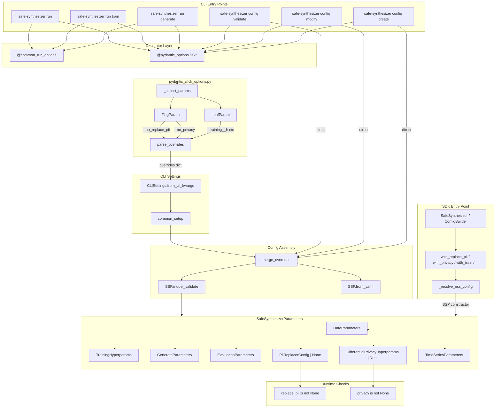
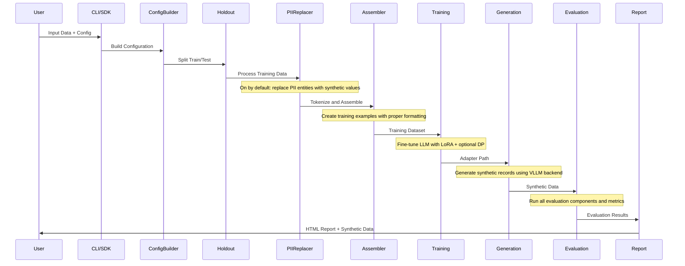
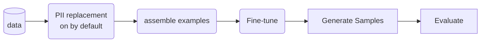

<!-- SPDX-FileCopyrightText: Copyright (c) 2025-2026 NVIDIA CORPORATION & AFFILIATES. All rights reserved. -->
<!-- SPDX-License-Identifier: Apache-2.0 -->

# Architecture

<!-- Migrated from design.md in the repository root -->

## Overview

NeMo Safe Synthesizer is a comprehensive package for generating safe synthetic data with privacy guarantees. The architecture follows a pipeline design with configurable stages for data processing, PII replacement, training, generation, and evaluation.

---

## High-Level Architecture

```mermaid
graph TB
    subgraph entryPoints [Entry Points]
        CLI["CLI Interface"]
        SDK["SDK Interface"]
    end

    subgraph configLayer [Configuration Layer]
        ConfigBuilder["ConfigBuilder"]
        SafeSynthesizerParams["SafeSynthesizerParameters"]

        subgraph configComponents [Config Components]
            DataConfig["DataParameters"]
            TrainConfig["TrainingHyperparams"]
            GenConfig["GenerateParameters"]
            EvalConfig["EvaluationParameters"]
            PIIConfig["PiiReplacerConfig"]
            DPConfig["DifferentialPrivacyHyperparams"]
        end
    end

    subgraph dataProcessing [Data Processing Pipeline]
        DataSource["Input Data"]
        Holdout["Holdout - Train/Test Split"]
        PIIReplacer["PII Replacer - NemoPII"]
        DataActions["ActionExecutor"]
        Assembler["ExampleAssembler"]
    end

    subgraph trainingBackend [Training Backend]
        TrainingBackendBase["TrainingBackend - Abstract"]
        HFBackend["HuggingFaceBackend"]
        UnslothBackend["UnslothBackend"]

        subgraph trainingComponents [Training Components]
            ModelLoader["Model Loader"]
            QuantizationComp["Quantization 4-bit/8-bit"]
            LoRA["LoRA Config - PEFT"]
            DPTrainer["Differential Privacy"]
            Callbacks["Training Callbacks"]
        end
    end

    subgraph generationBackend [Generation Backend]
        GenBackend["GeneratorBackend - Abstract"]
        VLLMBackend["VllmBackend"]

        subgraph generationComponents [Generation Components]
            RegexManager["RegexManager"]
            BatchGen["BatchGenerator"]
            Processors["Processors"]
            Stopping["Stopping Criteria"]
        end
    end

    subgraph evaluationSystem [Evaluation System]
        EvaluatorComp["Evaluator"]

        subgraph evaluationComponents [Evaluation Components]
            DataPrivacy["Data Privacy Score"]
            PIIReplay["PII Replay Detection"]
            MembershipInf["Membership Inference Protection"]
            AttributeInf["Attribute Inference Protection"]
            Distribution["Column Distributions"]
            Correlation["Correlations"]
            TextSimilarity["Text Semantic Similarity"]
            StructureSimilarity["Text Structure Similarity"]
            SQS["SQS Score"]
        end

        subgraph reporting [Reporting]
            ReportGen["Report Generator"]
            HTMLReport["HTML Report"]
        end
    end

    CLI --> ConfigBuilder
    SDK --> ConfigBuilder
    ConfigBuilder --> SafeSynthesizerParams
    SafeSynthesizerParams --> DataConfig
    SafeSynthesizerParams --> TrainConfig
    SafeSynthesizerParams --> GenConfig
    SafeSynthesizerParams --> EvalConfig
    SafeSynthesizerParams --> PIIConfig
    SafeSynthesizerParams --> DPConfig

    DataSource --> Holdout
    Holdout --> PIIReplacer
    PIIReplacer --> DataActions
    DataActions --> Assembler
    Assembler --> TrainingBackendBase

    TrainingBackendBase --> HFBackend
    TrainingBackendBase --> UnslothBackend
    HFBackend --> ModelLoader
    HFBackend --> QuantizationComp
    HFBackend --> LoRA
    HFBackend --> DPTrainer
    HFBackend --> Callbacks

    HFBackend --> GenBackend
    GenBackend --> VLLMBackend
    VLLMBackend --> RegexManager
    VLLMBackend --> BatchGen
    VLLMBackend --> Processors
    VLLMBackend --> Stopping

    VLLMBackend --> EvaluatorComp
    EvaluatorComp --> DataPrivacy
    EvaluatorComp --> PIIReplay
    EvaluatorComp --> MembershipInf
    EvaluatorComp --> AttributeInf
    EvaluatorComp --> Distribution
    EvaluatorComp --> Correlation
    EvaluatorComp --> TextSimilarity
    EvaluatorComp --> StructureSimilarity
    EvaluatorComp --> SQS

    EvaluatorComp --> ReportGen
    ReportGen --> HTMLReport
```



---

## Configuration System

Two paths produce a `SafeSynthesizerParameters` object: the CLI path (via Click
decorators and YAML merging) and the SDK path (via the builder pattern). Both
converge on the same Pydantic model and handle nullable sub-configs
(`replace_pii`, `privacy`) uniformly -- `None` means disabled.



Configuration precedence (highest to lowest):

1. CLI flags / SDK `with_*()` overrides
2. Dataset registry overrides
3. YAML config file
4. Pydantic model defaults (including `default_factory`)

Nullable sub-configs (`PiiReplacerConfig | None`, `DifferentialPrivacyHyperparams | None`)
use `None` as the sole disabled signal. The `@pydantic_options` decorator auto-generates
`--no_<field>` is-flags for these fields; `parse_overrides` translates them into
`{field: None}` in the overrides dict.

---

## Execution Flow



## Simple Overview



---

## Component Details

### 1. Configuration Layer

Path: `src/nemo_safe_synthesizer/config/`

- SafeSynthesizerParameters: main configuration class that aggregates all parameters
- DataParameters: dataset and preprocessing configurations
- TrainingHyperparams: training settings (learning rate, epochs, batch size, etc.)
- GenerateParameters: generation settings (temperature, top_p, num_records, etc.)
- EvaluationParameters: evaluation component toggles and settings
- PiiReplacerConfig: PII detection and replacement settings
- DifferentialPrivacyHyperparams: DP training parameters (epsilon, delta, clipping norm)

### 2. Data Processing Pipeline

Path: `src/nemo_safe_synthesizer/data_processing/`

- Holdout (`holdout/`): splits data into train/test sets with stratification support
- NemoPII (`pii_replacer/`): detects PII entities (names, emails, SSN, etc.) and replaces with synthetic but realistic values
- ActionExecutor (`actions/`): executes data transformations (date normalization, distributions)
- ExampleAssembler (`assembler.py`): converts records to JSON format, tokenizes for model training, handles truncation and padding

### 3. Training Backend

Path: `src/nemo_safe_synthesizer/training/`

| Backend | Description |
|---------|-------------|
| **HuggingFaceBackend** | Quantization (4-bit, 8-bit), LoRA via PEFT, Differential Privacy via Opacus |
| **UnslothBackend** | Optimized training with Unsloth library |

### 4. Generation Backend

Path: `src/nemo_safe_synthesizer/generation/`

- VllmBackend: fast inference using VLLM with LoRA adapter support
- RegexManager: enforces structured output (JSON format)
- BatchGenerator: manages batch generation with retry logic
- Processors: post-processing of generated text

### 5. Evaluation System

Path: `src/nemo_safe_synthesizer/evaluation/`

Components include: Data Privacy Score, PII Replay Detection, Membership Inference Protection, Attribute Inference Protection, Column Distributions, Correlations, Text Semantic Similarity, Text Structure Similarity, and SQS Score.

### 6. Supporting Modules

- LLM Utilities (`llm/`): model metadata, loading, and memory management
- Privacy Module (`privacy/dp_transformers/`): Opacus integration for DP-SGD
- Artifacts (`artifacts/`): data quality checks, field analysis, metadata management
- Records System (`data_processing/records/`): JSON record and fragment handling

---

## Key Design Patterns

### Builder Pattern

The `ConfigBuilder` and `SafeSynthesizer` classes use the builder pattern for fluent configuration:

```python
synthesizer = (
    SafeSynthesizer(config)
    .with_data_source(df)
    .with_train(learning_rate=0.0001)
    .with_generate(num_records=10000)
    .with_evaluate(enabled=True)
)
synthesizer.run()
```

### Backend Abstraction

Training and generation backends use abstract base classes to allow multiple implementations:

- Training: HuggingFace, Unsloth
- Generation: VLLM (extensible to others)

### Component-Based Evaluation

Evaluation uses a modular component system where each metric is a separate component that can be enabled/disabled.

### Pipeline Architecture

The execution follows a clear pipeline: Data --> PII Replacement --> Training --> Generation --> Evaluation

---

## Technology Stack

| Category | Tools |
|----------|-------|
| ML Frameworks | PyTorch, Transformers, PEFT (LoRA) |
| Inference | VLLM |
| Privacy | Opacus for Differential Privacy |
| Data | Pandas, HuggingFace Datasets |
| Config | Pydantic |
| CLI | Click |
| Visualization | Jinja2, HTML/CSS/JS |

---

## Extension Points

1. Custom Training Backend: implement `TrainingBackend` abstract class
2. Custom Generation Backend: implement `GeneratorBackend` abstract class
3. Custom Evaluation Component: extend `Component` base class
4. Custom Data Actions: add to `data_processing/actions/`
5. Custom PII Detectors: extend NER pipeline
