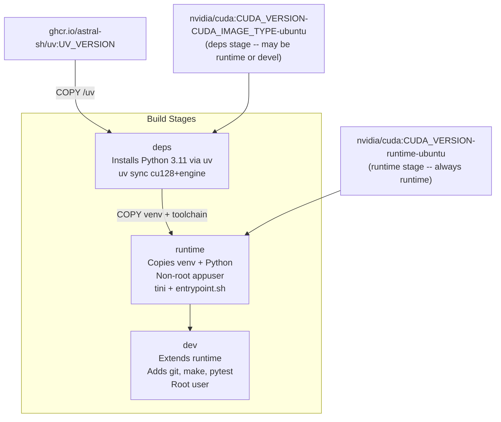

<!-- SPDX-FileCopyrightText: Copyright (c) 2025-2026 NVIDIA CORPORATION & AFFILIATES. All rights reserved. -->
<!-- SPDX-License-Identifier: Apache-2.0 -->

# Docker: Build and Customize

How the CUDA Docker image is built, how to customize it, and how it relates
to the CI test image.

For running Safe Synthesizer in a container, see
[User Guide -- Docker](../user-guide/docker.md).

---

## Dockerfile Layout

[`containers/Dockerfile.cuda`](https://github.com/NVIDIA-NeMo/Safe-Synthesizer/blob/main/containers/Dockerfile.cuda)
uses a three-stage multistage build:



- deps: installs uv, Python, and all cu128+engine dependencies. Uses
  `--mount=type=cache` to avoid re-downloading ~10 GB of PyTorch/CUDA wheels.
- runtime: copies the venv and uv-managed Python into a fresh CUDA runtime
  base. Runs as non-root `appuser` (uid 1000). GPU access is declared via
  `NVIDIA_VISIBLE_DEVICES=all` and `NVIDIA_DRIVER_CAPABILITIES=compute,utility`
  environment variables baked into the image.
  Uses a wrapper entrypoint (`containers/entrypoint.sh`) that detects
  common misconfigurations before delegating to `safe-synthesizer`.
- dev: extends runtime with git, make, uv, and the full dev dependency group
  (pytest, ruff, etc.). Runs as root for flexibility. Used for interactive
  development and running tests inside the container.

---

## Entrypoint Script

The runtime stage uses `containers/entrypoint.sh` instead of a bare
`ENTRYPOINT ["safe-synthesizer"]`. The script checks for common mistakes
and prints hints to stderr before calling `exec safe-synthesizer "$@"`:

- Empty `/workspace` -- user forgot to mount data
- `HF_HOME` not set or pointing to a nonexistent directory -- models will
  download to a temporary location and be lost on exit
- `HF_TOKEN` missing and no cached token file -- gated models will fail
- `nvidia-smi` not found -- user may have forgotten `--gpus all`
- `/dev/shm` below 256 MB -- training with multi-worker data loading will
  crash with "Bus error"; hints at `--shm-size=1g`

These checks run only on stderr and do not interfere with normal CLI
output. For non-GPU commands (`--help`, `config validate`), the GPU check
is skipped.

---

## OCI Labels

The runtime image includes [OCI image metadata](https://github.com/opencontainers/image-spec/blob/main/annotations.md)
visible via `docker inspect`:

```bash
docker inspect nss-gpu:latest --format '{{index .Config.Labels "org.opencontainers.image.usage"}}'
```

Labels include `title`, `description`, `vendor`, `licenses`, `source`,
`documentation`, `base.name`, and `usage` (a full example `docker run`
command).

---

## Build Arguments

| ARG | Default | Description |
|-----|---------|-------------|
| `CUDA_VERSION` | `12.8.1` | CUDA toolkit version in the base image tag |
| `UBUNTU_VERSION` | `22.04` | Ubuntu version in the base image tag |
| `CUDA_IMAGE_TYPE` | `runtime` | Base image variant for the deps stage. Change to `devel` if a dependency requires CUDA headers for compilation |
| `PYTHON_VERSION` | `3.11.13` | Python version installed via `uv python install` |
| `UV_VERSION` | `0.9.14` | uv version (pinned to the lower bound of `pyproject.toml` `required-version`) |
| `TARGETARCH` | _(set by BuildKit)_ | Target architecture (`amd64` or `arm64`). Automatically populated by `docker buildx build --platform` |
| `CUDA_ARCH_FLAGS` | `80;86;90;90a` | CUDA SM capabilities for `nvcc`. Override for arm64: `90;90a;120;120a` |

Override at build time:

```bash
docker build -f containers/Dockerfile.cuda \
  --build-arg PYTHON_VERSION=3.12.10 \
  --build-arg CUDA_VERSION=12.6.3 \
  --target runtime -t nss-gpu:custom .
```

---

## Key Build Details

### uv Environment Variables

The deps stage sets several uv environment variables for reproducible builds.
See the [uv Docker guide](https://docs.astral.sh/uv/guides/integration/docker/)
for full documentation.

| Variable | Value | Why |
|----------|-------|-----|
| `UV_PROJECT_ENVIRONMENT` | `/opt/venv` | Installs into a fixed venv path |
| `UV_PYTHON_INSTALL_DIR` | `/opt/python` | Stable path for cross-stage COPY |
| `UV_PYTHON_CACHE_DIR` | `/root/.cache/uv/python` | Lets Python downloads benefit from the uv cache mount |
| `UV_LINK_MODE` | `copy` | Hardlinks into cache mounts vanish after unmount; copy is safe |
| `UV_COMPILE_BYTECODE` | `1` | Precompile `.pyc` for faster container startup |
| `UV_NO_INSTALLER_METADATA` | `1` | Deterministic layers (no `installer`/`direct_url.json` variance) |
| `UV_FROZEN` | `true` | Equivalent to `--frozen` on every uv command; prevents accidental re-locking |

### NVIDIA Runtime Environment

The runtime stage sets two environment variables that declare GPU
requirements to the NVIDIA Container Toolkit:

| Variable | Value | Why |
|----------|-------|-----|
| `NVIDIA_VISIBLE_DEVICES` | `all` | Tells the toolkit this image needs GPU access. Equivalent to `--gpus all` intent; the user still passes `--gpus` to inject devices |
| `NVIDIA_DRIVER_CAPABILITIES` | `compute,utility` | Requests CUDA compute libraries and `nvidia-smi`. Matches the NMP convention (`nmp-gpu-base`) |

This follows the same pattern used by NeMo Customizer and `nmp-gpu-base`.
No `video` group membership is needed -- the toolkit handles device
permissions when these variables are set.

### Python Toolchain Portability

`UV_PYTHON_INSTALL_DIR=/opt/python` puts the uv-managed Python at a
stable, explicit path instead of the default `~/.local/share/uv/python/`.
The venv at `/opt/venv` symlinks into that directory. Both paths are
copied to the runtime stage:

```dockerfile
COPY --from=deps /opt/python /opt/python
COPY --from=deps /opt/venv /opt/venv
```

### Intermediate Layers

The deps stage uses two-pass installation following
[uv best practices](https://docs.astral.sh/uv/guides/integration/docker/#intermediate-layers):

1. `uv sync --no-install-project` -- installs all dependencies from the
   lockfile without the project itself. This layer is invalidated only when
   `pyproject.toml` or `uv.lock` changes.
2. `uv sync --no-editable` -- installs the project non-editably into the
   existing venv. Non-editable means the venv is self-contained and does
   not need source code at runtime.

### APT Cache Mounts

APT layers use `--mount=type=cache,target=/var/cache/apt,sharing=locked`
instead of the traditional `rm -rf /var/lib/apt/lists/*` pattern. This
caches downloaded `.deb` files across rebuilds, speeding up layer
re-creation when the apt install list changes.

### Why runtime, Not devel

All current locked dependencies (`torch`, `vllm`, `xformers`, `flashinfer`,
etc.) ship pre-built wheels. The CUDA devel image (~3 GB larger) is not
needed. If a future dependency requires source compilation with CUDA headers,
change `CUDA_IMAGE_TYPE` to `devel`.

---

## Makefile Targets

| Target | Description |
|--------|-------------|
| `container-build-gpu` | Build the `runtime` stage |
| `container-build-gpu-dev` | Build the `dev` stage |
| `container-build-gpu-multiarch` | Build multi-arch manifest (requires `CONTAINER_GPU_REGISTRY`) |
| `container-run-gpu` | Run a command in the runtime container |
| `container-run-gpu-dev` | Run a command in the dev container |

For interactive shells, use `docker run -it --entrypoint /bin/bash` directly --
this gives full control over mounts and flags. See the
[user guide](../user-guide/docker.md#interactive-shell) for examples.

Overridable variables:

| Variable | Default | Description |
|----------|---------|-------------|
| `CONTAINER_GPU_IMAGE` | `nss-gpu:latest` | Runtime image tag |
| `CONTAINER_GPU_IMAGE_DEV` | `nss-gpu-dev:latest` | Dev image tag |
| `CONTAINER_GPU_PLATFORM` | `linux/amd64` | Target platform (override for arm64) |
| `CONTAINER_GPU_REGISTRY` | _(empty)_ | Registry for multi-arch manifest pushes |
| `CONTAINER_GPU_FLAG` | `--gpus all` | GPU access flag |
| `CONTAINER_HF_CACHE` | `$(HOME)/.cache/huggingface` | Host HF cache dir |
| `CONTAINER_EXTRA_MOUNTS` | _(empty)_ | Additional `-v` flags for data outside the repo tree |

---

## Testing the Image

Smoke test (no GPU required):

```bash
docker run --rm nss-gpu:latest --help
```

Run unit tests inside the dev container:

```bash
make container-run-gpu-dev CMD="make test"
```

Interactive dev shell (use `docker run` directly for full mount control):

```bash
docker run -it --gpus all --shm-size=1g \
  -v $(pwd):/workspace \
  -v ~/.cache/huggingface:/workspace/.hf_cache \
  -e HF_HOME=/workspace/.hf_cache \
  --entrypoint /bin/bash \
  nss-gpu-dev:latest
```

---

## Image Size

The runtime image is approximately 15--25 GB, dominated by PyTorch, vllm,
and CUDA libraries. This is expected for a full ML inference stack.

To reduce size:

- The runtime stage excludes dev dependencies (`--no-group dev`)
- The base is `cuda-runtime` (not `cuda-devel`)
- Build caches (`--mount=type=cache`) stay out of the final image layers

---

## Relationship to `Dockerfile.test_ci`

`Dockerfile.test_ci` provides a CPU-only test image for CI and local testing.

| Aspect | `Dockerfile.cuda` | `Dockerfile.test_ci` |
|--------|-------------------|----------------------|
| Base | `nvidia/cuda:12.8.1-runtime-ubuntu22.04` | `python:3.11-slim` |
| Extras | `cu128` + `engine` | `cpu` + `engine` |
| GPU | Required | Not needed |
| Stages | `deps` / `runtime` / `dev` | Single stage |
| Use case | Training, generation, evaluation | CPU-only unit tests and CI checks |
| Build target | `make container-build-gpu` | `make container-build-test` |

Both follow the conventions in [STYLE_GUIDE.md -- Dockerfiles](https://github.com/NVIDIA-NeMo/Safe-Synthesizer/blob/main/STYLE_GUIDE.md#dockerfiles).

---

## Multi-Architecture Support

The CUDA Dockerfile supports `linux/amd64` and `linux/arm64`
(Grace/Blackwell). The `nvidia/cuda` base images and `uv` binaries are
already multi-platform, so the same Dockerfile works for both architectures
without conditional logic.

### How it works

Docker BuildKit sets the `TARGETARCH` build argument automatically when
you pass `--platform`:

```bash
docker buildx build --platform linux/arm64 \
  -f containers/Dockerfile.cuda --target runtime -t nss-gpu:arm64 .
```

No code paths branch on `TARGETARCH` today -- it exists as documentation
and forward-compatibility for when `CUDA_IMAGE_TYPE=devel` builds need to
pass architecture-specific flags to `nvcc`.

### Building for arm64 (Blackwell)

Single-platform arm64 build via Make:

```bash
make container-build-gpu CONTAINER_GPU_PLATFORM=linux/arm64
```

This uses `docker build --platform linux/arm64`, which works with local
`--load` and QEMU emulation (or natively on an arm64 host).

### Multi-platform manifest

A multi-platform manifest contains images for both architectures in a
single tag. Clients pull the correct variant automatically. Because
`--load` only supports one platform, multi-arch builds must be pushed
directly to a registry:

```bash
make container-build-gpu-multiarch CONTAINER_GPU_REGISTRY=ghcr.io/nvidia-nemo
```

This runs:

```bash
docker buildx build \
  --platform linux/amd64,linux/arm64 \
  --tag ghcr.io/nvidia-nemo/nss-gpu:latest \
  --target runtime --push \
  -f containers/Dockerfile.cuda .
```

### `docker buildx` requirements

- Docker 19.03+ with BuildKit enabled (`DOCKER_BUILDKIT=1` or Docker 23.0+
  where it is the default).
- A buildx builder instance with multi-platform support. Create one with:

```bash
docker buildx create --name multiarch --use
docker buildx inspect --bootstrap
```

- For cross-architecture builds on amd64 hosts, QEMU user-static must be
  registered: `docker run --rm --privileged multiarch/qemu-user-static --reset -p yes`.

### CUDA compute capabilities (`CUDA_ARCH_FLAGS`)

When `CUDA_IMAGE_TYPE=devel` is used and CUDA kernels must be compiled,
pass the appropriate SM values via `--build-arg CUDA_ARCH_FLAGS`:

| Architecture | `CUDA_ARCH_FLAGS` | GPUs |
|--------------|-------------------|------|
| amd64 | `80;86;90;90a` | A100, A10/3090, H100 |
| arm64 | `90;90a;120;120a` | H100 Grace, Blackwell |

The Dockerfile defaults to the amd64 set. Override for arm64:

```bash
docker build -f containers/Dockerfile.cuda \
  --build-arg CUDA_IMAGE_TYPE=devel \
  --build-arg CUDA_ARCH_FLAGS="90;90a;120;120a" \
  --platform linux/arm64 \
  --target runtime -t nss-gpu:arm64-devel .
```

### Makefile targets

| Target | Description |
|--------|-------------|
| `container-build-gpu` | Single-platform build (default `linux/amd64`, override with `CONTAINER_GPU_PLATFORM`) |
| `container-build-gpu-multiarch` | Multi-platform manifest build (requires `CONTAINER_GPU_REGISTRY`) |
