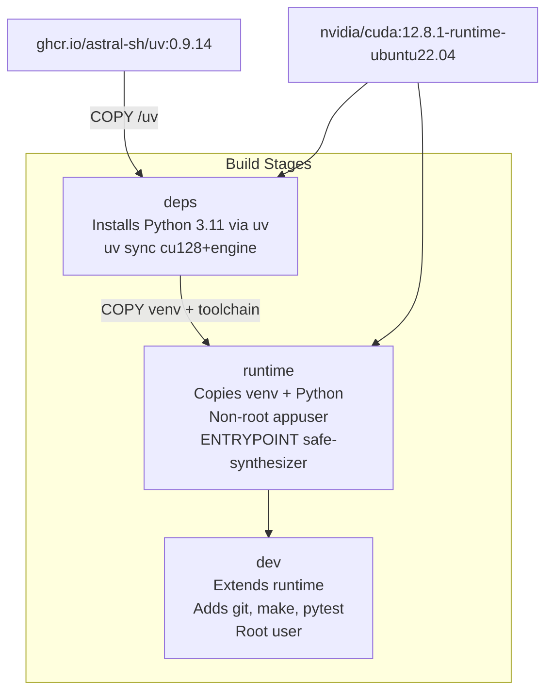

<!-- SPDX-FileCopyrightText: Copyright (c) 2025-2026 NVIDIA CORPORATION & AFFILIATES. All rights reserved. -->
<!-- SPDX-License-Identifier: Apache-2.0 -->

# Docker: Build and Customize

How the CUDA Docker image is built, how to customize it, and how it relates
to the CI test image.

For running Safe Synthesizer in a container, see
[User Guide -- Docker](../user-guide/docker.md).

---

## Dockerfile Layout

[`containers/Dockerfile.cuda`](https://github.com/NVIDIA-NeMo/Safe-Synthesizer/blob/main/containers/Dockerfile.cuda)
uses a three-stage multistage build:



- deps: installs uv, Python, and all cu128+engine dependencies. Uses
  `--mount=type=cache` to avoid re-downloading ~10 GB of PyTorch/CUDA wheels.
- runtime: copies the venv and uv-managed Python into a fresh CUDA runtime
  base. Runs as non-root `appuser` (uid 1000, `video` group for GPU access).
  The `safe-synthesizer` CLI is the entrypoint.
- dev: extends runtime with git, make, uv, and the full dev dependency group
  (pytest, ruff, etc.). Runs as root for flexibility. Used for interactive
  development and running tests inside the container.

---

## Build Arguments

| ARG | Default | Description |
|-----|---------|-------------|
| `CUDA_VERSION` | `12.8.1` | CUDA toolkit version in the base image tag |
| `UBUNTU_VERSION` | `22.04` | Ubuntu version in the base image tag |
| `CUDA_IMAGE_TYPE` | `runtime` | Base image variant for the deps stage. Change to `devel` if a dependency requires CUDA headers for compilation |
| `PYTHON_VERSION` | `3.11.13` | Python version installed via `uv python install` |
| `UV_VERSION` | `0.9.14` | uv version (pinned to the lower bound of `pyproject.toml` `required-version`) |

Override at build time:

```bash
docker build -f containers/Dockerfile.cuda \
  --build-arg PYTHON_VERSION=3.12.10 \
  --build-arg CUDA_VERSION=12.6.3 \
  --target runtime -t nss-gpu:custom .
```

---

## Key Build Details

### uv Environment Variables

The deps stage sets several uv environment variables for reproducible builds.
See the [uv Docker guide](https://docs.astral.sh/uv/guides/integration/docker/)
for full documentation.

| Variable | Value | Why |
|----------|-------|-----|
| `UV_PROJECT_ENVIRONMENT` | `/opt/venv` | Installs into a fixed venv path |
| `UV_PYTHON_INSTALL_DIR` | `/opt/python` | Stable path for cross-stage COPY |
| `UV_PYTHON_CACHE_DIR` | `/root/.cache/uv/python` | Lets Python downloads benefit from the uv cache mount |
| `UV_LINK_MODE` | `copy` | Hardlinks into cache mounts vanish after unmount; copy is safe |
| `UV_COMPILE_BYTECODE` | `1` | Precompile `.pyc` for faster container startup |
| `UV_NO_INSTALLER_METADATA` | `1` | Deterministic layers (no `installer`/`direct_url.json` variance) |
| `UV_FROZEN` | `true` | Equivalent to `--frozen` on every uv command; prevents accidental re-locking |

### Python Toolchain Portability

`UV_PYTHON_INSTALL_DIR=/opt/python` puts the uv-managed Python at a
stable, explicit path instead of the default `~/.local/share/uv/python/`.
The venv at `/opt/venv` symlinks into that directory. Both paths are
copied to the runtime stage:

```dockerfile
COPY --from=deps /opt/python /opt/python
COPY --from=deps /opt/venv /opt/venv
```

### Intermediate Layers

The deps stage uses two-pass installation following
[uv best practices](https://docs.astral.sh/uv/guides/integration/docker/#intermediate-layers):

1. `uv sync --no-install-project` -- installs all dependencies from the
   lockfile without the project itself. This layer is invalidated only when
   `pyproject.toml` or `uv.lock` changes.
2. `uv sync --no-editable` -- installs the project non-editably into the
   existing venv. Non-editable means the venv is self-contained and does
   not need source code at runtime.

### APT Cache Mounts

APT layers use `--mount=type=cache,target=/var/cache/apt,sharing=locked`
instead of the traditional `rm -rf /var/lib/apt/lists/*` pattern. This
caches downloaded `.deb` files across rebuilds, speeding up layer
re-creation when the apt install list changes.

### Why runtime, Not devel

All current locked dependencies (`torch`, `vllm`, `xformers`, `flashinfer`,
etc.) ship pre-built wheels. The CUDA devel image (~3 GB larger) is not
needed. If a future dependency requires source compilation with CUDA headers,
change `CUDA_IMAGE_TYPE` to `devel`.

---

## Makefile Targets

| Target | Description |
|--------|-------------|
| `container-build-gpu` | Build the `runtime` stage |
| `container-build-gpu-dev` | Build the `dev` stage |
| `container-run-gpu` | Run a command in the runtime container |
| `container-shell-gpu` | Interactive bash in the runtime container |
| `container-run-gpu-dev` | Run a command in the dev container |
| `container-shell-gpu-dev` | Interactive bash in the dev container |

Overridable variables:

| Variable | Default | Description |
|----------|---------|-------------|
| `CONTAINER_GPU_IMAGE` | `nss-gpu:latest` | Runtime image tag |
| `CONTAINER_GPU_IMAGE_DEV` | `nss-gpu-dev:latest` | Dev image tag |
| `CONTAINER_GPU_PLATFORM` | `linux/amd64` | Target platform |
| `CONTAINER_GPU_FLAG` | `--gpus all` | GPU access flag |
| `CONTAINER_HF_CACHE` | `$(HOME)/.cache/huggingface` | Host HF cache dir |

---

## Testing the Image

Smoke test (no GPU required):

```bash
docker run --rm nss-gpu:latest --help
```

Run unit tests inside the dev container:

```bash
make container-run-gpu-dev CMD="make test"
```

Interactive dev shell:

```bash
make container-shell-gpu-dev
```

---

## Image Size

The runtime image is approximately 15--25 GB, dominated by PyTorch, vllm,
and CUDA libraries. This is expected for a full ML inference stack.

To reduce size:

- The runtime stage excludes dev dependencies (`--no-group dev`)
- The base is `cuda-runtime` (not `cuda-devel`)
- Build caches (`--mount=type=cache`) stay out of the final image layers

---

## Relationship to `Dockerfile.test_ci`

| Aspect | `Dockerfile.cuda` | `Dockerfile.test_ci` |
|--------|-------------------|---------------------|
| Base | `nvidia/cuda:12.8.1-runtime-ubuntu22.04` | `python:3.11-slim` |
| Extras | `cu128` + `engine` | `cpu` |
| GPU | Required | Not needed |
| Use case | Training, generation, evaluation | CPU-only unit tests |
| Build target | `make container-build-gpu` | `make container-build-test` |

Both follow the conventions in [STYLE_GUIDE.md -- Dockerfiles](../../STYLE_GUIDE.md#dockerfiles).

---

## Future: Multi-Architecture Support

The Dockerfile currently targets `linux/amd64`. Multi-architecture support
(amd64 + arm64 for Blackwell) is planned for a follow-up. When the variant
matrix grows (CUDA version x Python version x architecture), the single
Dockerfile will be replaced by Jinja2 templates, following the same pattern
NVIDIA uses for the `nvidia/cuda` base images.
