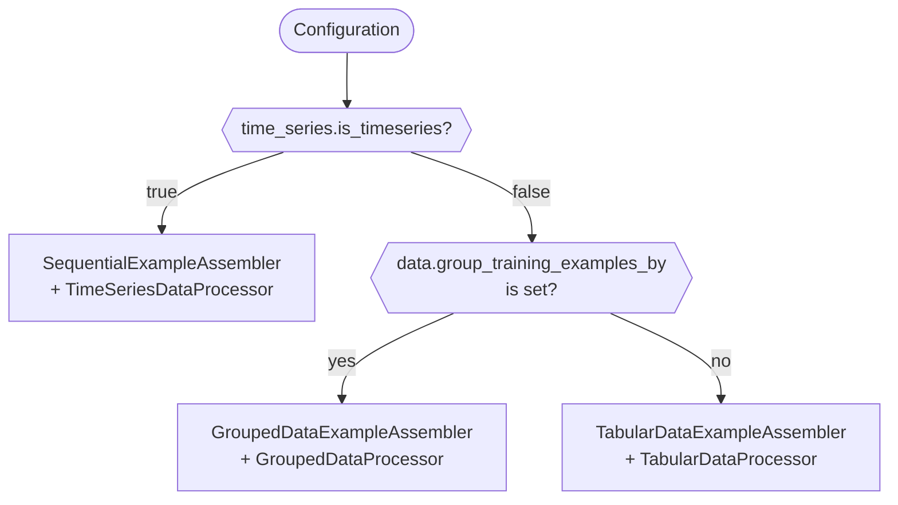
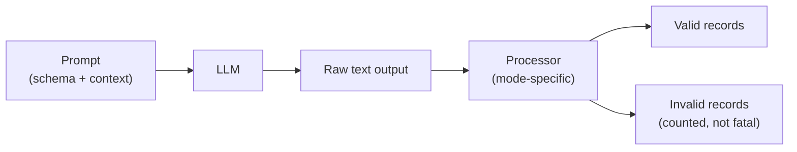

<!-- SPDX-FileCopyrightText: Copyright (c) 2025-2026 NVIDIA CORPORATION & AFFILIATES. All rights reserved. -->
<!-- SPDX-License-Identifier: Apache-2.0 -->

# Training Example Assembly

Safe Synthesizer converts tabular records into tokenized training examples that
fit inside a language model's context window. Understanding this process helps
when tuning `data.max_sequences_per_example`, diagnosing context-length errors,
or choosing a group column.

Safe Synthesizer supports three data modes -- tabular, grouped, and sequential
(time-series) -- each assembling training examples differently. The mode is
selected automatically based on your configuration.

---

## How Mode Is Selected

The pipeline inspects two configuration fields and dispatches to a matching
assembler and data processor:



You never pick an assembler directly. Set one or both config fields and the
pipeline does the rest:

| Config                                | Assembler                     | Processor                 |
| ------------------------------------- | ----------------------------- | ------------------------- |
| *(defaults)*                          | `TabularDataExampleAssembler` | `TabularDataProcessor`    |
| `time_series.is_timeseries: true`     | `SequentialExampleAssembler`  | `TimeSeriesDataProcessor` |
| `data.group_training_examples_by` set | `GroupedDataExampleAssembler` | `GroupedDataProcessor`    |

!!! note
    Time-series mode takes priority. If both `is_timeseries` and
    `group_training_examples_by` are set, the pipeline selects the sequential
    assembler.

---

## Tabular mode

Tabular is the default mode -- flat records with no grouping or temporal
ordering.

### Token structure

Each training example is a single sequence:

```
[schema prompt] [BOS record₁ record₂ … recordₙ EOS]
```

One BOS (beginning-of-sequence) / EOS (end-of-sequence) pair wraps all the
records in the example. The schema prompt lists the column names as JSON keys
so the model knows the expected output format; its tokens are masked
(`label = -100`) so they don't contribute to loss. Shorter column names
reduce prompt token count, leaving more room for records.

### Packing logic

Records are shuffled, then greedily packed:

1. Start a new example with the schema prompt.
2. Append the next record.
3. If the example has reached `max_sequences_per_example` records, or if
   adding the following record would exceed `max_seq_length`, flush the example
   and start a new one.
4. Repeat until all records are consumed.

This bin-packing approach minimizes wasted padding tokens -- most examples are
filled close to the context limit.

### Concrete example

Given four customer-transaction records:

```json
{"customer_id":"C-001","date":"2024-01-15","amount":42.50,"category":"grocery"}
{"customer_id":"C-002","date":"2024-01-16","amount":18.00,"category":"coffee"}
{"customer_id":"C-003","date":"2024-01-16","amount":250.00,"category":"electronics"}
{"customer_id":"C-001","date":"2024-01-17","amount":63.20,"category":"grocery"}
```

With `max_sequences_per_example: 3` and a modest `max_seq_length`, the
assembler might produce:

=== "Example 1"

    ```text
    customer_id, date, amount, category        ← schema prompt (masked)
    <BOS>
    {"customer_id":"C-003","date":"2024-01-16","amount":250.00,"category":"electronics"}
    {"customer_id":"C-001","date":"2024-01-17","amount":63.20,"category":"grocery"}
    {"customer_id":"C-002","date":"2024-01-16","amount":18.00,"category":"coffee"}
    <EOS>
    ```

=== "Example 2"

    ```text
    customer_id, date, amount, category        ← schema prompt (masked)
    <BOS>
    {"customer_id":"C-001","date":"2024-01-15","amount":42.50,"category":"grocery"}
    <EOS>
    ```

Notice the records are shuffled -- the order within an example carries no
semantic meaning in tabular mode.

---

## Grouped mode

Grouped mode is for data where multiple records share a key -- for example,
all transactions belonging to the same customer. Enable it by setting
`data.group_training_examples_by` to the column name (e.g. `customer_id`).

!!! info "When to use grouped mode"
    Grouped mode is recommended when there is a natural ordering within each
    group -- i.e., `data.order_training_examples_by` points to a valid
    ordering field (e.g. a date or sequence number). If your data has no
    meaningful intra-group order, tabular mode with shuffled records is
    usually sufficient.

### Token structure

Each group becomes its own BOS/EOS-delimited sequence, and multiple groups are
packed into one example:

```
[schema prompt] [BOS group₁-records EOS] [BOS group₂-records EOS] …
```

This is the key difference from tabular mode: records within the same group
share a single BOS/EOS pair, while distinct groups get separate pairs. The
model learns that BOS signals "new group" and can generate multi-group output
at inference time.

### Packing logic

1. Records are tokenized, then collapsed per group -- all records with the
   same group-column value are concatenated into a single tokenized row.
2. These group rows are packed into examples using the same greedy algorithm as
   tabular mode, but counting groups instead of individual records.
3. A new example starts when the next group would exceed `max_seq_length` or
   `max_sequences_per_example` groups have been packed.

!!! info "Split before tokenize"
    The grouped assembler splits the dataset into train and test sets
    *before* tokenization, using group boundaries. This ensures the expensive
    grouping and tokenization steps run independently on each split and that no
    group is divided across splits.

### Concrete example

Given six records across two customers:

```json
{"customer_id":"C-001","date":"2024-01-15","amount":42.50,"category":"grocery"}
{"customer_id":"C-001","date":"2024-01-17","amount":63.20,"category":"grocery"}
{"customer_id":"C-001","date":"2024-01-20","amount":11.00,"category":"coffee"}
{"customer_id":"C-002","date":"2024-01-16","amount":18.00,"category":"coffee"}
{"customer_id":"C-002","date":"2024-01-18","amount":250.00,"category":"electronics"}
{"customer_id":"C-002","date":"2024-01-19","amount":95.40,"category":"clothing"}
```

With `group_training_examples_by: customer_id` and
`max_sequences_per_example: 2`, both groups fit in one example:

```text
customer_id, date, amount, category              ← schema prompt (masked)
<BOS>
{"customer_id":"C-001","date":"2024-01-15","amount":42.50,"category":"grocery"}
{"customer_id":"C-001","date":"2024-01-17","amount":63.20,"category":"grocery"}
{"customer_id":"C-001","date":"2024-01-20","amount":11.00,"category":"coffee"}
<EOS>
<BOS>
{"customer_id":"C-002","date":"2024-01-16","amount":18.00,"category":"coffee"}
{"customer_id":"C-002","date":"2024-01-18","amount":250.00,"category":"electronics"}
{"customer_id":"C-002","date":"2024-01-19","amount":95.40,"category":"clothing"}
<EOS>
```

If `max_sequences_per_example` were 1, each customer would get its own example.

---

## Sequential / Time-Series Mode

Sequential mode is designed for temporally ordered data -- sensor readings,
transaction logs, event streams -- where the order of records carries meaning.
Enable it with `time_series.is_timeseries: true`.

### Token structure

Each example contains records from exactly one group, in chronological order:

```
[schema prompt] [BOS ordered-records-from-one-group EOS]
```

Like tabular mode, a single BOS/EOS pair wraps the records. Unlike tabular
mode, records are never shuffled and groups are never mixed.

### Order preservation

Records within each group maintain their original order (typically sorted by
a timestamp column specified via `data.order_training_examples_by`). The
train/test split is performed along group boundaries -- entire groups go to
train or test, never split across both -- and the dataset is re-sorted
after splitting so chronological order is restored.

### Continuation across examples

When a group has more records than fit in a single context window, the
sequence continues across example boundaries. The model sees:

- Example 1: records 0--99 from group A
- Example 2: records 100--199 from group A
- Example 3: records 0--74 from group B

This teaches the model that a sequence can pick up mid-stream, which is
critical for generating long event sequences at inference time. Each example
contains records from exactly one group -- records from different groups are
never mixed within an example.

### Randomized token budgets

To prevent the model from learning a fixed example length, each training
example's fill target is sampled uniformly between 70% and 100% of the
remaining record token budget (`max_seq_length` minus the schema prompt and
BOS/EOS overhead). Test-split examples always use the full budget (no
randomization).

### Flush conditions

The assembler flushes the current example and starts a new one when any of
these conditions are met:

- Group change -- the next record belongs to a different group
- Dataset restart -- the row index wraps back (happens when
  `training.num_input_records_to_sample` exceeds the number of training
  records, causing the dataset to be duplicated and reshuffled)
- Token budget exceeded -- the accumulated tokens reach the randomized budget
- `max_sequences_per_example` reached

### Initial prefill

For each group, the first 3 training records are stored as `initial_prefill` --
a dictionary mapping group IDs to seed text. During generation, the
time-series backend uses these prefill strings to prime the model's context for
each group.

### Concrete example

Given eight records for two devices:

```json
{"device_id":"sensor-A","timestamp":"2024-01-15T00:00","temp":21.3,"status":"ok"}
{"device_id":"sensor-A","timestamp":"2024-01-15T01:00","temp":21.5,"status":"ok"}
{"device_id":"sensor-A","timestamp":"2024-01-15T02:00","temp":22.1,"status":"ok"}
{"device_id":"sensor-A","timestamp":"2024-01-15T03:00","temp":28.7,"status":"warn"}
{"device_id":"sensor-A","timestamp":"2024-01-15T04:00","temp":30.2,"status":"alert"}
{"device_id":"sensor-B","timestamp":"2024-01-15T00:00","temp":19.0,"status":"ok"}
{"device_id":"sensor-B","timestamp":"2024-01-15T01:00","temp":19.1,"status":"ok"}
{"device_id":"sensor-B","timestamp":"2024-01-15T02:00","temp":19.3,"status":"ok"}
```

With `time_series.is_timeseries: true`,
`data.group_training_examples_by: device_id`,
`data.order_training_examples_by: timestamp`, and a token budget that fits
roughly 4 records per example:

=== "Example 1 (sensor-A, part 1)"

    ```text
    device_id, timestamp, temp, status           ← schema prompt (masked)
    <BOS>
    {"device_id":"sensor-A","timestamp":"2024-01-15T00:00","temp":21.3,"status":"ok"}
    {"device_id":"sensor-A","timestamp":"2024-01-15T01:00","temp":21.5,"status":"ok"}
    {"device_id":"sensor-A","timestamp":"2024-01-15T02:00","temp":22.1,"status":"ok"}
    {"device_id":"sensor-A","timestamp":"2024-01-15T03:00","temp":28.7,"status":"warn"}
    <EOS>
    ```

=== "Example 2 (sensor-A, part 2)"

    ```text
    device_id, timestamp, temp, status           ← schema prompt (masked)
    <BOS>
    {"device_id":"sensor-A","timestamp":"2024-01-15T04:00","temp":30.2,"status":"alert"}
    <EOS>
    ```

=== "Example 3 (sensor-B)"

    ```text
    device_id, timestamp, temp, status           ← schema prompt (masked)
    <BOS>
    {"device_id":"sensor-B","timestamp":"2024-01-15T00:00","temp":19.0,"status":"ok"}
    {"device_id":"sensor-B","timestamp":"2024-01-15T01:00","temp":19.1,"status":"ok"}
    {"device_id":"sensor-B","timestamp":"2024-01-15T02:00","temp":19.3,"status":"ok"}
    <EOS>
    ```

sensor-A's sequence spans two examples. sensor-B fits in one.

---

## Common concepts

### Schema prompt

Every training example begins with a schema prompt that lists the column names
of the dataset. The model uses this prompt as an instruction to generate
records in the expected format. Prompt tokens are masked during training
(label = -100) so they don't affect loss -- they exist only to condition the
model's output.

### BOS and EOS tokens

BOS (beginning-of-sequence) and EOS (end-of-sequence) tokens delimit record
sequences within an example. The specific tokens depend on the model:

For the default model ([SmolLM3](https://huggingface.co/HuggingFaceTB/SmolLM3-3B)):

| Token | String             | ID     |
| ----- | ------------------ | ------ |
| BOS   | `<&#124;im_start&#124;>` | 128011 |
| EOS   | `<&#124;im_end&#124;>`   | 128012 |

Other supported model families (Mistral, TinyLlama, Qwen, Llama, etc.) use
the same BOS/EOS override pattern with model-specific token IDs resolved at
runtime from `ModelMetadata` subclasses in `llm/metadata.py`.

!!! warning "Token IDs are model- and tokenizer-version dependent"
    The IDs above are illustrative, not repo-guaranteed constants. BOS tokens
    are explicitly set in `ModelMetadata` subclasses, while EOS tokens are
    generally read from the loaded tokenizer via
    `LLMPromptConfig.from_tokenizer(...)`. If a model's tokenizer is updated
    upstream, the IDs may change.

    These are not the models' native BOS/EOS tokens -- Safe Synthesizer
    overrides them for group delimiting. For example, SmolLM3's native token
    128009 is `<|eot_id|>`, not `<|im_end|>` -- the actual `<|im_end|>` EOS
    is at ID 128012
    ([tokenizer config](https://huggingface.co/HuggingFaceTB/SmolLM3-3B/blob/main/tokenizer_config.json)).

In tabular and sequential mode, one BOS/EOS pair wraps all the records in an
example. In grouped mode, each group gets its own pair -- so the model learns
that BOS marks the start of a new group.

### `data.max_sequences_per_example`

This parameter (CLI: `--data__max_sequences_per_example`) controls how many
units are packed into a single example. What counts as a "unit" depends on
the mode:

| Mode       | Unit                                      | Default                                        |
| ---------- | ----------------------------------------- | ---------------------------------------------- |
| Tabular    | individual records                        | `"auto"` -> 10 (1 for DP)                     |
| Grouped    | groups (each containing multiple records) | `"auto"` -> 10 (1 for DP)                     |
| Sequential | records from a single group (one group per example) | `"auto"` -> 10 (1 for DP; single-group enforced by group-boundary flush) |

The field default is `"auto"`. The auto-config resolver sets it to 1 when
differential privacy is enabled, 10 otherwise. You can also set an explicit
integer. With DP, each example must contain exactly one unit for correct
per-example gradient clipping. See
[Differential Privacy](../user-guide/running.md#differential-privacy) for
details.

??? tip "When to lower `data.max_sequences_per_example`"
    Reducing this value produces more training examples with fewer records each.
    More examples means more gradient steps, which often improves model quality.
    For grouped mode, start with 3--5 if you have many small groups; the
    default of 10 can compress a small dataset into very few examples. The
    tradeoff is proportionally longer training time -- more examples means more
    gradient steps per epoch.

---

## Generation: How Output Is Parsed

After training, Safe Synthesizer generates synthetic records by prompting the
fine-tuned model and parsing its text output back into structured data. The
parsing strategy depends on the mode because each produces output in a
different format.



### Tabular mode

The model produces a flat JSONL string -- one JSON object per line, each
matching the dataset schema. The `TabularDataProcessor` extracts lines with a
regex that matches `{...}` patterns, then validates each against the schema.

Lines that fail validation are counted as invalid but do not abort the batch.
No delimiter awareness is needed -- each line is independent.

### Grouped mode

The model generates one or more groups of records delimited by BOS and EOS
tokens. The `GroupedDataProcessor` calls `extract_groups_from_jsonl_string`,
which uses `re.findall` with a regex of the form:

```text
BOS + whitespace? + (one or more {…} records) + whitespace? + EOS
```

This finds all complete BOS/EOS-delimited blocks in the output. In principle,
a single prompt could produce multiple groups.

!!! note "Current limitation"
    In practice, vLLM stops generation at the first EOS token, so each prompt
    currently yields at most one group. This is under active improvement.

When no BOS/EOS delimiters are found, behavior depends on
`group_by_accept_no_delineator`: `false` (default) rejects the output;
`true` treats the whole output as a single group.

### Sequential (time-series) mode

!!! warning "Experimental"
    Time-series generation is experimental and its API may change.

The `TimeseriesBackend` generates one group at a time using a sliding-window
strategy:

1. Generation is seeded with an `initial_prefill` -- the first 3 records from
   training data for that group.
2. The model generates a continuation. Valid records are appended to the
   group's context window.
3. The updated context (most recent records) becomes the prefill for the
   next prompt.
4. This repeats until the target time range is covered or retries are
   exhausted.

Because each prompt sees the model's own prior output, sequential mode
preserves temporal continuity -- timestamps, intervals, and trends carry
forward naturally. The trade-off is that generation is inherently serial per
group (though multiple groups are processed in parallel batches).

---

## Grouped Generation: Validation Knobs

When parsing grouped output, four boolean parameters control how strictly the
processor enforces record validity. All default to `false` (strict mode).
Enable them selectively to recover more data from imperfect model output.

| Parameter                         | Default | What it does                                                                       | When to enable                                                           |
| --------------------------------- | ------- | ---------------------------------------------------------------------------------- | ------------------------------------------------------------------------ |
| `group_by_accept_no_delineator`   | `false` | Accept output that lacks BOS/EOS delimiters, treating the entire text as one group | Model consistently produces valid records but omits delimiter tokens     |
| `group_by_ignore_invalid_records` | `false` | Drop individual bad records from a group instead of rejecting the entire group     | Small fraction of records have schema errors but the rest are usable     |
| `group_by_fix_non_unique_value`   | `false` | Override mismatched group-column values with the first record's value              | Model occasionally hallucinates a different group-column value mid-group |
| `group_by_fix_unordered_records`  | `false` | Re-sort records instead of rejecting out-of-order groups                           | Model produces right records but scrambles their order                   |

!!! tip "Start strict, relax incrementally"
    Run generation with all knobs at their defaults first. Check the
    invalid-record fraction in the generation logs. If a specific failure mode
    dominates, enable the corresponding knob and re-run.

These parameters live under `generation.validation` in the config:

=== "CLI"

    ```bash
    safe-synthesizer run \
      --generation.validation.group_by_ignore_invalid_records true \
      --generation.validation.group_by_fix_non_unique_value true
    ```

=== "Python SDK"

    ```python
    synth = (
        SafeSynthesizer()
        .with_data_source(...)
        .with_model(...)
        .with_overrides({
            "generation.validation.group_by_ignore_invalid_records": True,
            "generation.validation.group_by_fix_non_unique_value": True,
        })
        .run()
    )
    ```

---

## Sizing and context budget

Every training example must fit within the model's `max_seq_length`. If it
doesn't, the assembler raises a `GenerationError` during data processing --
before training starts. Understanding the token budget helps you choose
parameters that avoid this error.

### Universal approximation

$$
\text{tokens} \approx \frac{\text{records} \times \text{avg\_chars\_per\_record}}{4}
$$

The divisor of 4 is a
[common approximation](https://help.openai.com/en/articles/4936856-what-are-tokens-and-how-to-count-them)
for BPE tokenizers on English text. Empirically, prose averages ~5.5 characters
per token, but JSON records with structural characters (`{`, `"`, `:`) are
denser -- closer to 3.5-4 characters per token. Treat this as a rough lower
bound on how many tokens you'll need.

### Per-mode budgets

=== "Tabular"

    ```text
    total = prompt_tokens + (tokens_per_record × max_sequences_per_example)
    ```

    Each "sequence" is one record. Records are packed until the context fills
    or `max_sequences_per_example` is reached.

=== "Grouped"

    ```text
    total = prompt_tokens + (tokens_per_group × max_sequences_per_example)
    ```

    Each "sequence" is an entire group (all records for one entity). Groups
    are larger than individual records, so the context fills faster.

=== "Sequential"

    ```text
    total = prompt_tokens + tokens_for_one_groups_records
    ```

    Each example holds one group. The token budget for records is bounded by a
    randomized fill ratio (70--100% of `max_new_tokens`, where `max_new_tokens`
    is `max_seq_length` minus the schema prompt and BOS/EOS overhead).

### Worked example

Consider a grouped dataset with:

- 200 records across 12 groups (~17 records per group)
- Average record length: ~80 characters -> ~20 tokens
- Schema prompt: ~100 tokens
- Model: SmolLM3, `max_seq_length` = 12,288

Per-group token cost:

```text
tokens_per_group ≈ 17 records × 20 tokens/record = 340 tokens
```

With `max_sequences_per_example = 5`:

```text
total ≈ 100 + (340 × 5) = 1,800 tokens   ← fits comfortably
```

Maximum groups before overflow:

```text
(12,288 − 100) / 340 ≈ 35 groups per example
```

Worst-case group with 80 records:

```text
tokens_per_group ≈ 80 × 20 = 1,600 tokens
total ≈ 100 + (1,600 × 5) = 8,100 tokens   ← still fits
total ≈ 100 + (1,600 × 8) = 12,900 tokens  ← GenerationError
```

!!! warning "Large groups overflow fast"
    Grouped mode with high `max_sequences_per_example` and groups that vary
    widely in size is the most common cause of context-overflow errors. If the
    largest group exceeds the available token budget, the assembler raises a
    `GenerationError` before training starts.

---

## Choosing a group column

The column you pass to `group_training_examples_by` determines how records are
bundled. A good choice directly affects model quality, context efficiency, and
whether assembly succeeds at all.

### Good choices

Entity identifiers with bounded, reasonably sized groups:

- `patient_id` -- 5 to 20 visits per patient
- `customer_id` -- 10 to 50 transactions per customer
- `project_id` -- 6 to 15 events per project

### Bad choices

Categorical columns with unbounded or highly skewed counts:

- `event_type` -- hundreds or thousands of records per type
- `status` -- nearly all records share "active", producing one massive group
- `country` -- an entire country's worth of records in one group

### Check before running

```python
import pandas as pd

df = pd.read_csv("your_data.csv")
group_sizes = df.groupby("your_group_column").size()
print(group_sizes.describe())
print(f"Largest group: {group_sizes.max()} records")
```

If the largest group's estimated token count exceeds `max_seq_length` minus
the prompt overhead, choose a different group column or a model with a longer
context window.

---

## Next steps

- [Running Safe Synthesizer](../user-guide/running.md) -- CLI and SDK syntax for grouping,
  ordering, and time-series configuration
- [Configuration Reference](../user-guide/configuration.md) -- full parameter tables
  including `generation.validation.*` knobs
- [Troubleshooting](../user-guide/troubleshooting.md) -- common errors like
  `GenerationError` and how to resolve them
