<!-- SPDX-FileCopyrightText: Copyright (c) 2025-2026 NVIDIA CORPORATION & AFFILIATES. All rights reserved. -->
<!-- SPDX-License-Identifier: Apache-2.0 -->

# Evaluation

Evaluation is a critical component of Safe Synthesizer that helps you understand both the utility and privacy of your synthetic data. The evaluation step is enabled by default and provides comprehensive reports comparing your original and synthetic datasets across multiple dimensions.

## How It Works

The evaluation system compares your original and synthetic datasets using two main frameworks:

1. **Synthetic Quality Score (SQS)**: Measures how well the synthetic data preserves statistical properties and utility
2. **Data Privacy Score (DPS)**: Assesses privacy protection and resistance to various attack vectors

Each framework consists of multiple metrics that are combined into an overall score.

---

## Synthetic Quality Score (SQS)

The SQS measures data utility across several dimensions:

### Column Correlation Stability

Analyzes the correlation across every combination of two columns:

- Compares correlation matrices between original and synthetic data
- Ensures relationships between variables are preserved
- Critical for maintaining predictive power in ML models

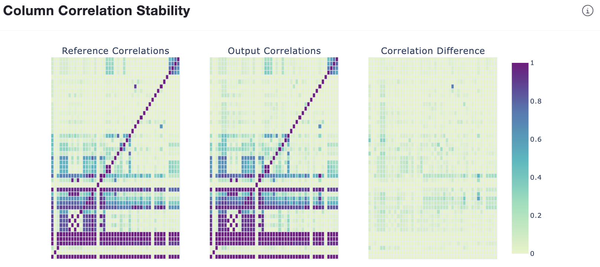

### Deep Structure Stability

Uses Principal Component Analysis to reduce dimensionality when comparing datasets:

- Captures overall data structure and patterns
- Evaluates high-dimensional relationships
- Assesses whether data maintains its fundamental characteristics

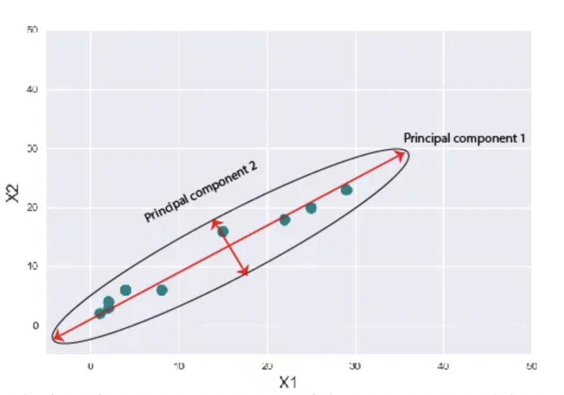

### Column Distribution Stability

Compares the distribution for each column in the original data to the matching column in the synthetic data:

- Statistical tests for numeric columns (KS test, Wasserstein distance)
- Frequency comparison for categorical columns
- Identifies distribution drift

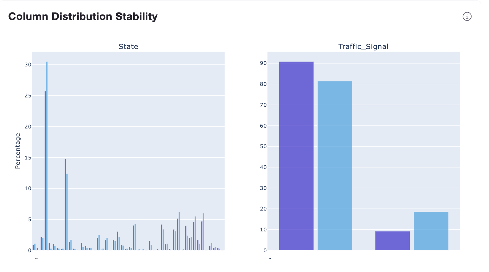

### Text Structure Similarity

For text columns, calculates sentence, word, and character counts:

- Compares structural properties of text
- Ensures text length and complexity are preserved
- Validates text generation quality

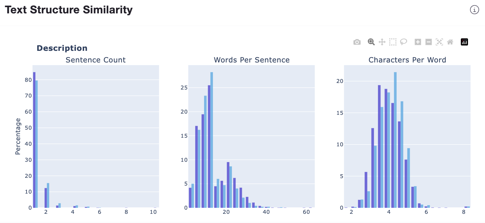

### Text Semantic Similarity

Understands whether the semantic meaning of the text is maintained after synthesizing:

- Uses embedding-based similarity measures
- Captures contextual and semantic properties
- Ensures text maintains intended meaning

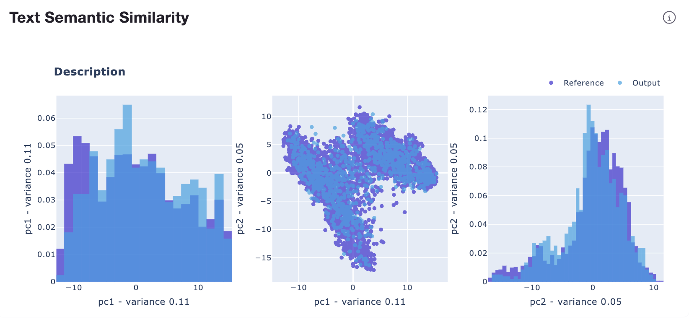

---

## Data Privacy Score (DPS)

The DPS assesses privacy protection through attack simulations:

### Membership Inference Protection

Tests whether attackers can determine if specific records were in the training data:

- Simulates membership inference attacks
- Measures how distinguishable training records are
- Higher scores indicate better privacy protection

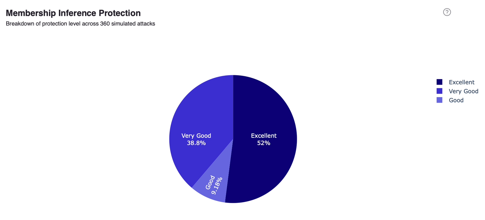

### Attribute Inference Protection

Assesses whether sensitive attributes can be inferred when other attributes are known:

- Tests ability to predict hidden values
- Measures information leakage
- Validates that synthesis doesn't create inference vulnerabilities

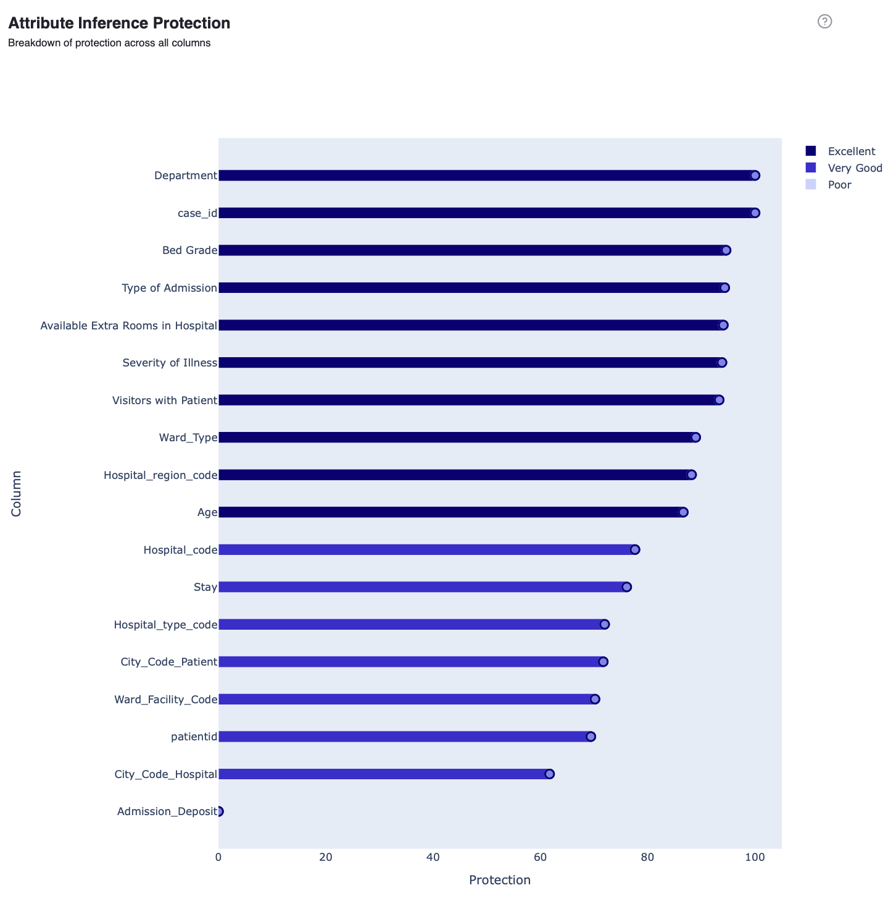

### PII Replay

Evaluates the frequency with which sensitive values from the original data appear in the synthetic version:

- Checks for exact matches of PII values
- Identifies potential memorization
- Critical for compliance and privacy guarantees

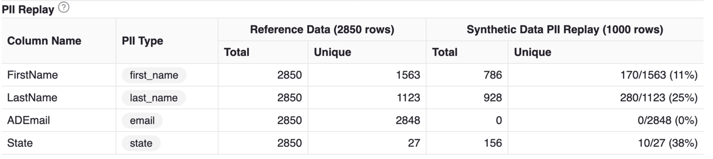

---

## Evaluation Reports

Every Safe Synthesizer run automatically generates an HTML evaluation report containing:

- Overall SQS and DPS scores
- Detailed subscores for each metric
- Visualizations comparing original and synthetic data
- Statistical test results

The report is saved to the run's `generate/` directory as `evaluation_report.html`.

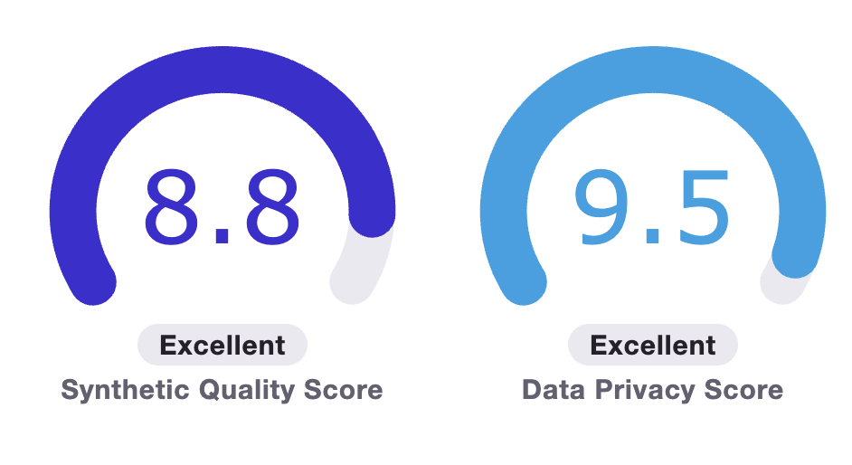

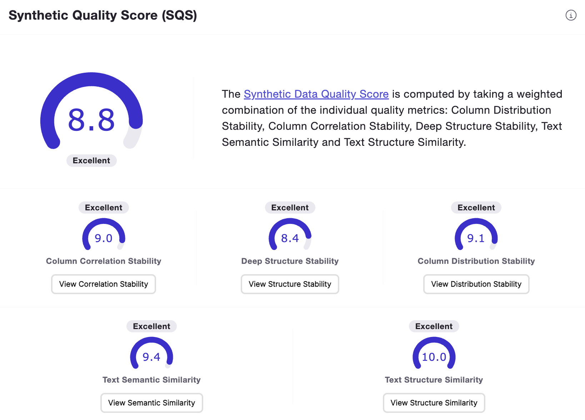

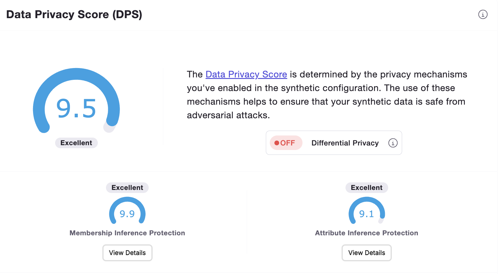

---

## Configuration

Evaluation is enabled by default but can be customized in your YAML config:

```yaml
evaluation:
  mia_enabled: true   # Membership Inference Attack
  aia_enabled: true   # Attribute Inference Attack
```

---

## Interpreting Scores

### SQS Interpretation

| Score Range | Rating | Guidance |
|-------------|--------|----------|
| **90-100** | Excellent | Synthetic data closely matches original utility |
| **70-89** | Good | Suitable for most use cases with minor differences |
| **50-69** | Fair | Noticeable differences, may impact some analyses |
| **Below 50** | Poor | Significant utility loss, review configuration |

### DPS Interpretation

| Score Range | Rating | Guidance |
|-------------|--------|----------|
| **90-100** | Excellent | Strong privacy protection |
| **70-89** | Good | Adequate privacy for most use cases |
| **50-69** | Fair | Some privacy risks, consider enabling differential privacy |
| **Below 50** | Poor | Insufficient privacy protection |

---

## API Reference

- [:material-api: `Evaluator`](../reference/nemo_safe_synthesizer/evaluation/evaluator.md)
- [:material-api: `EvaluationParameters`](../reference/nemo_safe_synthesizer/config/evaluate.md)
