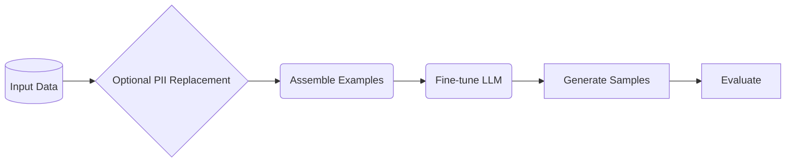

<!-- SPDX-FileCopyrightText: Copyright (c) 2025-2026 NVIDIA CORPORATION & AFFILIATES. All rights reserved. -->
<!-- SPDX-License-Identifier: Apache-2.0 -->

# Pipeline Overview

NeMo Safe Synthesizer enables you to create private versions of sensitive tabular datasets. The resulting data is entirely synthetic, with no one-to-one mapping to your original records. It is purpose-built for privacy compliance and data protection while preserving data utility for downstream AI tasks.

## How It Works

Safe Synthesizer employs a novel approach to synthetic data generation:

1. Tabular Fine-Tuning: fine-tunes a language model on your tabular data to learn patterns, correlations, and statistical properties
2. Generation: uses the fine-tuned model to generate new synthetic records that maintain data utility
3. Privacy Protection: optionally applies differential privacy during training for mathematical privacy guarantees

## Pipeline Stages



### 1. Data Preparation

The pipeline begins by loading your input data (CSV or DataFrame) and preparing it for training:

- Data validation and preprocessing
- Column type inference
- Grouping and ordering (if configured)
- Train/test split for holdout evaluation

### 2. PII Replacement (Optional)

If enabled, the PII replacer detects personally identifiable information using NER models and regex patterns, then replaces detected entities with synthetic but realistic values. This ensures the model has no chance of learning the most sensitive information like names and addresses.

See [PII Replacement](pii_replacement.md) for detailed PII documentation.

### 3. Example Assembly

Records are converted to JSONL format (one JSON object per line) and tokenized for model training. Records that exceed the model's context window raise a `GenerationError` rather than being silently truncated.

### 4. Training

The training stage fine-tunes a base LLM using LoRA (Low-Rank Adaptation). Two backends are available:

| Backend | Description |
|---------|-------------|
| **HuggingFace** | Standard training with quantization (4-bit/8-bit), LoRA via PEFT, and optional differential privacy via Opacus |
| **Unsloth** | Optimized training for faster fine-tuning |

### 5. Generation

Synthetic records are generated using the VLLM backend for fast inference. The generation stage loads the base model with the trained LoRA adapter and produces structured output.

### 6. Evaluation

The evaluation stage computes privacy and quality metrics, then generates an HTML report with interactive visualizations. See [Evaluation](evaluation.md) for details on all metrics.

## Supported Data Types

Safe Synthesizer supports diverse tabular data:

- Numeric: continuous and discrete numerical values
- Categorical: text labels and categories
- Text: free-form text fields
- Temporal: event sequences and time series

## Running the Pipeline

### CLI

```bash
# Full end-to-end pipeline
safe-synthesizer run --config config.yaml --url data.csv

# Training only
safe-synthesizer run train --config config.yaml --url data.csv

# Generation only (requires a trained adapter)
safe-synthesizer run generate --config config.yaml --url data.csv --run-path /path/to/trained/run
```

### Python SDK

```python
from nemo_safe_synthesizer.sdk.library_builder import SafeSynthesizer
from nemo_safe_synthesizer.config import SafeSynthesizerParameters

config = SafeSynthesizerParameters.from_yaml("config.yaml")
synthesizer = (
    SafeSynthesizer(config)
    .with_data_source("data.csv")
    .with_train(learning_rate=0.0005)
    .with_generate(num_records=5000)
    .with_evaluate(enabled=True)
)
synthesizer.run()
results = synthesizer.results
```

## Best Practices

### Resource Planning

- Larger datasets and models require more GPU memory (80GB+ VRAM recommended)
- Training time scales with data size and model complexity
- Plan for 15-60 minutes for typical jobs
- Ensure sufficient disk space for models and datasets (50GB+ recommended)

### Configuration

- Start with default settings
- Enable PII replacement for sensitive data
- Use differential privacy for maximum privacy guarantees
- Adjust generation parameters based on evaluation results

### Troubleshooting

GPU Memory Issues

- Reduce `batch_size` in training parameters
- Use a smaller subset of data for initial testing
- Increase `gradient_accumulation_steps` to maintain effective batch size with lower memory
- Check GPU usage with `nvidia-smi`

Invalid Data Format Errors

- Ensure CSV is UTF-8 encoded
- Validate column names don't contain special characters
- Check for null values or inconsistent data types

Generation Quality Issues

- Increase training data or epochs for more training
- Adjust `temperature` (try 0.7-1.0 range)
- Enable structured generation for better format adherence
- Review evaluation report for specific quality issues
