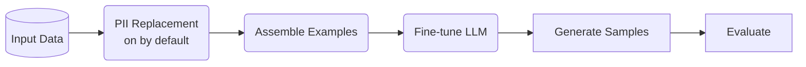

<!-- SPDX-FileCopyrightText: Copyright (c) 2025-2026 NVIDIA CORPORATION & AFFILIATES. All rights reserved. -->
<!-- SPDX-License-Identifier: Apache-2.0 -->

# Pipeline Overview

NeMo Safe Synthesizer enables you to create private versions of sensitive tabular datasets. The resulting data is entirely synthetic, with no one-to-one mapping to your original records. It is purpose-built for privacy compliance and data protection while preserving data utility for downstream AI tasks.

## How It Works

Safe Synthesizer employs a novel approach to synthetic data generation:

1. Tabular Fine-Tuning: fine-tunes a language model on your tabular data to learn patterns, correlations, and statistical properties
2. Generation: uses the fine-tuned model to generate new synthetic records that maintain data utility
3. Privacy Protection: applies differential privacy during training for mathematical privacy guarantees (off by default) and PII replacement as a pre-processing step (on by default)

## Pipeline Stages



### 1. Data Preparation

The pipeline begins by loading your input data (CSV or DataFrame) and preparing it for training:

- Data validation and preprocessing
- Column type inference
- Grouping and ordering (if configured)
- Train/test split for holdout evaluation

### 2. PII Replacement

On by default, the PII replacer detects personally identifiable information (PII) using NER models and regex patterns, then replaces detected entities with synthetic but realistic values. This ensures the model never has the opportunity to learn the most sensitive information (e.g. names, addresses, identifiers) from the training data. Disable with `--no_replace_pii` (CLI) or `.with_replace_pii(enable=False)` (SDK) if your data contains no PII.

See [PII Replacement](pii_replacement.md) for detailed PII Replacement documentation.

### 3. Example Assembly

Records are converted to a JSON format and tokenized for model training. The assembler handles truncation, padding, and proper formatting for the target LLM.

### 4. Training

The training stage fine-tunes a base LLM using LoRA (Low-Rank Adaptation). Two
backends are available -- Unsloth (default, faster) and HuggingFace (required
for differential privacy). Both perform LoRA fine-tuning; see
[Running -- Training](../user-guide/running.md#training) for details.

Three models have been extensively tested:

| Family | HuggingFace ID |
|--------|----------------|
| SmolLM3 (default) | `HuggingFaceTB/SmolLM3-3B` |
| TinyLlama | `TinyLlama/TinyLlama-1.1B-Chat-v1.0` |
| Mistral | `mistralai/Mistral-7B-Instruct-v0.3` |

### 5. Generation

Synthetic records are generated using the VLLM backend for fast inference. The generation stage loads the base model with the trained LoRA adapter and produces structured output.

### 6. Evaluation

The evaluation stage computes privacy and quality metrics, then generates an HTML report with interactive visualizations. See [Evaluation](evaluation.md) for details on all metrics.

## Supported Data Types

Safe Synthesizer supports diverse tabular data:

- Numeric: continuous and discrete numerical values
- Categorical: text labels and categories
- Text: free-form text fields
- Temporal: event sequences and time series (Note: Temporal dataset support is currently experimental)

## Running the Pipeline

### CLI

```bash
# Full end-to-end pipeline
safe-synthesizer run --config config.yaml --url data.csv

# Training only
safe-synthesizer run train --config config.yaml --url data.csv

# Generation only (requires a trained adapter)
safe-synthesizer run generate --config config.yaml --url data.csv --run-path /path/to/trained/run
```

### Python SDK

```python
from nemo_safe_synthesizer.sdk.library_builder import SafeSynthesizer
from nemo_safe_synthesizer.config import SafeSynthesizerParameters

config = SafeSynthesizerParameters.from_yaml("config.yaml")
synthesizer = (
    SafeSynthesizer(config)
    .with_data_source("data.csv")
    .with_train(learning_rate="auto")
    .with_generate(num_records=5000)
    .with_evaluate(enabled=True)
)
synthesizer.run()
results = synthesizer.results
```

## Best Practices

### Resource Planning

- NeMo Safe Synthesizer requires an NVIDIA GPU (A100 or larger) for training and generation
- Larger datasets and models require more GPU memory (80GB+ VRAM recommended)
- Training time scales with data size and model complexity
- Plan for 15-120 minutes for typical jobs
- Ensure sufficient disk space for models and datasets (50GB+ recommended)

### Troubleshooting

If results are poor, read [Synthetic Data Quality](../user-guide/evaluating-data.md) to see recommendations for adjusting data and configuration settings.

If your job fails to run, read [Program Runtime](../user-guide/troubleshooting.md) to see how to address common errors.