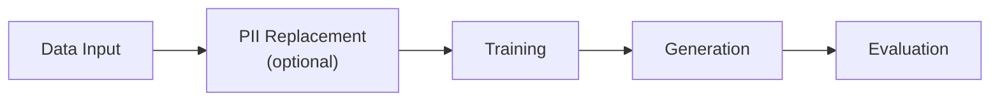

<!-- SPDX-FileCopyrightText: Copyright (c) 2025-2026 NVIDIA CORPORATION & AFFILIATES. All rights reserved. -->
<!-- SPDX-License-Identifier: Apache-2.0 -->

# Getting Started

NeMo Safe Synthesizer generates synthetic tabular data by fine-tuning a
pretrained LLM on your dataset and sampling from the trained model. This page
covers installation, a quick-start example, and a walkthrough of what the pipeline
does at each stage.

---

## Installation

### Prerequisites

- Python 3.11+
- CUDA runtime 12.8

### Install the Package

=== "CUDA 12.8 (Linux with NVIDIA GPU)"

    ```bash
    pip install "nemo-safe-synthesizer[cu128,engine]"
    ```

=== "CPU (macOS / Linux without GPU)"

    ```bash
    pip install "nemo-safe-synthesizer[cpu,engine]"
    ```

=== "Bare package for config definitions"

    ```bash
    pip install "nemo-safe-synthesizer"
    ```

### Verify

After installing, confirm the CLI is available:

```bash
safe-synthesizer --help
```

You should see:

```text
Usage: safe-synthesizer [OPTIONS] COMMAND [ARGS]...

  NeMo Safe Synthesizer command-line interface. This application is used to
  run the Safe Synthesizer pipeline. It can be used to train a model, generate
  synthetic data, and evaluate the synthetic data. It can also be used to
  modify a config file.

Options:
  --help  Show this message and exit.

Commands:
  artifacts  Artifacts management commands.
  config     Manage Safe Synthesizer configurations.
  run        Run the Safe Synthesizer end-to-end pipeline.
```

---

## Quick Start

Create a synthetic version of an input dataset in one step.

Save the following as `config.yaml`:

```yaml
training:
  pretrained_model: "HuggingFaceTB/SmolLM3-3B"
  learning_rate: 0.0005
generation:
  num_records: 1000
enable_replace_pii: true
```

PII replacement is on by default (shown explicitly here). Set
`enable_replace_pii: false` to skip it, or see
[Configuration -- Replacing PII](configuration.md#replacing-pii)
to customize entity types.

Then run:

=== "CLI"

    ```bash
    safe-synthesizer run --config config.yaml --url data.csv
    ```

    Without `--config`, all parameters use model defaults (SmolLM3-3B,
    PII replacement on). See [Running Safe Synthesizer](running.md)
    for the full option list.

=== "SDK"

    ```python
    from nemo_safe_synthesizer.sdk.library_builder import SafeSynthesizer
    from nemo_safe_synthesizer.config import SafeSynthesizerParameters

    config = SafeSynthesizerParameters.from_yaml("config.yaml")
    synthesizer = SafeSynthesizer(config).with_data_source("data.csv")
    synthesizer.run()

    results = synthesizer.results
    print(f"Generated {len(results.synthetic_data)} records")
    ```

This fine-tunes a LoRA adapter on your data, generates 1000 synthetic records,
and produces an evaluation report. The default outputs are placed in
`./safe-synthesizer-artifacts/<config>---<dataset>/<timestamp>/`

- `generate/synthetic_data.csv` -- the synthetic dataset
- `generate/evaluation_report.html` -- quality and privacy scores
- `train/adapter/` -- trained adapter (reusable for more generation)

---

## How the Pipeline Works

The pipeline has five stages. Each is independently configurable -- you can
run the full pipeline in one step, or execute stages individually (train once,
generate many times).



### 1. Data Input

The pipeline loads your input data (CSV, JSON, JSONL, Parquet, or DataFrame)
and prepares it for training:

- Column type inference and validation
- Grouping and ordering (if configured via `data.group_training_examples_by`)
- Train/test split -- a holdout set (default 5%) is reserved for evaluation
- Records are serialized to JSONL and tokenized; records that exceed the
  model's context window raise a `GenerationError` rather than being silently
  truncated

### 2. PII Replacement (Optional)

When `enable_replace_pii: true` (the default), the PII replacer detects
personally identifiable information using GLiNER NER and optional LLM-based
column classification, then replaces detected entities with synthetic but
realistic values. This ensures the model never learns the most sensitive
information -- names, addresses, identifiers -- from the training data.

See [Configuration -- Replacing PII](configuration.md#replacing-pii) for
entity types, LLM classification setup, and SDK customization.

### 3. Training

Fine-tunes a base LLM using LoRA (Low-Rank Adaptation). Two backends are
available:

| Backend | Description |
|---------|-------------|
| HuggingFace | Standard training with quantization (4-bit/8-bit), LoRA via PEFT, and optional differential privacy via Opacus |
| Unsloth | Optimized training for faster fine-tuning (auto-selected by default) |

The default model is `HuggingFaceTB/SmolLM3-3B`. Safe Synthesizer supports
specific model families (see [Configuration -- Training](configuration.md#training)
for the full list).

!!! tip "Differential privacy"
    For formal privacy guarantees, enable DP-SGD via `privacy.dp_enabled: true`.
    See [Configuration -- Differential Privacy](configuration.md#differential-privacy).

### 4. Generation

Produces synthetic records using the trained LoRA adapter via vLLM. The
generation stage samples from the fine-tuned model until the requested number
of valid records is reached, with configurable stopping conditions for quality
control.

See [Configuration -- Generation](configuration.md#generation).

### 5. Evaluation

Measures quality and privacy of the synthetic data and produces an HTML report
with interactive visualizations. Two composite scores are reported:

- SQS (Synthetic Quality Score) -- column distributions, correlations, deep
  structure
- DPS (Data Privacy Score) -- composite privacy score with three subscores:
    - MIA (Membership Inference Attack) -- privacy risk assessment
    - AIA (Attribute Inference Attack) -- quasi-identifier privacy
    - PII replay detection -- checks whether PII from training appears in output

See [Evaluating Output Data](evaluating-data.md) for how to interpret scores.

---

## Guides

<div class="grid cards" markdown>

-   Configuration

    ---

    Synthesis parameters for training, generation, PII, DP, evaluation,
    and time series.

    [→ Configuration](configuration.md)

-   Running Safe Synthesizer

    ---

    How to run the pipeline, CLI commands, individual stages, logging,
    and artifacts.

    [→ Running Safe Synthesizer](running.md)

-   Environment Variables

    ---

    Artifact paths, logging, model caching, NIM endpoints, and WandB.

    [→ Environment Variables](environment.md)

-   Troubleshooting

    ---

    Common errors, OOM fixes, offline setup, and configuration gotchas.

    [→ Troubleshooting](troubleshooting.md)

-   Evaluating Output Data

    ---

    Interpreting SQS and DPS scores, improving generation quality,
    choosing privacy settings.

    [→ Evaluating Output Data](evaluating-data.md)

</div>
