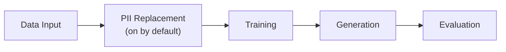

<!-- SPDX-FileCopyrightText: Copyright (c) 2025-2026 NVIDIA CORPORATION & AFFILIATES. All rights reserved. -->
<!-- SPDX-License-Identifier: Apache-2.0 -->

# Getting Started

NeMo Safe Synthesizer generates synthetic tabular data by fine-tuning a
pretrained LLM on your dataset and sampling from the trained model. This page
covers installation, a quick-start example, and a walkthrough of what the pipeline
does at each stage.

---

## Installation

### Prerequisites

- Python 3.11+ (dev tooling currently pins 3.11 via `.python-version` in the repo root)
- CUDA runtime 12.8
- NVIDIA GPU (A100 or better) for training and generation

### Install the Package

=== "CUDA 12.8 (Linux with NVIDIA GPU)"

    ```bash
    pip install "nemo-safe-synthesizer[cu128,engine]"
    ```

=== "CPU (macOS / Linux without GPU)"

    ```bash
    pip install "nemo-safe-synthesizer[cpu,engine]"
    ```

    !!! warning "Development use only"
        The CPU install does not support training or generation. Use it to
        validate configuration, explore the CLI, or import config classes in
        code. An A100 or better GPU is required to run the full pipeline.

=== "Docker (Linux with NVIDIA GPU)"

    ```bash
    make container-build-gpu

    docker run --gpus all --shm-size=1g \
      -v $(pwd):/workspace \
      -v ~/.cache/huggingface:/workspace/.hf_cache \
      -e HF_HOME=/workspace/.hf_cache \
      nss-gpu:latest run --config /workspace/config.yaml --url /workspace/data.csv
    ```

    No local Python install needed. See [Docker](docker.md) for full
    setup, volume mounts, and offline usage.

=== "Bare package for config definitions"

    ```bash
    pip install "nemo-safe-synthesizer"
    ```

    !!! note "Limited use"
        The bare package includes only the Pydantic configuration models -- no
        training, generation, or CLI engine. Use it in the NeMo Safe Synthesizer
        Service or any Python project that needs to construct or validate
        [`SafeSynthesizerParameters`][nemo_safe_synthesizer.config.parameters.SafeSynthesizerParameters] without pulling in the full ML stack.

### Verify

After installing, confirm the CLI is available:

```bash
safe-synthesizer --help
```

Expected output:

```text
Usage: safe-synthesizer [OPTIONS] COMMAND [ARGS]...

  NeMo Safe Synthesizer command-line interface. This application is used to
  run the Safe Synthesizer pipeline. It can be used to train a model, generate
  synthetic data, and evaluate the synthetic data. It can also be used to
  modify a config file.

Options:
  --help  Show this message and exit.

Commands:
  artifacts  Artifacts management commands.
  config     Manage Safe Synthesizer configurations.
  run        Run the Safe Synthesizer end-to-end pipeline.
```

---

## Quick Start

Create a synthetic version of an input dataset in one step.

!!! note "Config file"
    Save the following as `config.yaml`:

    ```yaml
    training:
      pretrained_model: "HuggingFaceTB/SmolLM3-3B"
    generation:
      num_records: 1000
    ```

    PII replacement is on by default. Pass `--no_replace_pii` on the CLI to skip
    it, or see [Configuration -- Replacing PII](configuration.md#replacing-pii)
    to customize entity types.

Then run:

```bash
safe-synthesizer run --config config.yaml --url data.csv
```

Replace `data.csv` with your actual input file. Any `.csv`, `.json`, `.jsonl`,
`.parquet`, or `.txt` file works -- see [Running Safe Synthesizer -- Data Input](running.md#data-input) for all supported formats.

The command above fine-tunes a LoRA adapter on your data, generates 1000 synthetic records,
and produces an evaluation report. The default outputs are placed in
`./safe-synthesizer-artifacts/<config>---<dataset>/<run_name>/`

- `generate/synthetic_data.csv` -- the synthetic dataset
- `generate/evaluation_report.html` -- quality and privacy scores
- `train/adapter/` -- trained adapter (reusable for more generation)

To run the same pipeline from Python, see [Running Safe Synthesizer -- SDK](running.md#running-the-pipeline).

→ Next step: read [Synthetic Data Quality](evaluating-data.md) to understand
your first report and how to interpret SQS and DPS scores.

---

## How the Pipeline Works

The pipeline has five stages. Each is independently configurable -- you can
run the full pipeline in one step, or execute stages individually (train once,
generate many times).



### 1. Data Input

The pipeline loads your input data (CSV, JSON, JSONL, Parquet, or DataFrame)
and prepares it for training:

- Column type inference and validation
- Grouping and ordering (if configured via `data.group_training_examples_by` and `data.order_training_examples_by`)
- Train/test split -- a holdout set (default 5%) is reserved for evaluation
- Records are serialized to JSONL and tokenized; records that exceed the
  model's context window raise a [`GenerationError`][nemo_safe_synthesizer.errors.GenerationError] rather than being silently
  truncated

### 2. PII Replacement

PII replacement is on by default. The PII replacer detects
personally identifiable information (PII) using GLiNER NER and optional LLM-based
column classification, then replaces detected entities with synthetic but
realistic values. This ensures the model never learns the most sensitive
information (e.g. names, addresses, identifiers) from the training data. See
[PII Replacement](../product-overview/pii_replacement.md) for the full entity
list.

See [Configuration -- Replacing PII](configuration.md#replacing-pii) for
entity types, LLM classification setup, and SDK customization.

### 3. Training

Fine-tunes a base LLM using LoRA (Low-Rank Adaptation). Two backends are
available:

| Backend | Description |
|---------|-------------|
| HuggingFace | Standard training with quantization (4-bit/8-bit), LoRA via PEFT, and optional differential privacy via Opacus |
| Unsloth | Optimized training for faster fine-tuning (auto-selected by default) |

The default model is `HuggingFaceTB/SmolLM3-3B`. Safe Synthesizer has tested
support for SmolLM3, TinyLlama, and Mistral (see
[Configuration -- Training](configuration.md#training) for details).

!!! tip "Differential privacy"
    For formal privacy guarantees, enable DP-SGD via `privacy.dp_enabled: true`.
    See [Configuration -- Differential Privacy](configuration.md#differential-privacy).

### 4. Generation

Produces synthetic records using the trained LoRA adapter via vLLM. The
generation stage samples from the fine-tuned model until the requested number
of valid records is reached, with configurable stopping conditions for quality
control.

See [Configuration -- Generation](configuration.md#generation).

### 5. Evaluation

Measures quality and privacy of the synthetic data and produces an HTML report
with interactive visualizations. Two composite scores are reported:

- SQS (Synthetic Quality Score) -- column distributions, correlations, deep
  structure
- DPS (Data Privacy Score) -- composite privacy score with three subscores:
    - MIA (Membership Inference Attack) -- measures whether a model trained on the data can distinguish training records from held-out records
    - AIA (Attribute Inference Attack) -- measures whether an attacker can infer a sensitive attribute from quasi-identifiers in the synthetic data
    - PII replay detection -- checks whether PII from training appears in synthetic data

See [Synthetic Data Quality](evaluating-data.md) for how to interpret scores.

---

## What to Read Next

After your first run, read [Synthetic Data Quality](evaluating-data.md) to understand
your SQS and DPS scores and learn how to improve generation quality.

## Guides

<div class="grid cards" markdown>

-   Configuration

    ---

    Synthesis parameters for training, generation, PII, DP, evaluation,
    and time series.

    [→ Configuration](configuration.md)

-   Running Safe Synthesizer

    ---

    How to run the pipeline, CLI commands, individual stages, logging,
    and artifacts.

    [→ Running Safe Synthesizer](running.md)

-   Environment Variables

    ---

    Artifact paths, logging, model caching, NIM endpoints, and WandB.

    [→ Environment Variables](environment.md)

-   Troubleshooting

    ---

    Common errors, OOM fixes, offline setup, and configuration gotchas.

    [→ Troubleshooting](troubleshooting.md)

-   Synthetic Data Quality

    ---

    Interpreting SQS and DPS scores, improving generation quality,
    choosing privacy settings.

    [→ Synthetic Data Quality](evaluating-data.md)

</div>
