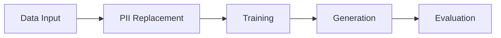

<!-- SPDX-FileCopyrightText: Copyright (c) 2025-2026 NVIDIA CORPORATION & AFFILIATES. All rights reserved. -->
<!-- SPDX-License-Identifier: Apache-2.0 -->

# User Guide

NeMo Safe Synthesizer generates synthetic tabular data by fine-tuning a
pretrained LLM on your dataset and sampling from the trained model. The
pipeline has five stages:



Each stage is independently configurable. You can run the full pipeline in
one step, or execute stages individually (train once, generate many times).
For a detailed overview of each stage, see
[Pipeline Overview](../product-overview/pipeline.md).

## Quick Start

Get a synthetic dataset in one step:

=== "YAML"

    ```yaml title="config.yaml"
    training:
      pretrained_model: "TinyLlama/TinyLlama-1.1B-Chat-v1.0"
      learning_rate: 0.0005
    generation:
      num_records: 1000
    enable_replace_pii: true
    ```

    ```bash
    safe-synthesizer run --config config.yaml --url data.csv
    ```

    PII replacement is on by default (shown explicitly here). Set
    `enable_replace_pii: false` to skip it, or see
    [Configuration -- PII Replacement](configuration.md#pii-replacement)
    to customize entity types.

=== "CLI"

    ```bash
    safe-synthesizer run --config config.yaml --url data.csv
    ```

    Without `--config`, all parameters use model defaults (TinyLlama,
    PII replacement on). See [Reference](cli.md) for the full
    option list.

=== "SDK"

    ```python
    from nemo_safe_synthesizer.sdk.library_builder import SafeSynthesizer
    from nemo_safe_synthesizer.config import SafeSynthesizerParameters

    config = SafeSynthesizerParameters.from_yaml("config.yaml")
    synthesizer = SafeSynthesizer(config).with_data_source("data.csv")
    synthesizer.run()

    results = synthesizer.results
    print(f"Generated {len(results.synthetic_data)} records")
    ```

This fine-tunes a LoRA adapter on your data, generates 1000 synthetic records,
and produces an evaluation report. Outputs go to
`<artifact-path>/<config>---<dataset>/<run_name>/` (the default artifact path
is `./safe-synthesizer-artifacts`; override with `--artifact-path` or
`NSS_ARTIFACTS_PATH`):

- `generate/synthetic_data.csv` -- the synthetic dataset
- `generate/evaluation_report.html` -- quality and privacy scores
- `train/adapter/` -- trained adapter (reusable for more generation)

## Guides

<div class="grid cards" markdown>

-   Configuration

    ---

    Synthesis parameters for training, generation, PII, DP, evaluation,
    and time series.

    [:octicons-arrow-right-24: Configuration](configuration.md)

-   Pipeline Stages

    ---

    What each stage does, how to run the full pipeline or individual
    stages, artifacts and output.

    [:octicons-arrow-right-24: Pipeline Stages](pipeline-stages.md)

-   Reference

    ---

    CLI commands, environment variables, logging, WandB, and parameter
    precedence.

    [:octicons-arrow-right-24: Reference](cli.md)

-   Troubleshooting

    ---

    Common errors, OOM fixes, offline setup, and configuration gotchas.

    [:octicons-arrow-right-24: Troubleshooting](troubleshooting.md)

-   Data Quality

    ---

    Interpreting SQS and DPS scores, improving generation quality,
    choosing privacy settings.

    [:octicons-arrow-right-24: Data Quality](data-quality.md)

</div>
