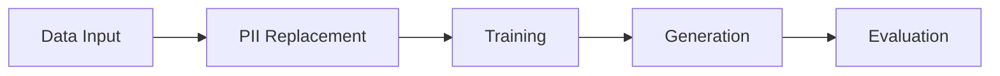

<!-- SPDX-FileCopyrightText: Copyright (c) 2025-2026 NVIDIA CORPORATION & AFFILIATES. All rights reserved. -->
<!-- SPDX-License-Identifier: Apache-2.0 -->

# Pipeline Stages

Stage-by-stage walkthrough from data input through evaluation. For parameter
tables and config examples, see [Configuration](configuration.md). For CLI
commands and environment variables, see [Reference](cli.md).

---

## Running the Pipeline

Run the full end-to-end pipeline in one step:

=== "YAML"

    ```yaml title="config.yaml"
    training:
      pretrained_model: "TinyLlama/TinyLlama-1.1B-Chat-v1.0"
      learning_rate: 0.0005
    generation:
      num_records: 1000
    enable_replace_pii: false
    ```

    ```bash
    safe-synthesizer run --config config.yaml --url data.csv
    ```

=== "CLI"

    ```bash
    safe-synthesizer run \
      --config config.yaml \
      --url data.csv \
      --artifact-path ./artifacts
    ```

=== "SDK"

    ```python
    from nemo_safe_synthesizer.sdk.library_builder import SafeSynthesizer
    from nemo_safe_synthesizer.config import SafeSynthesizerParameters

    config = SafeSynthesizerParameters.from_yaml("config.yaml")
    synthesizer = SafeSynthesizer(config).with_data_source("data.csv")
    synthesizer.run()

    results = synthesizer.results
    ```

You can also run stages individually:

- `safe-synthesizer run train` -- train only, saves the adapter
- `safe-synthesizer run generate` -- generate only (use `--auto-discover-adapter` or `--run-path`)
- PII replacement only: `safe-synthesizer run --enable_replace_pii true --enable_synthesis false --url data.csv`
- SDK stepwise: `process_data()` -> `train()` -> `generate()` -> `evaluate()`



---

## Data Input

Provide your dataset as a file path, URL, DataFrame (SDK), or dataset
registry name.

Data source options:

- CLI / dataset registry: `--url data.csv` -- supports `.csv`, `.json`, `.jsonl`, `.parquet`, `.txt`
- URL: `--url https://example.com/data.csv`
- DataFrame (SDK): `.with_data_source(df)` -- supports any format you can load into pandas
- CSV path (SDK): `.with_data_source("data.csv")` -- loaded via `pd.read_csv`; for non-CSV formats, load into a DataFrame first
- Dataset registry name: `--url my_dataset` (with `--dataset-registry registry.yaml`)

!!! note "SDK file format limitation"
    The SDK currently loads string paths via `pd.read_csv`, so only CSV and
    TXT files work directly. For JSON, JSONL, or Parquet, load into a
    DataFrame first. A future release will unify SDK format support with
    the CLI.

See [Configuration -- Data](configuration.md#data) for holdout, grouping, and
ordering parameters. See
[`DataParameters`][nemo_safe_synthesizer.config.data.DataParameters] for the
full field list.

---

## PII Replacement

Optional stage that runs before training. Detects and replaces personally
identifiable information using GLiNER NER and optional LLM-based column
classification.

=== "YAML"

    ```yaml
    enable_replace_pii: true
    ```

    PII replacement is on by default. To customize entity types or
    classification, use the SDK builder -- the `replace_pii` config block
    requires the full `steps` field which is verbose in YAML.

=== "CLI"

    ```bash
    safe-synthesizer run \
      --enable_replace_pii true \
      --url data.csv
    ```

=== "SDK"

    ```python
    from nemo_safe_synthesizer.config.replace_pii import PiiReplacerConfig

    pii_config = PiiReplacerConfig.get_default_config()
    pii_config.globals.classify.enable_classify = True
    pii_config.globals.classify.entities = ["email", "phone_number", "ssn"]

    synthesizer = (
        SafeSynthesizer(config)
        .with_data_source("data.csv")
        .with_replace_pii(config=pii_config)
        .with_train()
        .with_generate(num_records=5000)
    )
    ```

    The SDK builder merges partial overrides with
    `PiiReplacerConfig.get_default_config()`, so you don't need to
    provide the full `steps` list.

To enable LLM-based column classification (optional), set the endpoint
before running the pipeline. Any OpenAI-compatible inference endpoint works:

```bash
export NIM_ENDPOINT_URL="https://your-inference-endpoint"
export NIM_API_KEY="your-api-key"  # pragma: allowlist secret  (optional -- only for direct endpoints)
```

When `NIM_ENDPOINT_URL` is unset, the classification step is attempted but
falls back to NER-only detection (with an error log). `NIM_API_KEY` is
only required for direct endpoints, not inference gateways. No environment
variables are required for NER-only PII replacement.

### PII-Only Mode

Set `enable_synthesis: false` with `enable_replace_pii: true` to run PII
replacement without synthesis.

See [Configuration -- PII Replacement](configuration.md#pii-replacement) for
the full parameter reference.

---

## Training

Fine-tunes a pretrained LLM on your data using LoRA. Two backends are
available:

| Backend | Description |
|---------|-------------|
| HuggingFace | Standard training with quantization (4-bit/8-bit), LoRA via PEFT, and optional differential privacy via Opacus |
| Unsloth | Optimized training for faster fine-tuning |

=== "YAML"

    ```yaml
    training:
      learning_rate: 0.001
      batch_size: 4
    ```

=== "CLI"

    ```bash
    safe-synthesizer run \
      --training__learning_rate 0.001 \
      --training__batch_size 4 \
      --url data.csv
    ```

=== "SDK"

    ```python
    synthesizer = (
        SafeSynthesizer(config)
        .with_data_source("data.csv")
        .with_train(learning_rate=0.001, batch_size=4)
    )
    ```

See [Configuration -- Training](configuration.md#training) for the full
parameter table, including quantization and attention backends. See
[Configuration -- Differential Privacy](configuration.md#differential-privacy)
for DP-SGD settings.

---

## Generation

Produces synthetic records using the trained adapter via vLLM.

=== "YAML"

    ```yaml
    generation:
      num_records: 5000
      temperature: 0.7
    ```

=== "CLI"

    ```bash
    safe-synthesizer run \
      --generation__num_records 5000 \
      --generation__temperature 0.7 \
      --url data.csv
    ```

=== "SDK"

    ```python
    synthesizer = (
        SafeSynthesizer(config)
        .with_data_source("data.csv")
        .with_generate(num_records=5000, temperature=0.7)
    )
    ```

See [Configuration -- Generation](configuration.md#generation) for the full
parameter table and stopping-condition details. See
[`GenerateParameters`][nemo_safe_synthesizer.config.generate.GenerateParameters].

---

## Evaluation

Measures quality and privacy of synthetic data. Produces an HTML report with
interactive visualizations. See [Data Quality](data-quality.md) for how to
interpret scores.

=== "YAML"

    ```yaml
    evaluation:
      mia_enabled: false
      aia_enabled: false
    ```

=== "CLI"

    ```bash
    safe-synthesizer run \
      --evaluation__mia_enabled false \
      --evaluation__aia_enabled false \
      --url data.csv
    ```

=== "SDK"

    ```python
    synthesizer = (
        SafeSynthesizer(config)
        .with_data_source("data.csv")
        .with_evaluate(mia_enabled=False, aia_enabled=False)
    )
    ```

See [Configuration -- Evaluation](configuration.md#evaluation) for the full
parameter table. See
[`EvaluationParameters`][nemo_safe_synthesizer.config.evaluate.EvaluationParameters].

---

## Run Individual Stages

### Train only

=== "CLI"

    ```bash
    safe-synthesizer run train --config config.yaml --url data.csv
    ```

=== "SDK"

    ```python
    synthesizer = SafeSynthesizer(config).with_data_source("data.csv")
    synthesizer.process_data()
    synthesizer.train()
    ```

### Generate only

Use `--auto-discover-adapter` to find the latest trained adapter, or
`--run-path` for an explicit location:

=== "CLI"

    ```bash
    # Auto-discover the latest adapter
    safe-synthesizer run generate \
      --config config.yaml \
      --url data.csv \
      --auto-discover-adapter

    # Or specify explicitly
    safe-synthesizer run generate \
      --config config.yaml \
      --url data.csv \
      --run-path ./safe-synthesizer-artifacts/myconfig---mydata/2026-01-15T12:00:00
    ```

=== "SDK"

    ```python
    from pathlib import Path
    from nemo_safe_synthesizer.cli.artifact_structure import Workdir

    workdir = Workdir.from_path(
        Path("./safe-synthesizer-artifacts/myconfig---mydata/2026-01-15T12:00:00")
    )
    synthesizer = SafeSynthesizer(config, workdir=workdir)
    synthesizer.load_from_save_path()
    synthesizer.generate().evaluate()
    ```

### Stepwise execution (SDK)

For full control, call each stage individually:

```python
synthesizer = SafeSynthesizer(config).with_data_source(df)
synthesizer.process_data()
synthesizer.train()
synthesizer.generate()
synthesizer.evaluate()

results = synthesizer.results
synthesizer.save_results()
```

---

## Time Series Mode

!!! warning "Experimental"
    Time series synthesis is an experimental feature. APIs and behavior may
    change between releases.

=== "YAML"

    ```yaml
    time_series:
      is_timeseries: true
      timestamp_column: "timestamp"
      timestamp_interval_seconds: 60
    data:
      group_training_examples_by: "sensor_id"
    ```

=== "CLI"

    ```bash
    safe-synthesizer run \
      --time_series__is_timeseries true \
      --time_series__timestamp_column timestamp \
      --time_series__timestamp_interval_seconds 60 \
      --data__group_training_examples_by sensor_id \
      --url sensor_data.csv
    ```

=== "SDK"

    ```python
    synthesizer = (
        SafeSynthesizer(config)
        .with_data_source("sensor_data.csv")
        .with_time_series(
            is_timeseries=True,
            timestamp_column="timestamp",
            timestamp_interval_seconds=60,
        )
        .with_data(group_training_examples_by="sensor_id")
    )
    ```

See [Configuration -- Time Series](configuration.md#time-series) for the full
parameter table. See
[`TimeSeriesParameters`][nemo_safe_synthesizer.config.time_series.TimeSeriesParameters].

---

## Artifacts and Output

```text
safe-synthesizer-artifacts/
└── <config>---<dataset>/
    └── <run_name>/
        ├── safe-synthesizer-config.json
        ├── train/
        │   └── adapter/
        ├── generate/
        │   ├── synthetic_data.csv
        │   └── evaluation_report.html
        └── dataset/
            ├── training.csv
            ├── test.csv
            └── validation.csv
```

Key outputs:

- `generate/synthetic_data.csv`: the synthetic dataset
- `generate/evaluation_report.html`: quality and privacy report
- `train/adapter/`: LoRA weights for resuming generation
- `safe-synthesizer-config.json`: resolved config snapshot

### SDK Results Access

```python
results = synthesizer.results
df = results.synthetic_data
summary = results.summary
synthesizer.save_results()
```

### Cleaning Up

```bash
safe-synthesizer artifacts clean --artifact-path ./safe-synthesizer-artifacts
safe-synthesizer artifacts clean --caches-only  # training cache only
safe-synthesizer artifacts clean --dry-run      # preview
```

---

## Running in Offline Environments

Pre-cache models by running once with internet access:

```bash
export HF_HOME=/shared/cache/huggingface
safe-synthesizer run --config config.yaml --url data.csv
```

Key environment variables for offline use:

| Variable | Effect |
|----------|--------|
| `HF_HOME` | Cache directory for Hugging Face downloads |
| `HF_HUB_OFFLINE` | When set to `1`, error instead of downloading |
| `LOCAL_FILES_ONLY` | When set to `true`, skip downloads (Unsloth, GLiNER only) |
| `VLLM_CACHE_ROOT` | vLLM internal cache directory (defaults to `~/.cache/vllm`; does not control model downloads) |

Disable kernels network calls: `training.attn_implementation: "sdpa"`.
Disable column classification: unset `NIM_ENDPOINT_URL` (classification falls
back to NER-only with an error log), or use the SDK to set `enable_classify: false` via
`PiiReplacerConfig.get_default_config()`.

See [Troubleshooting](troubleshooting.md) for more offline setup guidance.
