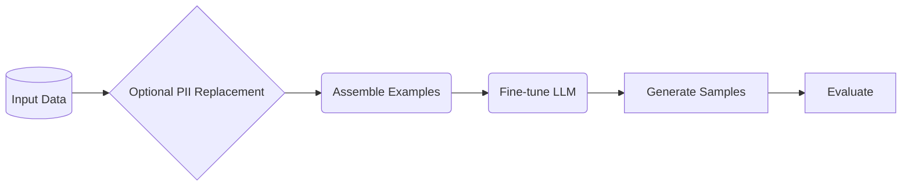

# Pipeline Overview

NeMo Safe Synthesizer follows a pipeline architecture with distinct stages that execute sequentially.

## Pipeline Stages

### 1. Data Processing

The pipeline begins by loading your input data (CSV or DataFrame) and splitting it into train/test sets using a configurable holdout strategy.

<!-- TODO: Add details on holdout configuration, stratification options -->

### 2. PII Replacement (Optional)

If enabled, the PII replacer detects personally identifiable information using NER models and regex patterns, then replaces detected entities with synthetic but realistic values.

<!-- TODO: Link to privacy.md for detailed PII documentation -->

### 3. Example Assembly

Records are converted to a JSON format and tokenized for model training. The assembler handles truncation, padding, and proper formatting for the target LLM.

### 4. Training

The training stage fine-tunes a base LLM using LoRA (Low-Rank Adaptation). Two backends are available:

| Backend | Description |
|---------|-------------|
| **HuggingFace** | Standard training with quantization, LoRA, and optional differential privacy |
| **Unsloth** | Optimized training for faster fine-tuning |

### 5. Generation

Synthetic records are generated using the VLLM backend for fast inference. The generation stage loads the base model with the trained LoRA adapter and produces structured output.

### 6. Evaluation

The evaluation stage computes privacy and quality metrics, then generates an HTML report with interactive visualizations.

## Running the Pipeline

See the [Quick Start](../getting-started/quickstart.md) guide for examples of running the full pipeline or individual stages.
