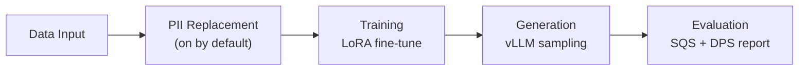
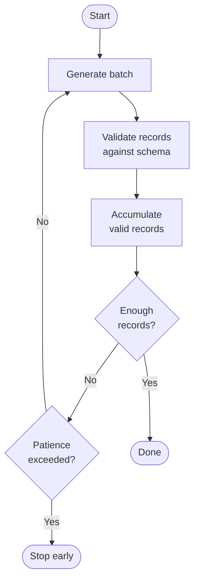

<!-- SPDX-FileCopyrightText: Copyright (c) 2025-2026 NVIDIA CORPORATION & AFFILIATES. All rights reserved. -->
<!-- SPDX-License-Identifier: Apache-2.0 -->

# Running Safe Synthesizer

Full reference for pipeline execution. For a quick first run, see
[Getting Started](getting-started.md). For parameter tables, see
[Configuration Reference](configuration.md). For environment variables, see
[Environment Variables](environment.md).

---

## Configuration Interfaces

NeMo Safe Synthesizer has two ways to run the pipeline and four-and-a-half ways to configure it.

Two ways to run:

- `safe-synthesizer` CLI -- the command-line application
- Python SDK -- the [`SafeSynthesizer`][nemo_safe_synthesizer.sdk.library_builder.SafeSynthesizer] builder, for use in scripts, notebooks, and services

Four-and-a-half ways to configure:

- YAML config file -- a portable, versionable snapshot of parameters; passed to the CLI via `--config` or loaded in the SDK with [`SafeSynthesizerParameters.from_yaml()`][nemo_safe_synthesizer.config.parameters.SafeSynthesizerParameters]
- CLI flags -- `--generation__num_records 10000`, `--privacy__dp_enabled true`; override the YAML file when both are provided
- Python SDK builder calls -- `.with_generate(num_records=10000)`, `.with_differential_privacy(dp_enabled=True)`; override the YAML file when both are used
- [Dataset registry](#dataset-registry) -- a YAML file (passed via `--dataset-registry`) that defines named datasets and their parameter overrides so you can refer to them by name in the CLI
- Environment variables (the half) -- control infrastructure only: artifact paths, logging, model cache locations, WandB mode. They do not set synthesis parameters like learning rate or record count

The asymmetry matters: YAML and environment variables are *configuration only* -- they don't invoke the pipeline. CLI and SDK are *run and configure* -- they set parameters and execute.

All configuration surfaces share the same underlying [Pydantic](https://docs.pydantic.dev/) parameter models defined in `src/nemo_safe_synthesizer/config/`. The `__` syntax used in CLI flags (e.g. `--privacy__dp_enabled true`) mirrors the nested structure of those models: `privacy` is the config section, `dp_enabled` is the field. Setting a parameter via YAML, CLI flag, or SDK call resolves to the same field in the same model.

Exactly what avenues of configuration are available, and thus how precedence is resolved, depends on how you run the pipeline. Settings are resolved in this order, from highest (first) to lowest priority (last):

- CLI: `CLI flags` > `dataset registry` > `YAML config file` > `model defaults`
- SDK: `Python SDK builder calls` > `YAML config file` > `model defaults`

See [Configuration Precedence](configuration.md#configuration-precedence) for details.

The same run, three ways -- 10,000 records with DP-SGD:

=== "CLI"

    ```bash
    safe-synthesizer run \
      --data-source data.csv \
      --generation__num_records 10000 \
      --privacy__dp_enabled true \
      --privacy__epsilon 8.0
    ```

=== "SDK"

    ```python
    from nemo_safe_synthesizer.sdk.library_builder import SafeSynthesizer

    synthesizer = (
        SafeSynthesizer()
        .with_data_source("data.csv")
        .with_generate(num_records=10000)
        .with_differential_privacy(dp_enabled=True, epsilon=8.0)
    )
    synthesizer.run()
    ```

=== "Config reference"

    ```yaml
    # config.yaml
    generation:
      num_records: 10000
    privacy:
      dp_enabled: true
      epsilon: 8.0
    ```

    ```bash
    safe-synthesizer run --config config.yaml --data-source data.csv
    ```

---

## Running the Pipeline

The pipeline runs five stages in sequence. PII replacement is on by default as a pre-processing step; disable it with `--no-replace-pii` (CLI) or `.with_replace_pii(enable=False)` (SDK).



Run the full end-to-end pipeline in one step:

=== "CLI"

    ```bash
    safe-synthesizer run \
      --config config.yaml \
      --data-source data.csv \
      --artifact-path ./artifacts
    ```

=== "SDK"

    ```python
    from nemo_safe_synthesizer.sdk.library_builder import SafeSynthesizer
    synthesizer = SafeSynthesizer().with_data_source("data.csv")
    synthesizer.run()

    results = synthesizer.results
    ```

You can also run stages individually:

- `safe-synthesizer run train` -- train only, saves the adapter
- `safe-synthesizer run generate` -- generate only (use `--auto-discover-adapter` or `--run-path`)
- SDK stepwise: `process_data()` → `train()` → `generate()` → `evaluate()`

---

## Using YAML Config Files

A `config.yaml` file is optional for the CLI and SDK. When omitted, model
defaults apply. When provided, CLI flags and SDK builder calls override the
values from the file.

### CLI

Pass `--config` to load a base config, then override individual fields with
`--key__subkey value` syntax:

```bash
# All defaults, no config file
safe-synthesizer run --data-source data.csv

# Config file as base, override two fields
safe-synthesizer run \
  --config config.yaml \
  --data-source data.csv \
  --training__learning_rate 0.001 \
  --generation__num_records 2000
```

### SDK

Pass a [`SafeSynthesizerParameters`][nemo_safe_synthesizer.config.parameters.SafeSynthesizerParameters] loaded from YAML as the seed, then use
`with_*` calls to override specific sections:

```python
from nemo_safe_synthesizer.sdk.library_builder import SafeSynthesizer
from nemo_safe_synthesizer.config import SafeSynthesizerParameters

# Load base config from file, override generation settings
config = SafeSynthesizerParameters.from_yaml("config.yaml")
synthesizer = (
    SafeSynthesizer(config)
    .with_data_source("data.csv")
    .with_generate(num_records=2000, temperature=0.8)
)
synthesizer.run()
```

`with_*` keyword arguments take precedence over whatever is in the YAML file.
Sections not mentioned in the builder call retain their values from `config`.

See [Configuration Reference -- CLI Override Syntax](configuration.md#cli-override-syntax)
for the full override precedence rules.

---

## CLI Commands

```bash
safe-synthesizer --help
```

### `run` -- Execute the Pipeline

Without a subcommand, `run` executes the full end-to-end pipeline (data processing,
PII replacement, training, generation, evaluation). PII replacement is on by default.

```bash
safe-synthesizer run --config config.yaml --data-source data.csv
```

#### Common Options

These options apply to `run` and `run generate`. Only `--data-source` is required;
all others have defaults or are optional.

| Option | Env var | Default | Description |
|--------|---------|---------|-------------|
| `--config` | `NSS_CONFIG` | (model defaults) | Path to YAML config file; omit to use all model defaults |
| `--data-source` | -- | (required) | Dataset path, URL, or name from `--dataset-registry` |
| `--artifact-path` | `NSS_ARTIFACTS_PATH` | `./safe-synthesizer-artifacts` | Base directory for all runs |
| `--run-path` | -- | -- | Explicit run directory (for `run generate`, must point to an existing trained run) |
| `--output-file` | -- | -- | Path to output CSV file |
| `--log-format` | `NSS_LOG_FORMAT` | `plain` (TTY) / `json` (non-TTY) | Console log format -- auto-detected from TTY; accepts `plain` or `json` |
| `--log-file` | `NSS_LOG_FILE` | -- | Log file path (defaults to run directory) |
| `--log-color` / `--no-log-color` | `NSS_LOG_COLOR` | auto | Colorize console output (auto-detected from TTY) |
| `--wandb-mode` | `NSS_WANDB_MODE` | `disabled` | WandB mode (`online`, `offline`, `disabled`) |
| `--wandb-project` | `NSS_WANDB_PROJECT` | -- | WandB project name |
| `--dataset-registry` | `NSS_DATASET_REGISTRY` | -- | Dataset registry YAML path/URL |
| `-v` / `-vv` | -- | -- | Verbose logging (`-v` debug, `-vv` debug + dependencies) |

#### Synthesis Parameter Overrides

Any synthesis parameter can be overridden on the command line using
`--section__field` syntax (e.g., `--training__learning_rate 0.001`).
See [Configuration Reference -- CLI Override Syntax](configuration.md#cli-override-syntax)
for the full syntax, examples, and precedence rules.

### `run train`

Train only -- saves the adapter without generating or evaluating.

```bash
safe-synthesizer run train --config config.yaml --data-source data.csv
```

Accepts the same common options and synthesis parameter overrides as `run`.

### `run generate`

Generate only -- requires a previously trained adapter.

```bash
safe-synthesizer run generate \
  --config config.yaml \
  --data-source data.csv \
  --auto-discover-adapter

# Or specify an explicit run path
safe-synthesizer run generate \
  --config config.yaml \
  --data-source data.csv \
  --run-path ./safe-synthesizer-artifacts/myconfig---mydata/2026-01-15T12:00:00
```

| Option | Description |
|--------|-------------|
| `--auto-discover-adapter` | Find the latest trained adapter in the artifact directory |
| `--run-path` | Explicit path to a previous run's output directory |
| `--wandb-resume-job-id` | WandB run ID to resume (or path to file containing the ID) |

Accepts the same common options and synthesis parameter overrides as `run`.

### `artifacts clean`

Delete artifacts from a previous run:

```bash
safe-synthesizer artifacts clean --artifact-path ./safe-synthesizer-artifacts
safe-synthesizer artifacts clean --caches-only   # training cache only
safe-synthesizer artifacts clean --dry-run        # preview what would be deleted
```

| Option | Description |
|--------|-------------|
| `--artifact-path` | Path to artifact directory (defaults to `./safe-synthesizer-artifacts`) |
| `--dry-run` | Preview deletions without actually deleting |
| `--caches-only` | Only delete the training cache, keep everything else |
| `--force` | Skip confirmation prompt |

---

## Data Input

Provide your dataset as a file path, URL, DataFrame (SDK), or dataset
registry name.

Data source options:

- CLI / dataset registry: `--data-source data.csv` -- supports `.csv`, `.json`, `.jsonl`, `.parquet`, `.txt`
- URL: `--data-source https://example.com/data.csv`
- DataFrame (SDK): `.with_data_source(df)` -- supports any format you can load into pandas
- CSV path (SDK): `.with_data_source("data.csv")` -- loaded via `pd.read_csv`; for non-CSV formats, load into a DataFrame first
- Dataset registry name: `--data-source my_dataset` (with `--dataset-registry registry.yaml`)

### Grouping and Ordering

Use `data.group_training_examples_by` to group records by a column (e.g.,
customer ID) so related rows are trained together. Use
`data.order_training_examples_by` to sort within groups (requires group_by).

=== "CLI"

    ```bash
    safe-synthesizer run \
      --data__group_training_examples_by customer_id \
      --data__order_training_examples_by transaction_date \
      --data-source transactions.csv
    ```

=== "SDK"

    ```python
    from nemo_safe_synthesizer.sdk.library_builder import SafeSynthesizer

    synthesizer = (
        SafeSynthesizer()
        .with_data_source("transactions.csv")
        .with_data(
            group_training_examples_by="customer_id",
            order_training_examples_by="transaction_date",
        )
    )
    ```

=== "Config reference"

    ```yaml
    data:
      group_training_examples_by: "customer_id"
      order_training_examples_by: "transaction_date"
    ```

!!! info "What the model sees"

    With grouping enabled, each training example is tokenized as:

    ```text
    [schema prompt] <BOS> group1-record1
    group1-record2 <EOS> <BOS> group2-record1
    group2-record2 <EOS>
    ```

    Here `<BOS>` and `<EOS>` represent the model's begin-of-sequence and
    end-of-sequence tokens; the exact strings are taken from the selected
    model's metadata and may differ across model families.

    `data.max_sequences_per_example` controls how many groups are packed
    into a single example (default: `"auto"`, which resolves to 10 without
    DP). Fewer groups per example means more training examples overall.
    See [Example Generation](../developer-guide/example-generation.md) for a full walkthrough.

### Dataset Registry

Define named datasets in a YAML file to reference them by name:

```yaml
base_url: "/data/datasets"
datasets:
  - name: "customer_transactions"
    url: "customers/transactions.csv"
    overrides:
      data:
        group_training_examples_by: "customer_id"
```

```bash
safe-synthesizer run --dataset-registry registry.yaml --data-source customer_transactions
```

See [Configuration Reference -- Data](configuration.md#data) for the full parameter table.

---

## PII Replacement

Enabled-by-default stage that runs before training. Detection works in two independent
steps: GLiNER NER is used on columns detected as free text for named-entity
patterns (names, emails, phone numbers, etc.) and replaces matches with
synthetic placeholders. An optional second step uses an LLM to identify
columns that are exclusively a single entity type (e.g., a column that is
always SSNs), marking those columns for wholesale replacement before training.
The two steps are independent -- NER runs on free-text content, LLM
classification targets structured sensitive columns. PII replacement is on by
default in both the CLI and SDK. PII on by default means no config flag is needed to enable it.

!!! tip "Skip PII replacement"
    If your dataset does not contain PII, you may disable this stage to reduce pipeline
    runtime:

    - CLI: `--no-replace-pii`
    - SDK: `.with_replace_pii(enable=False)`

=== "CLI"

    Default (PII on, no config needed):

    ```bash
    safe-synthesizer run --data-source data.csv
    ```

    Customize (e.g. enable LLM classification and restrict entity types):
    put the `replace_pii` block in a YAML file and pass it with `--config`.
    List-typed fields like `entities` cannot be set via CLI flags; use the
    config file (see Config reference tab) or SDK.

    ```bash
    safe-synthesizer run --config pii_config.yaml --url data.csv
    ```

    To override only non-list PII settings from the CLI, use the `__` syntax,
    e.g. `--replace_pii__globals__classify__enable_classify true`.

=== "SDK"

    PII replacement is on by default -- no `with_replace_pii()` call is needed
    for the standard case.  Call it only to customize the config or to disable:

    ```python
    from nemo_safe_synthesizer.sdk.library_builder import SafeSynthesizer
    from nemo_safe_synthesizer.config.replace_pii import PiiReplacerConfig

    # Default: PII on, no call needed
    synthesizer = SafeSynthesizer().with_data_source("data.csv").with_train()

    # Customize: enable LLM classification for specific entity types
    pii_config = PiiReplacerConfig.get_default_config()
    pii_config.globals.classify.enable_classify = True
    pii_config.globals.classify.entities = ["email", "phone_number", "ssn"]

    synthesizer = (
        SafeSynthesizer()
        .with_data_source("data.csv")
        .with_replace_pii(config=pii_config)
        .with_train()
        .with_generate(num_records=5000)
    )
    ```

    The SDK builder merges partial overrides with
    [`PiiReplacerConfig.get_default_config()`][nemo_safe_synthesizer.config.replace_pii.PiiReplacerConfig], so you don't need to
    provide the full `steps` list.

=== "Config reference"

    ```yaml
    replace_pii:
      globals:
        classify:
          enable_classify: true
          entities: ["email", "phone_number", "ssn"]
      steps:
        - rows:
            update:
              - condition: column.entity == "email" and not (this | isna)
                value: column.entity | fake
              - condition: column.entity == "phone_number" and not (this | isna)
                value: column.entity | fake
              - condition: column.entity == "ssn" and not (this | isna)
                value: column.entity | fake
    ```

    `steps` is required and has no default. The snippet above shows a minimal
    single-step config. For the full default ruleset (50+ entity types), use
    [`PiiReplacerConfig.get_default_config()`][nemo_safe_synthesizer.config.replace_pii.PiiReplacerConfig]
    in the SDK and export it to YAML:

    ```python
    from nemo_safe_synthesizer.config.replace_pii import PiiReplacerConfig
    PiiReplacerConfig.get_default_config().to_yaml("pii_config.yaml")
    ```

### LLM Column Classification

To enable LLM-based PII column classification (optional), set the API key
before running the pipeline. The endpoint defaults to
`https://integrate.api.nvidia.com/v1`; override `NSS_INFERENCE_ENDPOINT` for a
custom OpenAI-compatible endpoint.

When using the CLI, set both for column classification:

```bash
export NSS_INFERENCE_ENDPOINT="https://integrate.api.nvidia.com/v1"  # optional; this is the default
export NSS_INFERENCE_KEY="your-api-key"  # pragma: allowlist secret  (required for column classification with the inference endpoint)
```

PII column classification requires `NSS_INFERENCE_KEY` (and optionally `NSS_INFERENCE_ENDPOINT` if not using the default).
When `NSS_INFERENCE_KEY` is unset, the classification step is attempted but
falls back to NER-only detection (with an error log). No environment
variables are required for NER-only PII replacement.

See [Configuration Reference -- Replacing PII](configuration.md#replacing-pii) for the full parameter reference.

---

## Training

Fine-tunes a pretrained LLM on your data using LoRA (Low-Rank Adaptation).
LoRA inserts a small set of trainable adapter weights into the frozen pretrained
model. Only the adapter is updated during training, which keeps VRAM
requirements low and produces a compact artifact that can be reused for
generation without re-training.

Two backends are available:

| Backend | Description | When to use |
|---------|-------------|-------------|
| Unsloth | LoRA fine-tuning with optimized kernels for faster training and lower VRAM usage. Uses Unsloth's `FastLanguageModel` for model loading and PEFT wrapping | Default -- use unless you need DP or a custom quantization setup |
| HuggingFace | LoRA fine-tuning via PEFT with 4-bit/8-bit quantization support and optional differential privacy (DP-SGD) via [Opacus](https://opacus.ai/) | Required for differential privacy; also the fallback when Unsloth is unavailable |

If you enable differential privacy, the pipeline automatically switches to the HuggingFace backend.

Three models have been extensively tested:

| Family | HuggingFace ID |
|--------|----------------|
| SmolLM3 (default) | `HuggingFaceTB/SmolLM3-3B` |
| Mistral | `mistralai/Mistral-7B-Instruct-v0.3` |
| TinyLlama | `TinyLlama/TinyLlama-1.1B-Chat-v1.0` |

We recommend you start with the default, `HuggingFaceTB/SmolLM3-3B`. However, depending on your use case, you may find a different model to be a better fit.

Based on testing, some trade-offs identified compared to SmolLM3 on average:
- TinyLlama runs ~17% faster, while Mistral takes ~2x as long to run.
- Mistral has ~6% increase in valid record fraction, while TinyLlama has ~7% decrease.
- Mistral has ~5% higher job completion rate and TinyLlama has ~3% higher.
- Mistral is comparable to SmolLM3 in Data Privacy Score, while TinyLlama has ~0.1 point decrease.
- All 3 have comparable Synthetic Quality Scores.

=== "CLI"

    ```bash
    safe-synthesizer run \
      --training__learning_rate 0.001 \
      --training__batch_size 4 \
      --data-source data.csv
    ```

=== "SDK"

    ```python
    from nemo_safe_synthesizer.sdk.library_builder import SafeSynthesizer

    synthesizer = (
        SafeSynthesizer()
        .with_data_source("data.csv")
        .with_train(learning_rate=0.001, batch_size=4)
    )
    ```

=== "Config reference"

    ```yaml
    training:
      pretrained_model: "HuggingFaceTB/SmolLM3-3B"
      learning_rate: 0.001
      batch_size: 4
    ```

### Quantization

Enabling quantization reduces VRAM consumption at the cost of some numerical
precision. Set `training.quantize_model` to `true` and choose a bit width with
`training.quantization_bits`.

| Setting | VRAM | Precision | Speed | Notes |
|---------|------|-----------|-------|-------|
| No quantization | Highest | Full | Baseline | Use when VRAM is not a constraint |
| 8-bit | ~50% reduction | Near-full | Slightly slower | Good balance for most cases |
| 4-bit | ~75% reduction | Reduced | Faster | Use when VRAM is tight; may affect output quality |

=== "CLI"

    ```bash
    safe-synthesizer run \
      --training__quantize_model true \
      --training__quantization_bits 4 \
      --data-source data.csv
    ```

=== "SDK"

    ```python
    from nemo_safe_synthesizer.sdk.library_builder import SafeSynthesizer

    synthesizer = (
        SafeSynthesizer()
        .with_data_source("data.csv")
        .with_train(quantize_model=True, quantization_bits=4)
    )
    ```

=== "Config reference"

    ```yaml
    training:
      quantize_model: true
      quantization_bits: 4
    ```

### Attention Backends

`training.attn_implementation` controls which attention kernel is used when
loading the model. The default uses Flash Attention 3 via the HuggingFace
Kernels Hub and falls back to `sdpa` when the `kernels` package is not
installed.

Common values:

- `kernels-community/vllm-flash-attn3`: Flash Attention 3 (default, requires `kernels` package)
- `flash_attention_2`: Flash Attention 2 (requires `flash-attn` package)
- `sdpa`: PyTorch scaled dot-product attention -- broadest compatibility
- `eager`: standard PyTorch attention -- useful for debugging

!!! note "Training vs generation attention backends"
    The training attention backend (`training.attn_implementation`) and the
    generation attention backend (`generation.attention_backend` /
    `VLLM_ATTENTION_BACKEND`) are independent settings.

### Differential Privacy

Differential privacy (DP) provides a formal bound on what an adversary can
learn about any individual record. Safe Synthesizer implements Differentially Private Stochastic Gradient Descent (DP-SGD) via [Opacus](https://opacus.ai/).

=== "CLI"

    ```bash
    safe-synthesizer run \
      --privacy__dp_enabled true \
      --privacy__epsilon 8.0 \
      --data-source data.csv
    ```

=== "SDK"

    ```python
    from nemo_safe_synthesizer.sdk.library_builder import SafeSynthesizer

    synthesizer = (
        SafeSynthesizer()
        .with_data_source("data.csv")
        .with_differential_privacy(dp_enabled=True, epsilon=8.0)
    )
    ```

=== "Config reference"

    ```yaml
    privacy:
      dp_enabled: true
      epsilon: 8.0
    ```

Compatibility constraints when DP is enabled:

- Set `training.use_unsloth` to `false` or leave it at `"auto"` -- `"auto"` resolves to `false` when DP is enabled
- `data.max_sequences_per_example` must be `1` (or `"auto"`, which resolves to `1` when DP is enabled)
- Gradient checkpointing is disabled (incompatible with Opacus)

!!! note "DP training trade-offs"
    DP training is slower and typically requires more epochs to reach the same
    loss as non-DP training. Start with `epsilon: 8.0` -- a common, practical
    threshold -- and lower it only if your privacy requirements demand it.
    Very low epsilon values (e.g., below 1.0) significantly degrade model
    utility.

See [Configuration Reference -- Differential Privacy](configuration.md#differential-privacy) for the full parameter table.

---

## Generation

Produces synthetic records using the trained LoRA adapter via vLLM. The
generation stage runs a sampling loop: the model generates batches of records,
each record is validated against the original dataset schema (correct columns,
correct types, no malformed values), and valid records accumulate until
`num_records` is reached. If too many consecutive batches produce mostly invalid
records, the loop stops early.



=== "CLI"

    ```bash
    safe-synthesizer run \
      --generation__num_records 5000 \
      --generation__temperature 0.7 \
      --data-source data.csv
    ```

=== "SDK"

    ```python
    from nemo_safe_synthesizer.sdk.library_builder import SafeSynthesizer

    synthesizer = (
        SafeSynthesizer()
        .with_data_source("data.csv")
        .with_generate(num_records=5000, temperature=0.7)
    )
    ```

=== "Config reference"

    ```yaml
    generation:
      num_records: 5000
      temperature: 0.7
    ```

### Structured Generation

Set `generation.use_structured_generation` to `true` to constrain the model's
output so every record matches the dataset schema. This reduces the fraction of
invalid records, typically at the cost of reducing the quality of the generated
records. Use it when the pipeline struggles to produce valid records.

=== "CLI"

    ```bash
    safe-synthesizer run \
      --generation__use_structured_generation true \
      --data-source data.csv
    ```

=== "SDK"

    ```python
    from nemo_safe_synthesizer.sdk.library_builder import SafeSynthesizer

    synthesizer = (
        SafeSynthesizer()
        .with_data_source("data.csv")
        .with_generate(use_structured_generation=True)
    )
    ```

=== "Config reference"

    ```yaml
    generation:
      use_structured_generation: true
      structured_generation_schema_method: "regex"
    ```

- `"regex"`: constructs a custom regex from the dataset schema. More comprehensive but slower.
- `"json_schema"`: passes a JSON Schema to the backend. Faster, but may miss edge cases.

### Stopping Conditions

Generation stops early when too many consecutive batches produce mostly invalid
records. `generation.patience` controls how many bad batches to tolerate;
`generation.invalid_fraction_threshold` defines what counts as "bad." If the
pipeline stops early, check the generation logs for the invalid record
fraction per batch.

=== "CLI"

    ```bash
    safe-synthesizer run \
      --generation__patience 5 \
      --generation__invalid_fraction_threshold 0.6 \
      --data-source data.csv
    ```

=== "SDK"

    ```python
    from nemo_safe_synthesizer.sdk.library_builder import SafeSynthesizer

    synthesizer = (
        SafeSynthesizer()
        .with_data_source("data.csv")
        .with_generate(patience=5, invalid_fraction_threshold=0.6)
    )
    ```

=== "Config reference"

    ```yaml
    generation:
      patience: 5
      invalid_fraction_threshold: 0.6
    ```

!!! tip "Early stopping"
    If the pipeline stops early due to patience, try enabling
    `use_structured_generation: true` to constrain outputs to the dataset
    schema, or lower `temperature` to reduce the chance of malformed records.

See [Configuration Reference -- Generation](configuration.md#generation) for the full parameter table.

---

## Evaluation

Measures quality and privacy of synthetic data and produces an HTML report
with interactive visualizations. Scores are from 0-10, and higher is better. Two composite scores are reported:

- SQS (Synthetic Quality Score) -- composite quality score with five subscores:
    - Column Correlation Stability -- measures the correlation across every combination of two numeric and categorical columns
    - Deep Structure Stability -- compares numeric and categorical columns in the training and synthetic data using Principal Component Analysis (PCA)
    - Column Distribution Stability -- measures the distribution of each numeric and categorical column
    - Text Structure Similarity -- measures the sentence, word, and character counts for text columns
    - Text Semantic Similarity -- measures whether the semantic meaning in text columns held after synthesizing
- DPS (Data Privacy Score) -- composite privacy score with three subscores:
    - Membership Inference Protection -- measures whether a model trained on the data can distinguish training records from held-out records
    - Attribute Inference Protection -- measures whether an attacker can infer a sensitive attribute from quasi-identifiers in the synthetic data
    - PII Replay Detection -- checks whether PII from training appears in synthetic data

See [Evaluation](../product-overview/evaluation.md) for details on score
interpretation.

=== "CLI"

    ```bash
    safe-synthesizer run \
      --evaluation__mia_enabled false \
      --evaluation__aia_enabled false \
      --data-source data.csv
    ```

=== "SDK"

    ```python
    from nemo_safe_synthesizer.sdk.library_builder import SafeSynthesizer

    synthesizer = (
        SafeSynthesizer()
        .with_data_source("data.csv")
        .with_evaluate(mia_enabled=False, aia_enabled=False)
    )
    ```

=== "Config reference"

    ```yaml
    evaluation:
      mia_enabled: true
      aia_enabled: true
      pii_replay_enabled: true
    ```

### Disable Evaluation

To skip evaluation entirely (e.g., for faster iteration during development):

=== "CLI"

    ```bash
    safe-synthesizer run \
      --evaluation__enabled false \
      --data-source data.csv
    ```

=== "SDK"

    ```python
    from nemo_safe_synthesizer.sdk.library_builder import SafeSynthesizer

    synthesizer = (
        SafeSynthesizer()
        .with_data_source("data.csv")
        .with_evaluate(enabled=False)
    )
    ```

=== "Config reference"

    ```yaml
    evaluation:
      enabled: false
    ```

See [Configuration Reference -- Evaluation](configuration.md#evaluation) for the full parameter table.

---

## Time Series Mode

!!! warning "Experimental"
    Time series synthesis is an experimental feature. APIs and behavior may
    change between releases.

Enable time series mode by setting `time_series.is_timeseries: true` and
providing timestamp configuration. Use `data.group_training_examples_by` to
group records by entity (e.g., sensor ID) and `data.order_training_examples_by`
to sort within groups.

=== "CLI"

    ```bash
    safe-synthesizer run \
      --time_series__is_timeseries true \
      --time_series__timestamp_column timestamp \
      --time_series__timestamp_interval_seconds 60 \
      --data__group_training_examples_by sensor_id \
      --data-source sensor_data.csv
    ```

=== "SDK"

    ```python
    from nemo_safe_synthesizer.sdk.library_builder import SafeSynthesizer

    synthesizer = (
        SafeSynthesizer()
        .with_data_source("sensor_data.csv")
        .with_time_series(
            is_timeseries=True,
            timestamp_column="timestamp",
            timestamp_interval_seconds=60,
        )
        .with_data(
            group_training_examples_by="sensor_id",
            order_training_examples_by="timestamp",
        )
    )
    ```

=== "Config reference"

    ```yaml
    time_series:
      is_timeseries: true
      timestamp_column: "timestamp"
      timestamp_interval_seconds: 60
    data:
      group_training_examples_by: "sensor_id"
      order_training_examples_by: "timestamp"
    ```

See [Configuration Reference -- Time Series](configuration.md#time-series) for the full parameter table.
See [Troubleshooting -- Time Series](troubleshooting.md#time-series) for common issues.

!!! note "How time-series examples are assembled"
    Each training example contains records from a single group in
    chronological order. The model learns to continue a sequence --
    not to produce independent records. See
    [Example Generation](../developer-guide/example-generation.md) for assembly details.

---

## Run Individual Stages

### Train only

=== "CLI"

    ```bash
    safe-synthesizer run train --config config.yaml --data-source data.csv
    ```

=== "SDK"

    ```python
    from nemo_safe_synthesizer.sdk.library_builder import SafeSynthesizer

    synthesizer = SafeSynthesizer().with_data_source("data.csv")
    synthesizer.process_data()
    synthesizer.train()
    ```

### Generate only

Use `--auto-discover-adapter` to find the latest trained adapter, or
`--run-path` for an explicit location. See [`run generate`](#run-generate) in
the CLI Commands section for all options.

=== "CLI"

    ```bash
    safe-synthesizer run generate \
      --config config.yaml \
      --data-source data.csv \
      --auto-discover-adapter
    ```

=== "SDK"

    ```python
    from pathlib import Path
    from nemo_safe_synthesizer.sdk.library_builder import SafeSynthesizer
    from nemo_safe_synthesizer.config import SafeSynthesizerParameters
    from nemo_safe_synthesizer.cli.artifact_structure import Workdir

    config = SafeSynthesizerParameters.from_yaml("config.yaml")
    workdir = Workdir.from_path(
        Path("./safe-synthesizer-artifacts/myconfig---mydata/2026-01-15T12:00:00")
    )
    synthesizer = SafeSynthesizer(config, workdir=workdir)
    synthesizer.load_from_save_path()
    synthesizer.process_data()
    synthesizer.generate()
    synthesizer.evaluate()
    synthesizer.save_results()
    ```

### Stepwise execution (SDK)

For full control, call each stage individually:

```python
synthesizer = (
    SafeSynthesizer()
    .with_data_source(df)
    .process_data()
    .train()
    .generate()
    .evaluate()
)

results = synthesizer.results
synthesizer.save_results()
```

---

## Artifacts and Output

Each run writes to a directory named `<config-stem>---<dataset-stem>/<run_name>`
under the artifact path. The config and dataset stems are derived from the
filenames you pass to `--config` and `--data-source`, making it easy to identify runs
at a glance. `<run_name>` defaults to an ISO 8601 timestamp (e.g., `2026-01-15T12:00:00`).

To use an explicit output directory (skipping the auto-generated
`<config>---<dataset>/<run_name>` structure), pass `--run-path`:

```bash
safe-synthesizer run --config config.yaml --data-source data.csv --run-path ./my-run
```

```text
safe-synthesizer-artifacts/
└── <config>---<dataset>/
    └── <run_name>/
        ├── safe-synthesizer-config.json
        ├── train/
        │   └── adapter/
        ├── generate/
        │   ├── synthetic_data.csv
        │   └── evaluation_report.html
        └── dataset/
            ├── training.csv
            ├── test.csv
            └── validation.csv  (only when training.validation_ratio > 0.0)
```

Key outputs:

- `generate/synthetic_data.csv`: the synthetic dataset
- `generate/evaluation_report.html`: quality and privacy report
- `train/adapter/`: LoRA weights for resuming generation
- `safe-synthesizer-config.json`: resolved config snapshot

!!! tip "Clean up artifacts"
    Adapter weights and training caches can consume significant disk space
    during iterative development. Run `safe-synthesizer artifacts clean` to
    remove them when no longer needed. Use `--caches-only` to keep the adapter
    but reclaim training cache space.

### SDK Results Access

`run()` automatically saves `synthetic_data.csv` and `evaluation_report.html`
to the artifacts directory unless an `output_file` override is provided.
For stepwise execution, call `save_results()` explicitly after `evaluate()`.

```python
results = synthesizer.results
df = results.synthetic_data
summary = results.summary
# synthesizer.save_results()  # only needed for stepwise execution; run() saves automatically
```

### Cleaning Up

See [`artifacts clean`](#artifacts-clean) in the CLI Commands section for options.

---

## Running in Offline Environments

Pre-cache models by running once with internet access, then set
`HF_HUB_OFFLINE=1` in your target environment. For detailed cache setup
and environment variables (`HF_HOME`, `HF_HUB_OFFLINE`, `LOCAL_FILES_ONLY`,
`VLLM_CACHE_ROOT`), see
[Environment Variables -- Hugging Face Cache](environment.md#hugging-face-cache).

For offline-specific errors, see [Program Runtime](troubleshooting.md).

---

## Logging and Experiment Tracking

### Log Format

| Method | Setting |
|--------|---------|
| CLI | `--log-format json` or `--log-format plain` |
| Environment | `NSS_LOG_FORMAT=json` |

The format auto-detects from the terminal: `plain` when stdout is a TTY, `json` otherwise.

=== "Plain"

    Human-readable columns separated by `|`. Used by default in interactive terminals.

    ```text
    2026-01-15T12:03:42.001 | Nemo Safe Synthesizer | user    | info  | training.py:TrainingBackend.train:87
    Training complete

    2026-01-15T12:03:42.105 | Nemo Safe Synthesizer | runtime | info  | generation.py:VllmBackend._generate:214
    Batch complete: {'valid': 48, 'invalid': 2}
    ```

=== "JSON"

    One JSON object per line. Used by default in non-TTY environments (CI, containers, log aggregators).

    ```json
    {"timestamp": "2026-01-15T12:03:42.001000Z", "level": "info", "filename": "training.py", "lineno": 87, "category": "user", "message": "Training complete"}
    {"timestamp": "2026-01-15T12:03:42.105000Z", "level": "info", "filename": "generation.py", "lineno": 214, "category": "runtime", "message": "Batch complete", "valid": 48, "invalid": 2}
    ```

Log categories in both formats:

- `user` -- user-relevant progress and results (training complete, generation done)
- `runtime` -- internal operational details (memory, timings, batch stats)
- `system` -- system-level events (startup, config loaded)
- `backend` -- logs from dependencies (vLLM, HuggingFace, etc.)

Verbosity: `-v` for debug, `-vv` for debug + dependencies.

### WandB Integration

WandB is configured via CLI flags or environment variables -- not in the YAML
config file.

=== "CLI"

    ```bash
    safe-synthesizer run \
      --config config.yaml \
      --data-source data.csv \
      --wandb-mode online \
      --wandb-project my-experiments
    ```

=== "SDK"

    ```python
    import os
    import wandb

    os.environ["WANDB_API_KEY"] = "your-api-key"  # pragma: allowlist secret
    wandb.init(project="my-experiments", mode="online")

    synthesizer = SafeSynthesizer().with_data_source("data.csv")
    synthesizer.run()
    ```

    Unlike the CLI, the SDK does not auto-initialize WandB. You must call
    `wandb.init(...)` before `synthesizer.run()`.

=== "Environment variables"

    ```bash
    export WANDB_API_KEY="your-api-key"  # pragma: allowlist secret
    export WANDB_PROJECT="my-experiments"
    export NSS_WANDB_MODE="online"
    ```

    These environment variables are read by the CLI only. SDK users must
    call `wandb.init(...)` explicitly.

For parameter precedence (CLI flags vs environment variables vs YAML), see
[Environment Variables -- Precedence](environment.md#precedence).
