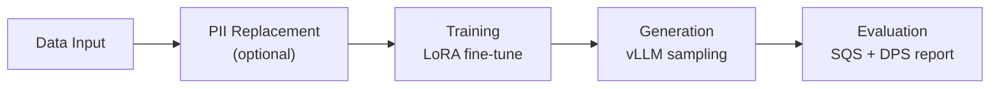

<!-- SPDX-FileCopyrightText: Copyright (c) 2025-2026 NVIDIA CORPORATION & AFFILIATES. All rights reserved. -->
<!-- SPDX-License-Identifier: Apache-2.0 -->

# Running Safe Synthesizer

How to run the pipeline and configure each stage. For the full parameter
tables, see [Configuration Reference](configuration.md). For environment
variables, see [Environment Variables](environment.md).

---

## Running the Pipeline

The pipeline runs five stages in sequence. Each stage is optional or configurable; the diagram shows the default full run.



Run the full end-to-end pipeline in one step:

=== "YAML"

    ```yaml
    training:
      pretrained_model: "HuggingFaceTB/SmolLM3-3B"
      learning_rate: 0.0005
    generation:
      num_records: 1000
    enable_replace_pii: false
    ```

    ```bash
    safe-synthesizer run --config config.yaml --url data.csv
    ```

=== "CLI"

    ```bash
    safe-synthesizer run \
      --config config.yaml \
      --url data.csv \
      --artifact-path ./artifacts
    ```

=== "SDK"

    ```python
    from nemo_safe_synthesizer.sdk.library_builder import SafeSynthesizer
    from nemo_safe_synthesizer.config import SafeSynthesizerParameters

    config = SafeSynthesizerParameters.from_yaml("config.yaml")
    synthesizer = SafeSynthesizer(config).with_data_source("data.csv")
    synthesizer.run()

    results = synthesizer.results
    ```

You can also run stages individually:

- `safe-synthesizer run train` -- train only, saves the adapter
- `safe-synthesizer run generate` -- generate only (use `--auto-discover-adapter` or `--run-path`)
- PII replacement only: `safe-synthesizer run --enable_replace_pii true --enable_synthesis false --url data.csv`
- SDK stepwise: `process_data()` -> `train()` -> `generate()` -> `evaluate()`

---

## CLI Commands

All commands are accessed through `safe-synthesizer`.

```bash
safe-synthesizer --help
```

### `run` -- Execute the Pipeline

Without a subcommand, runs the full end-to-end pipeline (data processing,
optional PII replacement, training, generation, evaluation).

```bash
safe-synthesizer run --config config.yaml --url data.csv
```

#### Common Options

These options apply to `run` and `run generate`. Only `--url` is required;
all others have defaults or are optional.

| Option | Env var | Default | Description |
|--------|---------|---------|-------------|
| `--config` | `NSS_CONFIG` | (model defaults) | Path to YAML config file; omit to use all model defaults |
| `--url` | -- | (required) | Dataset path, URL, or name from `--dataset-registry` |
| `--artifact-path` | `NSS_ARTIFACTS_PATH` | `./safe-synthesizer-artifacts` | Base directory for all runs |
| `--run-path` | -- | -- | Explicit run directory (for `run generate`, must point to an existing trained run) |
| `--output-file` | -- | -- | Path to output CSV file |
| `--log-format` | `NSS_LOG_FORMAT` | `plain` (TTY) / `json` (non-TTY) | Console log format -- auto-detected from TTY; accepts `plain` or `json` |
| `--log-file` | `NSS_LOG_FILE` | -- | Log file path (defaults to run directory) |
| `--log-color` / `--no-log-color` | `NSS_LOG_COLOR` | auto | Colorize console output (auto-detected from TTY) |
| `--wandb-mode` | `NSS_WANDB_MODE` | `disabled` | WandB mode (`online`, `offline`, `disabled`) |
| `--wandb-project` | `NSS_WANDB_PROJECT` | -- | WandB project name |
| `--dataset-registry` | `NSS_DATASET_REGISTRY` | -- | Dataset registry YAML path/URL |
| `-v` / `-vv` | -- | -- | Verbose logging (`-v` debug, `-vv` debug + dependencies) |

#### Synthesis Parameter Overrides

Any synthesis parameter can be overridden on the command line using
`--section__field` syntax (e.g., `--training__learning_rate 0.001`).
See [Configuration Reference -- CLI Override Syntax](configuration.md#cli-override-syntax)
for the full syntax, examples, and precedence rules.

### `run train`

Train only -- saves the adapter without generating or evaluating.

```bash
safe-synthesizer run train --config config.yaml --url data.csv
```

Accepts the same common options as `run`. Does not accept synthesis parameter overrides (`--training__learning_rate`, `--generation__num_records`, etc.) -- those only work with `run` (end-to-end) or `run generate`.

### `run generate`

Generate only -- requires a previously trained adapter.

```bash
safe-synthesizer run generate \
  --config config.yaml \
  --url data.csv \
  --auto-discover-adapter

# Or specify an explicit run path
safe-synthesizer run generate \
  --config config.yaml \
  --url data.csv \
  --run-path ./safe-synthesizer-artifacts/myconfig---mydata/2026-01-15T12:00:00
```

| Option | Description |
|--------|-------------|
| `--auto-discover-adapter` | Find the latest trained adapter in the artifact directory |
| `--run-path` | Explicit path to a previous run's output directory |
| `--wandb-resume-job-id` | WandB run ID to resume (or path to file containing the ID) |

Accepts the same common options and synthesis parameter overrides as `run`.

### `artifacts clean`

Delete artifacts from a previous run:

```bash
safe-synthesizer artifacts clean --artifact-path ./safe-synthesizer-artifacts
safe-synthesizer artifacts clean --caches-only   # training cache only
safe-synthesizer artifacts clean --dry-run        # preview what would be deleted
```

| Option | Description |
|--------|-------------|
| `--artifact-path` | Path to artifact directory (defaults to `./safe-synthesizer-artifacts`) |
| `--dry-run` | Preview deletions without actually deleting |
| `--caches-only` | Only delete the training cache, keep everything else |
| `--force` | Skip confirmation prompt |

---

## Data Input

Provide your dataset as a file path, URL, DataFrame (SDK), or dataset
registry name.

Data source options:

- CLI / dataset registry: `--url data.csv` -- supports `.csv`, `.json`, `.jsonl`, `.parquet`, `.txt`
- URL: `--url https://example.com/data.csv`
- DataFrame (SDK): `.with_data_source(df)` -- supports any format you can load into pandas
- CSV path (SDK): `.with_data_source("data.csv")` -- loaded via `pd.read_csv`; for non-CSV formats, load into a DataFrame first
- Dataset registry name: `--url my_dataset` (with `--dataset-registry registry.yaml`)

### Grouping and Ordering

Use `data.group_training_examples_by` to group records by a column (e.g.,
customer ID) so related rows are trained together. Use
`data.order_training_examples_by` to sort within groups (requires group_by).

=== "YAML"

    ```yaml
    data:
      group_training_examples_by: "customer_id"
      order_training_examples_by: "transaction_date"
    ```

=== "CLI"

    ```bash
    safe-synthesizer run \
      --data__group_training_examples_by customer_id \
      --data__order_training_examples_by transaction_date \
      --url transactions.csv
    ```

=== "SDK"

    ```python
    synthesizer = (
        SafeSynthesizer(config)
        .with_data_source("transactions.csv")
        .with_data(
            group_training_examples_by="customer_id",
            order_training_examples_by="transaction_date",
        )
    )
    ```

### Dataset Registry

Define named datasets in a YAML file to reference them by name:

```yaml
base_url: "/data/datasets"
datasets:
  - name: "customer_transactions"
    url: "customers/transactions.csv"
    overrides:
      data:
        group_training_examples_by: "customer_id"
```

```bash
safe-synthesizer run --dataset-registry registry.yaml --url customer_transactions
```

See [Configuration Reference -- Data](configuration.md#data) for the full parameter table.

---

## PII Replacement

Optional stage that runs before training. Detection works in two independent
steps: GLiNER NER scans free-text columns for named-entity patterns (names,
emails, phone numbers, etc.) and replaces matches with synthetic placeholders.
An optional second step uses an LLM to classify which columns contain
exclusively sensitive data of one type (e.g., a column that is always SSNs),
marking those columns for wholesale replacement before training. The two steps
are independent -- NER runs on free-text content, LLM classification targets
structured sensitive columns. PII replacement is on by default
(`enable_replace_pii: true`).

!!! tip
    If your dataset does not contain PII, set `enable_replace_pii: false` to
    skip this stage entirely and reduce pipeline runtime.

=== "YAML"

    ```yaml
    enable_replace_pii: true
    ```

    To customize entity types or classification, use the SDK builder -- the
    `replace_pii` config block requires the full `steps` field which is
    verbose in YAML.

=== "CLI"

    ```bash
    safe-synthesizer run \
      --enable_replace_pii true \
      --url data.csv
    ```

=== "SDK"

    ```python
    from nemo_safe_synthesizer.config.replace_pii import PiiReplacerConfig

    pii_config = PiiReplacerConfig.get_default_config()
    pii_config.globals.classify.enable_classify = True
    pii_config.globals.classify.entities = ["email", "phone_number", "ssn"]

    synthesizer = (
        SafeSynthesizer(config)
        .with_data_source("data.csv")
        .with_replace_pii(config=pii_config)
        .with_train()
        .with_generate(num_records=5000)
    )
    ```

    The SDK builder merges partial overrides with
    `PiiReplacerConfig.get_default_config()`, so you don't need to
    provide the full `steps` list.

### LLM Column Classification

To enable LLM-based column classification (optional), set the endpoint
before running the pipeline. Any OpenAI-compatible inference endpoint
works -- not just NVIDIA NIM:

```bash
export NIM_ENDPOINT_URL="https://your-inference-endpoint"
export NIM_API_KEY="your-api-key"  # pragma: allowlist secret  (optional -- only needed for direct endpoints, not inference gateways)
```

When `NIM_ENDPOINT_URL` is unset, the classification step is attempted but
falls back to NER-only detection (with an error log). No environment
variables are required for NER-only PII replacement; column classification
requires `NIM_ENDPOINT_URL`.

### PII-Only Mode

Set `enable_synthesis: false` with `enable_replace_pii: true` to run PII
replacement without synthesis.

See [Configuration Reference -- PII Replacement](configuration.md#pii-replacement) for the full parameter reference.

---

## Training

Fine-tunes a pretrained LLM on your data using LoRA (Low-Rank Adaptation).
LoRA inserts a small set of trainable adapter weights into the frozen pretrained
model. Only the adapter is updated during training, which keeps VRAM
requirements low and produces a compact artifact that can be reused for
generation without re-training.

Two backends are available:

| Backend | Description | When to use |
|---------|-------------|-------------|
| Unsloth | Optimized kernels for faster fine-tuning | Default -- use unless you need DP or a custom quantization setup |
| HuggingFace | Standard PEFT training with 4-bit/8-bit quantization and optional differential privacy via Opacus | Required for differential privacy; also the fallback when Unsloth is unavailable |

=== "YAML"

    ```yaml
    training:
      pretrained_model: "HuggingFaceTB/SmolLM3-3B"
      learning_rate: 0.001
      batch_size: 4
    ```

=== "CLI"

    ```bash
    safe-synthesizer run \
      --training__learning_rate 0.001 \
      --training__batch_size 4 \
      --url data.csv
    ```

=== "SDK"

    ```python
    synthesizer = (
        SafeSynthesizer(config)
        .with_data_source("data.csv")
        .with_train(learning_rate=0.001, batch_size=4)
    )
    ```

### Quantization

Enabling quantization reduces VRAM consumption at the cost of some numerical
precision. Set `training.quantize_model` to `true` and choose a bit width with
`training.quantization_bits`.

| Setting | VRAM | Precision | Speed | Notes |
|---------|------|-----------|-------|-------|
| No quantization | Highest | Full | Baseline | Use when VRAM is not a constraint |
| 8-bit | ~50% reduction | Near-full | Slightly slower | Good balance for most cases |
| 4-bit | ~75% reduction | Reduced | Faster | Use when VRAM is tight; may affect output quality |

=== "YAML"

    ```yaml
    training:
      quantize_model: true
      quantization_bits: 4
    ```

=== "CLI"

    ```bash
    safe-synthesizer run \
      --training__quantize_model true \
      --training__quantization_bits 4 \
      --url data.csv
    ```

=== "SDK"

    ```python
    synthesizer = (
        SafeSynthesizer(config)
        .with_data_source("data.csv")
        .with_train(quantize_model=True, quantization_bits=4)
    )
    ```

### Attention Backends

`training.attn_implementation` controls which attention kernel is used when
loading the model. The default uses Flash Attention 3 via the HuggingFace
Kernels Hub and falls back to `sdpa` when the `kernels` package is not
installed.

Common values:

- `kernels-community/vllm-flash-attn3`: Flash Attention 3 (default, requires `kernels` package)
- `flash_attention_2`: Flash Attention 2 (requires `flash-attn` package)
- `sdpa`: PyTorch scaled dot-product attention -- broadest compatibility
- `eager`: standard PyTorch attention -- useful for debugging

!!! note "Training vs generation attention backends"
    The training attention backend (`training.attn_implementation`) and the
    generation attention backend (`generation.attention_backend` /
    `VLLM_ATTENTION_BACKEND`) are independent settings.

### Differential Privacy

Differential privacy (DP) provides a formal bound on what an adversary can
learn about any individual record. Safe Synthesizer implements DP-SGD via
Opacus.

=== "YAML"

    ```yaml
    privacy:
      dp_enabled: true
      epsilon: 8.0
    ```

=== "CLI"

    ```bash
    safe-synthesizer run \
      --privacy__dp_enabled true \
      --privacy__epsilon 8.0 \
      --url data.csv
    ```

=== "SDK"

    ```python
    synthesizer = (
        SafeSynthesizer(config)
        .with_data_source("data.csv")
        .with_differential_privacy(dp_enabled=True, epsilon=8.0)
    )
    ```

Compatibility constraints when DP is enabled:

- Set `training.use_unsloth` to `false` or leave it at `"auto"` -- `"auto"` resolves to `false` when DP is enabled
- `data.max_sequences_per_example` must be `1` (or `"auto"`, which resolves to `1` when DP is enabled)
- Gradient checkpointing is disabled (incompatible with Opacus)

!!! note
    DP training is slower and typically requires more epochs to reach the same
    loss as non-DP training. Start with `epsilon: 8.0` -- a common practical
    threshold -- and lower it only if your privacy requirements demand it.
    Very low epsilon values (e.g., below 1.0) significantly degrade model
    utility.

See [Configuration Reference -- Differential Privacy](configuration.md#differential-privacy) for the full parameter table.

---

## Generation

Produces synthetic records using the trained LoRA adapter via vLLM. The
generation stage runs a sampling loop: the model generates batches of records,
each record is validated against the original dataset schema (correct columns,
correct types, no malformed values), and valid records accumulate until
`num_records` is reached. If too many consecutive batches produce mostly invalid
records, the loop stops early.


=== "YAML"

    ```yaml
    generation:
      num_records: 5000
      temperature: 0.7
    ```

=== "CLI"

    ```bash
    safe-synthesizer run \
      --generation__num_records 5000 \
      --generation__temperature 0.7 \
      --url data.csv
    ```

=== "SDK"

    ```python
    synthesizer = (
        SafeSynthesizer(config)
        .with_data_source("data.csv")
        .with_generate(num_records=5000, temperature=0.7)
    )
    ```

### Structured Generation

Set `generation.use_structured_generation` to `true` to constrain the model's
output so every record matches the dataset schema. This reduces the fraction of
invalid records, typically at the cost of reducing the quality of the generated
records. Use it when the pipeline struggles to produce valid records.

=== "YAML"

    ```yaml
    generation:
      use_structured_generation: true
      structured_generation_schema_method: "regex"
    ```

=== "CLI"

    ```bash
    safe-synthesizer run \
      --generation__use_structured_generation true \
      --url data.csv
    ```

=== "SDK"

    ```python
    synthesizer = (
        SafeSynthesizer(config)
        .with_data_source("data.csv")
        .with_generate(use_structured_generation=True)
    )
    ```

- `"regex"`: constructs a custom regex from the dataset schema. More comprehensive but slower.
- `"json_schema"`: passes a JSON Schema to the backend. Faster, but may miss edge cases.

### Stopping Conditions

Generation stops early when too many consecutive batches produce mostly invalid
records. `generation.patience` controls how many bad batches to tolerate;
`generation.invalid_fraction_threshold` defines what counts as "bad." If the
pipeline stops early, check the generation logs for the invalid record
fraction per batch.

=== "YAML"

    ```yaml
    generation:
      patience: 5
      invalid_fraction_threshold: 0.6
    ```

=== "CLI"

    ```bash
    safe-synthesizer run \
      --generation__patience 5 \
      --generation__invalid_fraction_threshold 0.6 \
      --url data.csv
    ```

!!! tip
    If the pipeline stops early due to patience, try enabling
    `use_structured_generation: true` to constrain outputs to the dataset
    schema, or lower `temperature` to reduce the chance of malformed records.

See [Configuration Reference -- Generation](configuration.md#generation) for the full parameter table.

---

## Evaluation

Measures quality and privacy of synthetic data and produces an HTML report
with interactive visualizations. Two composite scores are reported:

- Synthetic Quality Score (SQS): measures statistical fidelity -- how well
  column distributions, correlations, and structure in the synthetic data match
  the training data. Higher is better (scale of 0--10).
- Data Privacy Score (DPS): measures resistance to privacy attacks. Higher
  means the synthetic data leaks less information about individual training
  records.

See [Evaluating Output Data](evaluating-data.md) for details on score
interpretation and the privacy checks (MIA, AIA, PII Replay) that contribute
to DPS.

=== "YAML"

    ```yaml
    evaluation:
      mia_enabled: true
      aia_enabled: true
      pii_replay_enabled: true
    ```

=== "CLI"

    ```bash
    safe-synthesizer run \
      --evaluation__mia_enabled false \
      --evaluation__aia_enabled false \
      --url data.csv
    ```

=== "SDK"

    ```python
    synthesizer = (
        SafeSynthesizer(config)
        .with_data_source("data.csv")
        .with_evaluate(mia_enabled=False, aia_enabled=False)
    )
    ```

### Disable Evaluation

To skip evaluation entirely (e.g., for faster iteration during development):

=== "YAML"

    ```yaml
    evaluation:
      enabled: false
    ```

=== "CLI"

    ```bash
    safe-synthesizer run \
      --evaluation__enabled false \
      --url data.csv
    ```

=== "SDK"

    ```python
    synthesizer = (
        SafeSynthesizer(config)
        .with_data_source("data.csv")
        .with_evaluate(enabled=False)
    )
    ```

See [Configuration Reference -- Evaluation](configuration.md#evaluation) for the full parameter table.

---

## Time Series Mode

!!! warning "Experimental"
    Time series synthesis is an experimental feature. APIs and behavior may
    change between releases.

Enable time series mode by setting `time_series.is_timeseries: true` and
providing timestamp configuration. Use `data.group_training_examples_by` to
group records by entity (e.g., sensor ID) and `data.order_training_examples_by`
to sort within groups.

=== "YAML"

    ```yaml
    time_series:
      is_timeseries: true
      timestamp_column: "timestamp"
      timestamp_interval_seconds: 60
    data:
      group_training_examples_by: "sensor_id"
      order_training_examples_by: "timestamp"
    ```

=== "CLI"

    ```bash
    safe-synthesizer run \
      --time_series__is_timeseries true \
      --time_series__timestamp_column timestamp \
      --time_series__timestamp_interval_seconds 60 \
      --data__group_training_examples_by sensor_id \
      --url sensor_data.csv
    ```

=== "SDK"

    ```python
    synthesizer = (
        SafeSynthesizer(config)
        .with_data_source("sensor_data.csv")
        .with_time_series(
            is_timeseries=True,
            timestamp_column="timestamp",
            timestamp_interval_seconds=60,
        )
        .with_data(
            group_training_examples_by="sensor_id",
            order_training_examples_by="timestamp",
        )
    )
    ```

See [Configuration Reference -- Time Series](configuration.md#time-series) for the full parameter table.
See [Troubleshooting -- Time Series](troubleshooting.md#time-series) for common issues.

---

## Run Individual Stages

### Train only

=== "CLI"

    ```bash
    safe-synthesizer run train --config config.yaml --url data.csv
    ```

=== "SDK"

    ```python
    synthesizer = SafeSynthesizer(config).with_data_source("data.csv")
    synthesizer.process_data()
    synthesizer.train()
    ```

### Generate only

Use `--auto-discover-adapter` to find the latest trained adapter, or
`--run-path` for an explicit location. See [`run generate`](#run-generate) in
the CLI Commands section for all options.

=== "CLI"

    ```bash
    safe-synthesizer run generate \
      --config config.yaml \
      --url data.csv \
      --auto-discover-adapter
    ```

=== "SDK"

    ```python
    from pathlib import Path
    from nemo_safe_synthesizer.cli.artifact_structure import Workdir

    workdir = Workdir.from_path(
        Path("./safe-synthesizer-artifacts/myconfig---mydata/2026-01-15T12:00:00")
    )
    synthesizer = SafeSynthesizer(config, workdir=workdir)
    synthesizer.load_from_save_path()
    synthesizer.generate().evaluate()
    ```

### Stepwise execution (SDK)

For full control, call each stage individually:

```python
synthesizer = (
    SafeSynthesizer(config)
    .with_data_source(df)
    .process_data()
    .train()
    .generate()
    .evaluate()
)

results = synthesizer.results
synthesizer.save_results()
```

---

## Artifacts and Output

Each run writes to a directory named `<config-stem>---<dataset-stem>/<timestamp>`
under the artifact path. The config and dataset stems are derived from the
filenames you pass to `--config` and `--url`, making it easy to identify runs
at a glance. The timestamp is ISO 8601 (e.g., `2026-01-15T12:00:00`).

To use an explicit output directory (skipping the auto-generated
`<config>---<dataset>/<timestamp>` structure), pass `--run-path`:

```bash
safe-synthesizer run --config config.yaml --url data.csv --run-path ./my-run
```

```text
safe-synthesizer-artifacts/
└── <config>---<dataset>/
    └── <run_name>/
        ├── safe-synthesizer-config.json
        ├── train/
        │   └── adapter/
        ├── generate/
        │   ├── synthetic_data.csv
        │   └── evaluation_report.html
        └── dataset/
            ├── training.csv
            ├── test.csv
            └── validation.csv
```

Key outputs:

- `generate/synthetic_data.csv`: the synthetic dataset
- `generate/evaluation_report.html`: quality and privacy report
- `train/adapter/`: LoRA weights for resuming generation
- `safe-synthesizer-config.json`: resolved config snapshot

!!! tip
    Adapter weights and training caches can consume significant disk space
    during iterative development. Run `safe-synthesizer artifacts clean` to
    remove them when no longer needed. Use `--caches-only` to keep the adapter
    but reclaim training cache space.

### SDK Results Access

```python
results = synthesizer.results
df = results.synthetic_data
summary = results.summary
synthesizer.save_results()
```

### Cleaning Up

See [`artifacts clean`](#artifacts-clean) in the CLI Commands section for options.

---

## Running in Offline Environments

Pre-cache models by running once with internet access, then set
`HF_HUB_OFFLINE=1` in your target environment. For detailed cache setup
and environment variables (`HF_HOME`, `HF_HUB_OFFLINE`, `LOCAL_FILES_ONLY`,
`VLLM_CACHE_ROOT`), see
[Environment Variables -- Hugging Face Cache](environment.md#hugging-face-cache).

For offline-specific errors, see [Troubleshooting](troubleshooting.md).

---

## Logging and Experiment Tracking

### Log Format

| Method | Setting |
|--------|---------|
| CLI | `--log-format json` or `--log-format plain` |
| Environment | `NSS_LOG_FORMAT=json` |

The format auto-detects from the terminal: `plain` when stdout is a TTY, `json` otherwise.

=== "plain"

    Human-readable columns separated by `|`. Used by default in interactive terminals.

    ```text
    2026-01-15T12:03:42.001 | Nemo Safe Synthesizer | user    | info  | training.py:TrainingBackend.train:87
    Training complete

    2026-01-15T12:03:42.105 | Nemo Safe Synthesizer | runtime | info  | generation.py:VllmBackend._generate:214
    Batch complete: {'valid': 48, 'invalid': 2}
    ```

=== "json"

    One JSON object per line. Used by default in non-TTY environments (CI, containers, log aggregators).

    ```json
    {"timestamp": "2026-01-15T12:03:42.001000Z", "level": "info", "filename": "training.py", "lineno": 87, "category": "user", "message": "Training complete"}
    {"timestamp": "2026-01-15T12:03:42.105000Z", "level": "info", "filename": "generation.py", "lineno": 214, "category": "runtime", "message": "Batch complete", "valid": 48, "invalid": 2}
    ```

Log categories in both formats:

- `user` -- user-relevant progress and results (training complete, generation done)
- `runtime` -- internal operational details (memory, timings, batch stats)
- `system` -- system-level events (startup, config loaded)
- `backend` -- logs from dependencies (vLLM, HuggingFace, etc.)

Verbosity: `-v` for debug, `-vv` for debug + dependencies.

### WandB Integration

WandB is configured via CLI flags or environment variables -- not in the YAML
config file.

=== "CLI"

    ```bash
    safe-synthesizer run \
      --config config.yaml \
      --url data.csv \
      --wandb-mode online \
      --wandb-project my-experiments
    ```

=== "SDK"

    ```python
    import os
    import wandb

    os.environ["WANDB_API_KEY"] = "your-api-key"  # pragma: allowlist secret
    wandb.init(project="my-experiments", mode="online")

    synthesizer = SafeSynthesizer(config).with_data_source("data.csv")
    synthesizer.run()
    ```

    Unlike the CLI, the SDK does not auto-initialize WandB. You must call
    `wandb.init(...)` before `synthesizer.run()`.

=== "Environment"

    ```bash
    export WANDB_API_KEY="your-api-key"  # pragma: allowlist secret
    export WANDB_PROJECT="my-experiments"
    export NSS_WANDB_MODE="online"
    ```

    These environment variables are read by the CLI only. SDK users must
    call `wandb.init(...)` explicitly.

For parameter precedence (CLI flags vs environment variables vs YAML), see
[Environment Variables -- Precedence](environment.md#precedence).
