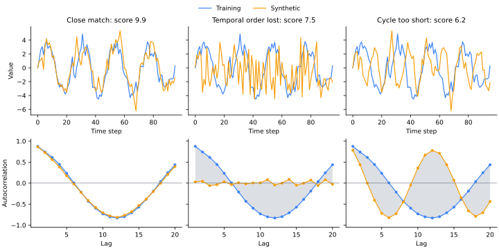
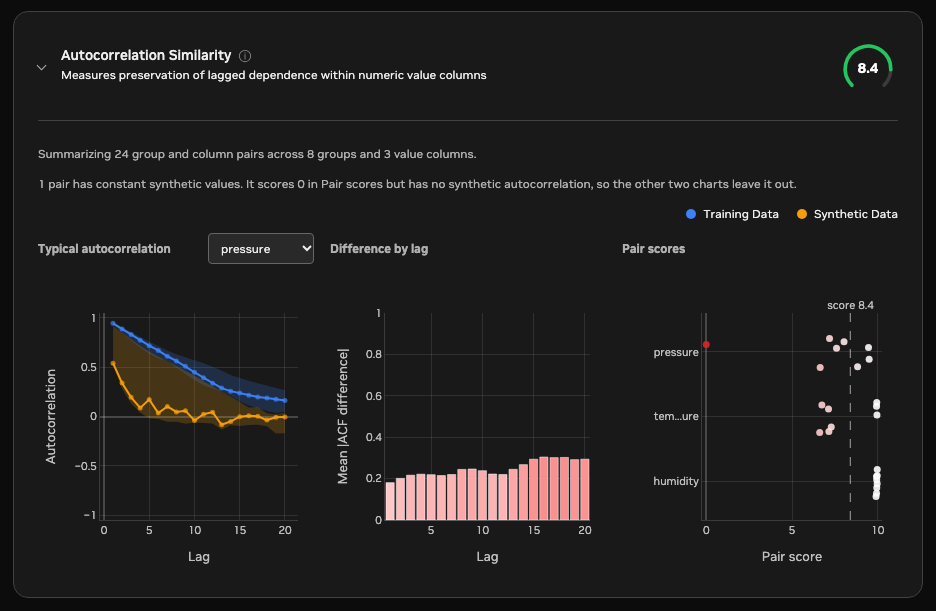

<!-- SPDX-FileCopyrightText: Copyright (c) 2025-2026 NVIDIA CORPORATION & AFFILIATES. All rights reserved. -->
<!-- SPDX-License-Identifier: Apache-2.0 -->

# Autocorrelation Similarity

Autocorrelation Similarity measures whether synthetic values depend on their
recent history in the same way as training values. It can reveal lost
persistence, incorrect oscillation, overly smooth or repetitive behavior, and
synthetic sequences whose temporal order has been disrupted.

## Reading the score

A higher score means the training and synthetic autocorrelation profiles are more alike.



Each column above compares one training series with one synthetic series. The
top row shows the values, and the bottom row shows their autocorrelation at
each lag. The shaded gap between the two profiles is what lowers the score.

- A score near 10 can occur when synthetic and training profiles overlap across the evaluated lags.
- A middle score can occur when the general profile shape is preserved but a
  cycle has shifted or persistence decays at a different rate.
- A lower score can occur when the synthetic data loses temporal order or its
  lag relationships oppose the training profile. Because autocorrelation
  rarely stays near 1 or -1 across every lag, synthetic series that vary
  seldom score below about 5, even when their lag structure is unrelated or
  opposite to the training data.
- A group and column pair scores 0 when its synthetic values are constant.

These examples are not calibrated quality bands. Compare scores only when the
selected columns, groups, and `max_lag` are the same. Whether a difference
matters depends on the downstream use case. For example, preserving short-term
dependence may be critical for sensor simulation but unimportant for a workload
that uses only long-term totals.

## Calculation

For every usable group and numeric value column, the metric computes the Pearson
correlation between values at positions `t` and `t + lag`. Each lag uses only
endpoint pairs that are finite in that sequence and requires at least three
pairs. It then takes the mean absolute difference between the training and
synthetic profiles, divides by 2 to map the maximum possible difference to 1,
and calculates:

`profile similarity = 1 - (mean absolute profile difference / 2)`

The final 0–10 score is ten times the mean profile similarity. Therefore, 10
means matching profiles and lower scores mean larger lag-by-lag disagreement.

Non-finite observations remain as gaps in their original temporal positions, so
an invalid observation cannot collapse the time axis. A comparison is skipped
when the training series is constant because its autocorrelation is undefined.
If the training series varies but the synthetic series is constant, that
comparison receives zero similarity to represent complete loss of temporal
variation.

## Configuration

Time-series evaluation is off by default. Enable it explicitly to compute the
metric and add a Time-Series Metrics panel to the Synthetic Quality section of
the HTML evaluation report.

```yaml
time_series:
  is_timeseries: true
  timestamp_column: time
evaluation:
  time_series:
    enabled: true
    autocorrelation:
      value_columns: null
      max_lag: 20
      min_points: 4
      max_groups: 128
```

`value_columns: null` evaluates all shared columns inferred as numeric. Set an
explicit list to evaluate only selected numeric channels. Timestamp ordering
uses `time_series.timestamp_column`, and sequence grouping uses
`data.group_training_examples_by`.

If more than `max_groups` groups are shared, the metric evaluates a reproducible
seeded sample instead of favoring labels that sort first. The result reports the
total, evaluated, and omitted shared-group counts. Changing `value_columns`,
`max_lag`, or the grouping configuration changes what the aggregate score
measures.

## Reading the report charts

The metric card shows three charts built from every evaluated group and column pair.



The example above comes from a dataset of eight sensors, grouped by sensor ID,
with three value columns: `temperature`, `pressure`, and `humidity`. The
synthetic data reproduces sensors 0 to 2 well, loses persistence in
`temperature` and `pressure` for sensors 3 to 7, and generates a constant
`pressure` series for sensor 7. `humidity` is preserved for every sensor.

- Typical autocorrelation: plots the median training and synthetic
  autocorrelation at each lag, with shaded bands covering the middle 50% of
  groups. The chart opens on the column with the lowest mean pair score, here
  `pressure`. Training autocorrelation decays slowly from about 0.9, while the
  synthetic median drops below 0.2 by lag 5, so most synthetic sensors lost
  the persistence of the training data. Use the column selector to switch
  value columns.
- Difference by lag: plots the mean absolute difference between paired
  training and synthetic profiles at each lag, across all value columns. Here
  the difference grows from about 0.18 at lag 1 to about 0.3 at lag 15 and
  beyond, so the loss is largest for long-range persistence. A peak at one lag
  instead points to a missing or shifted cycle. The y-axis always spans at
  least 0 to 1, so short, pale bars mean small differences, and bars turn
  red as the difference approaches 0.5.
- Pair scores: plots every group and column pair score on the 0–10 scale,
  with the overall score marked by the dashed line. Each point is one sensor,
  shaded from white at 10 to red at 0.
  `humidity` scores near 10 for all sensors, while `pressure` and
  `temperature` split into a cluster between about 9 and 10 for the
  well-reproduced sensors and a cluster between about 6.5 and 8 for the
  others. The gap between the overall score and 10 is therefore driven by
  specific sensors rather than the whole dataset. The
  chart plots the 8 lowest-scoring columns. Column names longer than 10
  characters are shortened to their first and last three characters, as with
  `tem...ure`. Hover over a point to see its full column name and group.

A pair whose synthetic values are constant scores 0 but has no synthetic
autocorrelation, so only Pair scores shows it. In the example, the `pressure`
point at 0 is sensor 7, and the note above the charts reports it. The
Typical autocorrelation median for `pressure` uses the remaining seven sensors.

## Limitations

Autocorrelation summarizes average linear dependence within one value channel.
Different sequences can have similar autocorrelation profiles, so a high score
does not mean that individual events, amplitudes, or phases match. A single
profile can also hide local regime changes, and irregular sampling intervals
can make lag comparisons misleading. Binary and categorical channels require
different lag-association measures and are not selected automatically. The
metric does not establish causality or show whether the synthetic data
memorizes training sequences. Interpret the score at a lag range and sequence
granularity that match the behavior you need to preserve.
