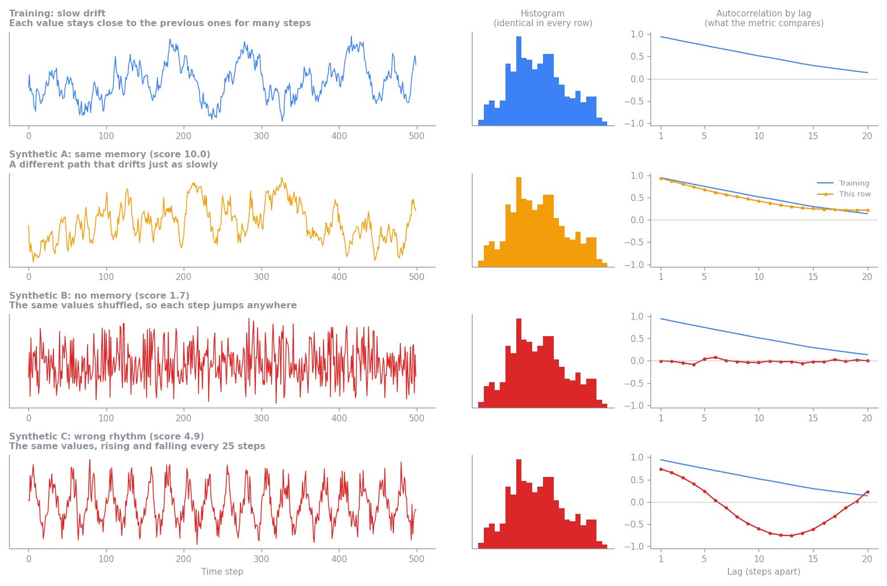
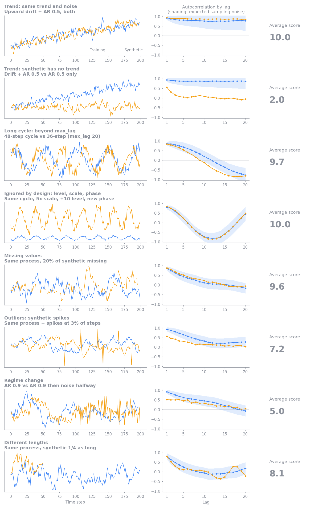

<!-- SPDX-FileCopyrightText: Copyright (c) 2025-2026 NVIDIA CORPORATION & AFFILIATES. All rights reserved. -->
<!-- SPDX-License-Identifier: Apache-2.0 -->

# Autocorrelation Similarity

Autocorrelation Similarity checks whether synthetic numeric columns change over
time the way the training columns do. Column-level metrics, such as histograms,
compare which values appear. This metric compares the order those values appear
in: how strongly each value resembles the values a few steps earlier.

Two properties matter most:

- Persistence, or memory: how long a value stays close to its recent past. A
  slowly drifting temperature has strong persistence, and a value that jumps
  anywhere at every step has none.
- Rhythm: whether values rise and fall in a repeating cycle, such as a daily
  pattern, and how long that cycle is.

The figure below shows one training sequence and three synthetic sequences that
all contain exactly the same values, so their histograms are identical. Only
the order differs. The right column shows each sequence's autocorrelation: the
correlation between each value and the value 1, 2, and up to 20 steps later.



- Synthetic A takes a different path but drifts just as slowly. Its
  autocorrelation follows the training curve, so it scores 10.0.
- Synthetic B is the training values shuffled. Each value is unrelated to the
  one before it, so its autocorrelation is flat at 0 and it scores 0.0.
- Synthetic C repeats every 25 steps. Its autocorrelation dips negative half a
  cycle later and rises again, which the training data never does. It scores
  2.2, because only the first few lags match.

## Reading the score

A higher score means the synthetic data's autocorrelation is closer to the
training data's. Differences small enough to be explained by chance do not
lower the score, so synthetic data generated by the same process as the
training data scores near 10, and synthetic data with no temporal structure
left scores near 0.

The score covers only how values depend on their own recent past. A low score
does not mean the synthetic data is bad overall. It means the synthetic data
does not reproduce the persistence or rhythm of the training data. The values
themselves, their distributions, and the relationships between columns can
still match well, as with the shuffled series in the figure above, which has
exactly the training values and scores 0.0. Read this score alongside the
Synthetic Quality Score, and weigh it by how much your use case depends on
behavior over time.

### Example scenarios

The figures below show how the metric scores one group and column pair in a
range of situations. Each row compares one training series (blue) with one
synthetic series (orange):

- The left chart shows the values.
- The middle chart shows their autocorrelation at lags 1 to 20. A lag is the
  number of steps between the two values being compared. The shaded band is
  the sampling noise the score allows for.
- The right column shows the average score across 200 random pairs from the
  same scenario, with 200 points per sequence. The plotted pair is one of
  them, and a single pair can land a point or more away from the average.




With about 200 points per sequence, scores fall into rough tiers:

- About 8 to 10: the synthetic data keeps the training data's persistence and
  cycles. Two pure-noise series average about 8.5, because a single pair's
  chance differences sometimes exceed what sampling noise predicts.
- About 2 to 7: the synthetic data keeps some structure but loses part of it,
  for example weaker persistence, a cycle buried in noise, a regime change, or
  too much smoothness. Occasional outlier spikes lower the score less, to
  about 7.
- About 0 to 2: the synthetic data has lost its structure over time, as when
  values are shuffled, a trend is missing, or a cycle has the wrong length.
- 0: the synthetic values are constant.

Sequence length affects how much the score can tell apart. Longer sequences
measure autocorrelation more precisely, so a real difference stands out more
clearly and scores lower. Shorter sequences carry less evidence, so the metric
gives them more benefit of the doubt and their scores bunch toward the middle.
Synthetic data from the same process scores high at any length. The metric
also cannot see patterns longer than `max_lag` steps, and by design it ignores
differences in level, scale, and phase, as the additional scenarios show.

These tiers are a guide rather than pass or fail thresholds. Compare scores
only when the selected columns, groups, and `max_lag` are the same. Whether a
difference matters depends on the downstream use case. For example, preserving
short-term persistence may be critical for sensor simulation but unimportant
for a workload that uses only long-term totals.

### Reading the report charts

The metric card shows three charts built from every evaluated group and column
pair. Select the info icon next to a chart title for a short reminder of how
to read it.


The example above comes from a dataset of eight sensors, grouped by sensor ID,
with three numeric columns: `temperature`, `pressure`, and `humidity`. The
synthetic data reproduces sensor 0 closely and drifts further from the
training data with each sensor after it: weaker persistence, a stretched
cycle, and more noise. Sensor 7 also has a constant `pressure` series. You
can confirm each of these details in the report itself: use the column
selector on the first chart, and hover over any bar or point to see its exact
values.

- Typical autocorrelation: plots the median training and synthetic
  autocorrelation at each lag for one numeric column. The shaded bands cover
  the middle 50% of groups. The chart opens on the column with the lowest mean
  pair score, here `pressure`. Use the column selector next to the title to
  switch columns. For `pressure`, training autocorrelation decays slowly from
  about 0.9, while the synthetic median drops to about 0.25 by lag 4 and to 0
  by lag 10, so most synthetic sensors lost part of the training data's
  persistence.
- Difference by lag: plots the mean absolute difference between the training
  and synthetic profiles of each pair at each lag, across all numeric columns.
  Hover over a bar to see its exact value. Here the difference grows from
  about 0.2 at lag 1 to about 0.3 to 0.35 from lag 9 onward, so the loss is
  largest for long-range persistence. A peak at one lag instead points to a missing or
  shifted cycle. The y-axis always spans at least 0 to 1, so short, pale bars
  mean small differences, and bars turn red as the difference approaches 0.5.
- Pair scores: plots the score of every group and column pair on the 0–10
  scale, with the overall score marked by the dashed line. Each point is one
  sensor, shaded from white at 10 to red at 0. Points within a row are spread
  out vertically so that equal scores stay visible. Hover over a point to see
  its full column name, group, and score. Each column's scores fall steadily
  from 10 for the first sensors toward the last ones. `temperature` and
  `humidity` stay above about 5.5, while `pressure` falls to between about 2.5
  and 4.5 for sensors 3 to 6 and to 0 for the constant sensor 7 series. The
  gap between the overall score and 10 therefore comes mostly from the later
  sensors and from `pressure`, rather than from every pair equally. The chart shows the 8 lowest-scoring columns. Column
  names longer than 10 characters are shortened to their first and last three
  characters, as with `tem...ure`.

A pair whose synthetic values are constant scores 0 but has no synthetic
autocorrelation, so only Pair scores shows it. In the example, the `pressure`
point at 0 is sensor 7, and the note above the charts reports it. The
Typical autocorrelation median for `pressure` uses the remaining seven sensors.

## Configuration

Time-series evaluation runs by default whenever `time_series.is_timeseries` is
true. It computes the metric and adds a Time-Series Metrics panel to the
Synthetic Quality section of the HTML evaluation report. Set
`evaluation.time_series.enabled: false` to skip it. Setting it to `true`
without time-series mode is a configuration error.

```yaml
time_series:
  is_timeseries: true
  timestamp_column: time
evaluation:
  time_series:
    enabled: null  # null follows time_series.is_timeseries
    autocorrelation:
      value_columns: null
      max_lag: 20
      min_points: 4
      max_groups: 128
```

`value_columns: null` evaluates every column that both datasets share and that
is inferred as numeric. Set an explicit list to evaluate only selected numeric
columns. Values are ordered by `time_series.timestamp_column` and split into
sequences by `data.group_training_examples_by`.

If more than `max_groups` groups are shared, the metric evaluates a reproducible
random sample of groups instead of the ones whose labels sort first. The result
reports the total, evaluated, and omitted shared-group counts. Changing
`value_columns`, `max_lag`, or the grouping configuration changes what the
aggregate score measures.

## Limitations

Autocorrelation summarizes the average linear relationship between a numeric
column and its own past values. Different sequences can have similar
autocorrelation profiles, so a high score does not mean that individual events,
amplitudes, or phases match. A single profile can also hide a change in
behavior partway through a sequence, and irregular sampling intervals can make
lag comparisons misleading. Binary and categorical columns need different
measures and are not selected automatically. The metric does not establish
causality or show whether the synthetic data memorizes training sequences.
Interpret the score at a lag range and sequence length that match the
behavior you need to preserve.

## Calculation

For every usable group and numeric column, the metric computes the Pearson
correlation between values at positions `t` and `t + lag`, for each lag from 1
to `max_lag`. This list of correlations is the column's autocorrelation
profile. Each lag uses only pairs of values that are both present in that
sequence and requires at least three pairs. The metric then compares the
training profile \(r^{\text{train}}_k\) and the synthetic profile
\(r^{\text{synth}}_k\) lag by lag, in three steps:

1. Estimate the sampling noise at each lag. Bartlett's formula gives the
   standard error of an autocorrelation at lag \(k\) measured from \(n_k\)
   pairs, \(\sqrt{(1 + 2 \sum_{j<k} r_j^2) / n_k}\). Each measured
   \(r_j^2\) includes about \(1 / n_j\) of noise, so the metric uses
   \(\max(0, r_j^2 - 1 / n_j)\) instead, which keeps short sequences from
   overstating their noise. The noise allowance \(\sigma_k\) combines the
   training and synthetic standard errors in quadrature.
2. Weight each lag by \(w_k = 1 / \sigma_k^2\), so precisely measured lags
   count more. Sum the squared gaps between the profiles across lags, and
   subtract the squared gap that sampling noise alone would produce,
   \(\sigma_k^2\). What remains is the excess difference, floored at 0.
3. Compare the excess with the structure present at each lag,
   \(m_k = \max(|r^{\text{train}}_k|, |r^{\text{synth}}_k|, \sigma_k)\). Using
   the larger of the two profiles penalizes lost structure and invented
   structure alike:

\[
\text{profile similarity} = 1 - \sqrt{\frac{\max\left(0, \sum_k w_k \left[(r^{\text{train}}_k - r^{\text{synth}}_k)^2 - \sigma_k^2\right]\right)}{\sum_k w_k m_k^2}}
\]

Subtracting the expected noise before taking the square root means that two
sequences from the same process do not lose points on average, at any length,
and pooling the lags before the square root keeps several small chance gaps
from adding up to a large penalty. The result is clipped to the range 0 to 1.
The final 0–10 score is ten times
the mean profile similarity across group and column pairs. Therefore, 10 means
the profiles agree within sampling noise, and 0 means none of the training
data's structure over time is reproduced.

Missing and non-finite values stay as gaps in their original positions, so
removing them cannot pull distant values next to each other. A comparison is
skipped when the training series is constant, because its autocorrelation is
undefined. If the training series varies but the synthetic series is constant,
that comparison scores 0 to represent complete loss of variation over time.
