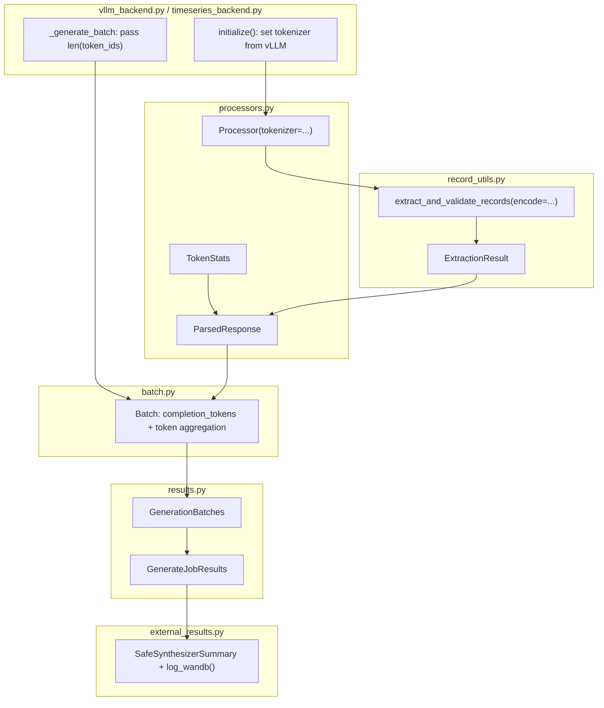

# Generation Token Statistics

## Architecture

Token counts originate at two levels: (a) per-record tokens from `tokenizer.encode()` on each regex-matched JSON string inside `extract_and_validate_records`, and (b) total completion tokens from vLLM's `len(output.token_ids)`. Non-record tokens = total - valid - invalid (exact, no estimation).



## 1. `ExtractionResult` dataclass

**File:** `record_utils.py`

Replace the 3-tuple return from extraction functions with a frozen dataclass. Extensible without breaking callers.

```python
@dataclass(frozen=True)
class ExtractionResult:
    """Result of extracting and validating records from a JSONL string."""

    valid_records: list[dict] = field(default_factory=list)
    """Records that passed schema validation."""

    invalid_records: list[str] = field(default_factory=list)
    """Raw text of records that failed validation."""

    errors: list[tuple[str, str]] = field(default_factory=list)
    """``(detailed_msg, validator)`` tuples for each invalid record."""

    valid_record_tokens: int = 0
    """Token count across all valid records."""

    invalid_record_tokens: int = 0
    """Token count across all invalid records."""

    tokenization_time_sec: float = 0.0
    """Wall-clock seconds spent in ``encode()`` calls."""
```

Callers migrate from `valid, invalid, errors = extract_and_validate_records(...)` to `result = extract_and_validate_records(...)` with `result.valid_records`, etc.

## 2. `TokenStats` dataclass

**File:** `processors.py`

Frozen dataclass alongside `ParsedResponse`. Lives here (not in `record_utils.py`) because it's a generation-layer concept.

```python
@dataclass(frozen=True)
class TokenStats:
    """Token counts collected during record parsing.

    Counts reflect schema-level validation only. Group-level
    reclassification in ``GroupedDataProcessor`` does not shift
    tokens between categories.
    """

    valid_record_tokens: int = 0
    invalid_record_tokens: int = 0
    tokenization_time_sec: float = 0.0
```

Add to `ParsedResponse`:

```python
token_stats: TokenStats = field(default_factory=TokenStats)
```

## 3. Tokenize during record extraction

**File:** `record_utils.py`

Add an optional `encode` callable. This keeps the module free of `transformers` imports.

```python
def extract_and_validate_records(
    jsonl_string: str,
    schema: dict,
    encode: Callable[[str], list[int]] | None = None,
) -> ExtractionResult:
```

Inside the loop, tokenize each `matched_json` before classification:

```python
n_tokens = 0
if encode is not None:
    t0 = time.perf_counter()
    n_tokens = len(encode(matched_json))
    tokenization_time += time.perf_counter() - t0

if error:
    invalid_tokens += n_tokens
else:
    valid_tokens += n_tokens
```

Apply the same to `extract_and_validate_timeseries_records`. Cascade records (remaining records after a time-interval error) must also be tokenized:

```python
if encode is not None:
    for remaining_json in remaining_records:
        t0 = time.perf_counter()
        invalid_tokens += len(encode(remaining_json))
        tokenization_time += time.perf_counter() - t0
```

Without this, cascade tokens silently inflate "non-record tokens."

## 4. Feed tokenizer into Processor

**File:** `processors.py`

Add `tokenizer` to `Processor.__init__` (typed as `PreTrainedTokenizerBase | None` under `TYPE_CHECKING`). Add `_encode` property and `set_tokenizer()` for deferred assignment:

```python
@property
def _encode(self) -> Callable[[str], list[int]] | None:
    if self._tokenizer is None:
        return None
    return functools.partial(self._tokenizer.encode, add_special_tokens=False)

def set_tokenizer(self, tokenizer: PreTrainedTokenizerBase) -> None:
    self._tokenizer = tokenizer
```

`add_special_tokens=False` prevents BOS/EOS artifacts from inflating counts.

**`TabularDataProcessor._process_text_generation`:** Pass `encode=self._encode`, build `TokenStats` from `ExtractionResult` fields.

**`GroupedDataProcessor._process_text_generation`:** Accumulate token counts across groups. Token counts reflect schema-level validation only -- group-level reclassification (non-unique `group_by`, unordered records) does not shift tokens. Rationale: these metrics measure how much LLM output looks like valid JSON records vs unstructured text; group rules are a stricter filter. The existing `valid_record_fraction` already captures group-level rejection.

**`TimeSeriesDataProcessor._process_text_generation`:** Same pattern as tabular.

**`create_processor`:** Accept optional `tokenizer`, forward to constructor. All subclasses pass it through to `super().__init__()`.

## 5. Set tokenizer in backends

**File:** `vllm_backend.py`

No change to `__init__` -- `create_processor` runs without a tokenizer. In `initialize()`, after vLLM engine creation:

```python
self.processor.set_tokenizer(self.llm.get_tokenizer())
```

Reuses vLLM's already-loaded tokenizer. Fallback: `AutoTokenizer.from_pretrained(self.config.training.pretrained_model)` if `get_tokenizer()` is unavailable.

**File:** `timeseries_backend.py` -- Inherits from `VllmBackend`; tokenizer set by parent's `initialize()`. No changes needed.

**Training callback path:** `training/huggingface_backend.py` calls `create_processor(config=..., schema=..., metadata=...)` without a tokenizer. `Batch.process` defaults `completion_tokens=0`. Token stats will be zero throughout the training eval path -- this is expected since HF `model.generate()` doesn't provide vLLM-style `token_ids`.

## 6. Track completion tokens in `Batch`

**File:** `batch.py`

Add `self._total_completion_tokens: int = 0`. Modify `process()` to accept and accumulate `completion_tokens: int = 0`.

Aggregate properties:

- `total_completion_tokens` -- accumulated from `process()` calls
- `total_valid_record_tokens` -- sum across `resp.token_stats.valid_record_tokens`
- `total_invalid_record_tokens` -- sum across `resp.token_stats.invalid_record_tokens`
- `total_non_record_tokens` -- `completion - valid - invalid`; clamps to 0 with warning if negative (indicates missing `completion_tokens`)
- `total_tokenization_time_sec` -- sum across `resp.token_stats.tokenization_time_sec`

Update `log_summary()`: include token stats in `summary_data` when `total_completion_tokens > 0`.

## 7. Pass completion tokens from backends

**File:** `vllm_backend.py` -- In `_generate_batch`:

```python
batch.process(idx, out.text, completion_tokens=len(out.token_ids))
```

In `_log_batch_timing_and_progress`, add `tokens_per_second` and `valid_tokens_per_second` to `progress_data` when `batch.total_completion_tokens > 0`. `duration` here is per-batch wall-clock time around `_generate_batch` -- measures pure inference + processing for that batch.

**File:** `timeseries_backend.py` -- In `_generate_parallel_groups`:

```python
batch.process(completion_idx, completion.text, completion_tokens=len(completion.token_ids))
```

## 8. Propagate through results

**File:** `results.py` (generation)

**`GenerationBatches`:** Add aggregate properties summing across `self._batches`: `total_completion_tokens`, `total_valid_record_tokens`, `total_invalid_record_tokens`, `total_non_record_tokens`, `total_tokenization_time_sec`.

**`GenerateJobResults`:** Add fields (all `int | None` or `float | None`, default `None`):

- `num_completion_tokens`, `num_valid_record_tokens`, `num_invalid_record_tokens`, `num_non_record_tokens`
- `tokens_per_completion`, `tokens_per_second`, `valid_tokens_per_second`
- `tokenization_overhead_sec`

In `from_batches()`, gate on `has_token_data = batches.total_completion_tokens > 0`. When false, all fields stay `None` -- avoids misleading zeros when no tokenizer was used.

## Timing semantics

Two distinct "tokens per second" values:

1. **Per-batch** (`_log_batch_timing_and_progress`): `total_tokens / batch_duration`. `batch_duration` is `time.perf_counter()` around `_generate_batch` -- pure inference + record processing. For monitoring speed during a run.
2. **Job-level** (`tokens_per_second` on results/summary): `total_tokens / generation_time_sec`. `generation_time_sec` is wall-clock time of the entire `generate()` method. Includes batch loop overhead, logging, data actions. User-facing "how fast was my run" metric.

Neither includes model loading time (`initialize()`). A startup-excluded variant can be added as a follow-up.

## 9. Surface in summary and W&B

**File:** `external_results.py`

Add fields to `SafeSynthesizerSummary` with `num_` prefix for counts (matching `num_valid_records`, `num_invalid_records`):

`num_completion_tokens`, `num_valid_record_tokens`, `num_invalid_record_tokens`, `num_non_record_tokens`, `valid_record_token_fraction`, `tokens_per_completion`, `tokens_per_second`, `valid_tokens_per_second`, `tokenization_overhead_sec` -- all `int | None` or `float | None` with `Field(default=None, description=...)`.

Update `log_wandb()` to log under `gen/` prefix.

**File:** `results.py` (bridge)

Update `make_nss_summary`: when `results` is `GenerateJobResults`, pass token fields through. Compute `valid_record_token_fraction = num_valid_record_tokens / num_completion_tokens` when both are available.

## 10. Tests

**Cleanup:** `tests/test_results.py` has an orphaned `GenerationTokenStats` import -- remove or align.

**Existing tests:** Pass `tokenizer=None` to processor constructors; `completion_tokens=0` to `Batch.process`. Backward-compatible defaults mean minimal changes.

**New tests:**

- `test_record_utils.py`: Mock `encode` returning known-length lists. Assert correct token accumulation for valid/invalid records, `tokenization_time_sec > 0`, and zero fields when `encode=None`. Test timeseries cascade tokenization. Test `ExtractionResult` is frozen.
- `test_processors.py`: Mock tokenizer -> assert `token_stats` populated. `GroupedDataProcessor` -> verify token counts reflect schema-level validation only (no shift on group-level reclassification). Test `set_tokenizer()` after `tokenizer=None` construction.
- `test_batch.py`: Assert `total_completion_tokens`, `total_valid_record_tokens`, `total_non_record_tokens`. Test negative guard (completion_tokens=0, positive record tokens -> clamp to 0 + warning).
- `test_results.py`: `from_batches` populates token fields when data available. Sets fields to `None` when `total_completion_tokens == 0`.
- Parametrized no-op path: `tokenizer=None` through full pipeline -> all token stats are zero/`None` at every level.

## Key Design Decisions

- **Exact counts, not estimates** -- use the real tokenizer per team lead. Optimize later if needed.
- **`encode` callable, not tokenizer object** -- keeps `record_utils.py` free of `transformers` imports.
- **`add_special_tokens=False`** -- count content tokens only, not BOS/EOS artifacts.
- **`ExtractionResult` over tuple** -- named fields avoid positional fragility.
- **Frozen `TokenStats`** -- immutable value object; grouped processor accumulates via local variables.
- **Schema-level token classification** -- group-level reclassification doesn't shift tokens between categories.
- **Deferred tokenizer from vLLM** -- reuse vLLM's loaded tokenizer via `set_tokenizer()` after `initialize()`.
- **`None`-when-unmeasured** -- prevents misleading zeros in W&B when no tokenizer was available.
- **Negative non-record guard** -- clamp to 0 with warning if `completion_tokens` missing or inconsistent.
- **Training callback safe** -- `create_processor` in `huggingface_backend.py` passes no tokenizer; token stats stay zero.
