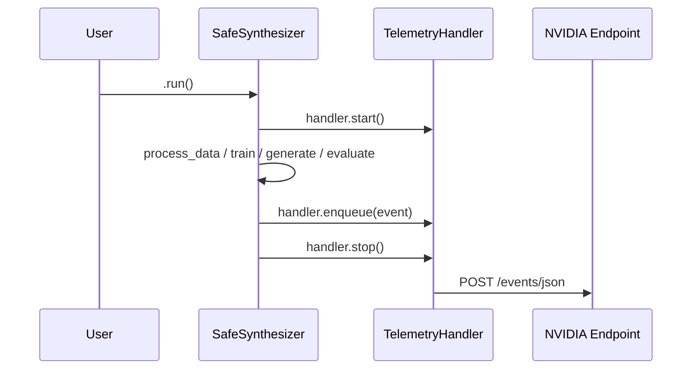
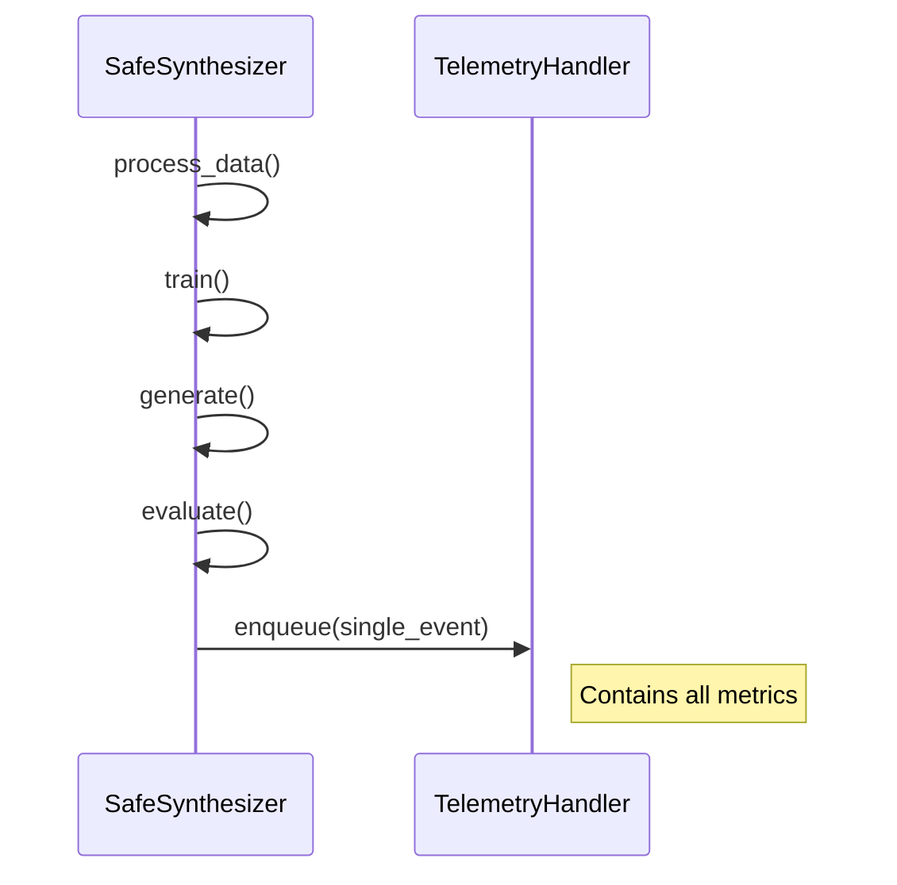
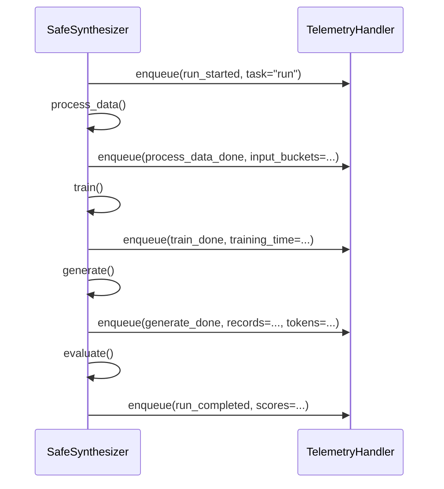
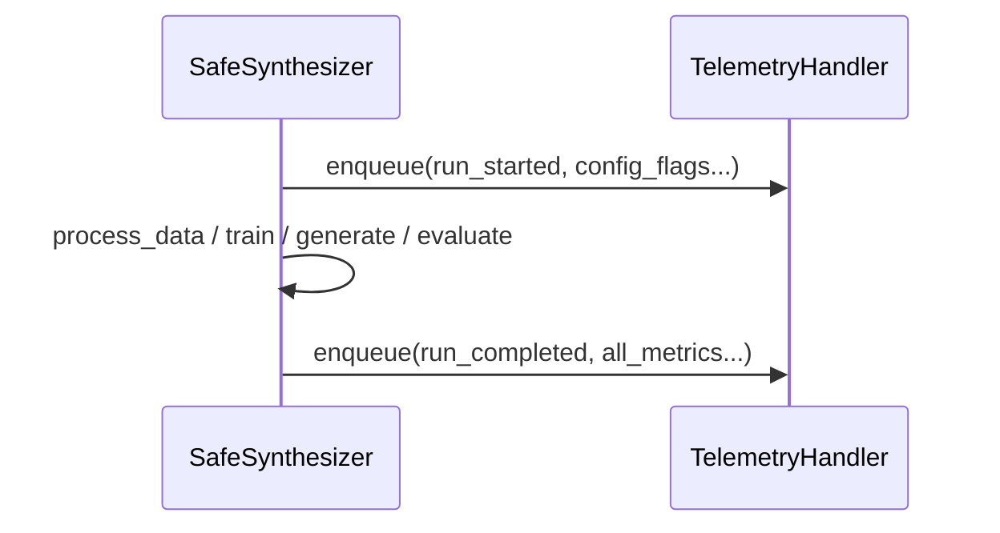
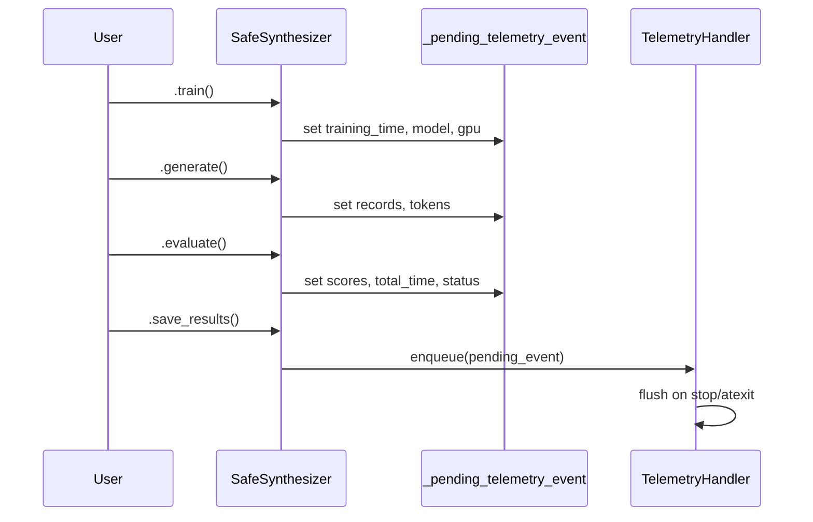
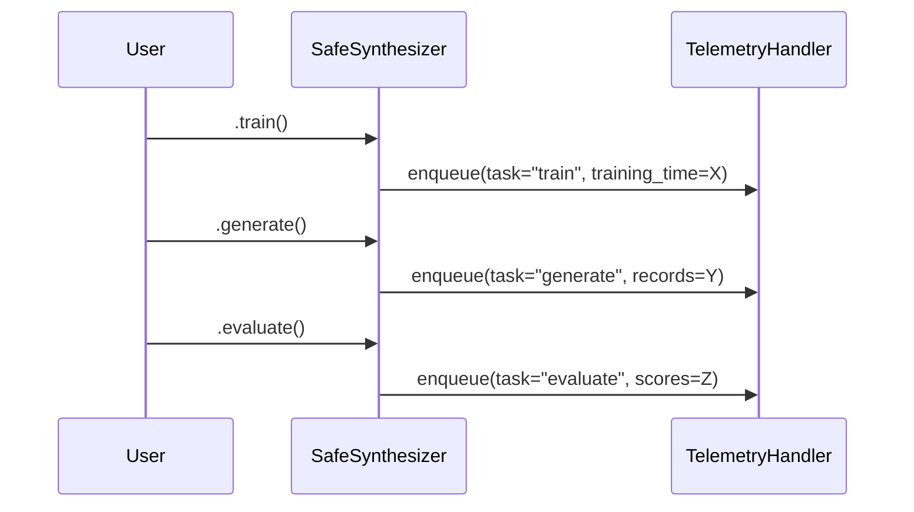
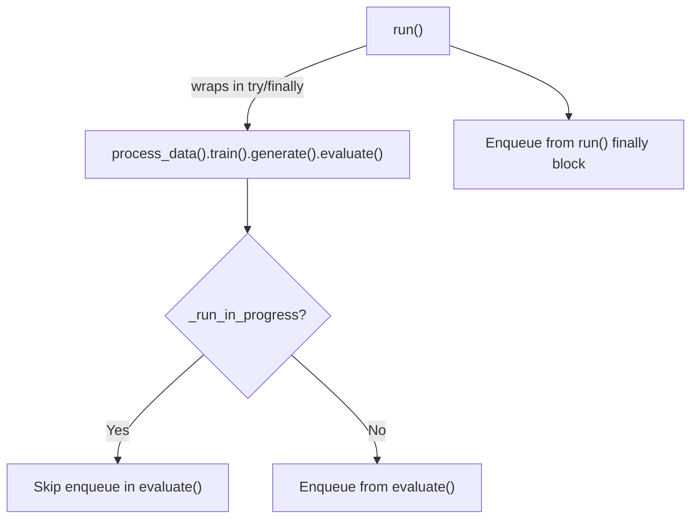

# Telemetry Integration Options for Safe Synthesizer

## Current State

[telemetry.py](src/nemo_safe_synthesizer/telemetry.py) is fully built but not wired into any production code. It defines:

- `TelemetryHandler` -- async batching, retry, DLQ, context-manager lifecycle (`start`/`stop`)
- `NSSTrainingAndGenerationEvent` -- Pydantic model with all the fields for the metrics listed below
- `DeploymentTypeEnum` -- derived from `NEMO_DEPLOYMENT_TYPE` env var
- `bucket_records()` / `bucket_columns()` -- bucketing helpers
- Gated by `NEMO_TELEMETRY_ENABLED` env var (default `true`)

The question is where to call `enqueue()` and how to manage the handler lifecycle.

---

## Integration Point Options

### Option A: Instrument `SafeSynthesizer` in `library_builder.py`

Wrap `run()` (and optionally individual stage methods) with telemetry.



- Covers both SDK and CLI usage (CLI constructs `SafeSynthesizer` internally)
- Single integration point; all data (timing, results, config, scores) is available after `evaluate()` inside `run()`
- `run()` currently has no `try/except/finally` -- would need one to capture error/canceled status
- Individual stage calls (`train()`, `generate()` alone) are NOT captured unless each is also instrumented
- The `TelemetryHandler` must be created and `start()`/`stop()`'d somewhere -- natural fit is as an instance attribute on `SafeSynthesizer`, started in `__init__` or lazily, stopped in a new `close()` or `__del__`

### Option B: Instrument the CLI layer in `cli/run.py`

Add telemetry around the Click commands that invoke `SafeSynthesizer`.

- Easy to add: the CLI already has `common_setup`, `traced_user`, timing, and a `finally` block
- Automatically captures error status via try/except in the Click command
- Misses SDK-only usage entirely (users calling `SafeSynthesizer()` from Python)
- Deployment type is unambiguously `cli` in this layer
- Data availability is the same as Option A (CLI calls the same `SafeSynthesizer` methods)
- Would also need to instrument `run train` and `run generate` subcommands separately

### Option C: Hybrid -- SDK core events + CLI enrichment

Emit the primary telemetry event from within `SafeSynthesizer` (Option A) for universal coverage, but allow the CLI layer to set deployment-type or other CLI-specific metadata before the run starts.

- Full coverage of SDK + CLI + NMP
- Deployment type already handled via `NEMO_DEPLOYMENT_TYPE` env var (set by CLI/NMP entry points)
- Avoids double-counting risk if carefully designed (one event per run, emitted from SDK)
- Slightly more complex coordination

### Option D: Decorator / lifecycle-hook approach

Create a telemetry decorator or callback system (similar to `@traced`) that wraps stage methods.

- Clean separation of concerns
- Could emit per-stage events (train, generate, evaluate) in addition to a run-level event
- More complex; cross-stage data aggregation (e.g., total time) is harder
- Overkill for the current single-event model

---

## Recommendation

Option A (instrument `SafeSynthesizer`) with elements of Option C is the most practical:

- Emit the event from `SafeSynthesizer.run()` and from individual stage methods (`train()`, `generate()`, `evaluate()`) so both `run()` and standalone stage usage are captured
- Use the existing `NEMO_DEPLOYMENT_TYPE` env var for deployment type (CLI sets it to `cli`, NMP sets it to `nmp`, SDK defaults to `sdk`)
- Manage `TelemetryHandler` as an instance attribute on `SafeSynthesizer`, or as a module-level singleton (following the `SETTINGS` / `_INITIALIZED_OBSERVABILITY` pattern in [observability.py](src/nemo_safe_synthesizer/observability.py))

---

## Metric Availability by Integration Point

All options have access to the same underlying data; the question is where/when it is most convenient to collect.

| Metric | Where data lives | Difficulty |
|--------|-----------------|------------|
| Runs created count | Increment on `run()` / stage entry | Trivial |
| Run final status | Requires `try/except/finally` in `run()` | Easy (needs new error handling in `run()`) |
| Time per job | `SafeSynthesizerTiming` built in `evaluate()` | Easy -- already computed |
| Num records generated | `GenerateJobResults.num_valid_records` | Easy -- available after `generate()` |
| Num tokens generated | Not currently aggregated | Hard -- see below |
| `replace_pii` on/off | `config.replace_pii is not None` | Trivial |
| Differential privacy on/off | `config.privacy is not None` | Trivial |
| `time_series` on/off | `config.time_series` fields | Trivial |
| `group_by` not none | `config.data.group_training_examples_by is not None` | Trivial |
| Bucketed input records/columns | Input `DataFrame` shape, available after `process_data()` | Easy -- need to stash `df.shape` |
| Top-level SQS | `report.get_score_by_name("Synthetic Quality Score")` | Easy -- available after `evaluate()` |
| Top-level DPS | `report.get_score_by_name("Data Privacy Score")` | Easy -- available after `evaluate()` |
| Model used | `config.training.pretrained_model` | Trivial |
| Deployment type | `NEMO_DEPLOYMENT_TYPE` env var, already in `telemetry.py` | Trivial |
| GPU used | `torch.cuda.get_device_properties(0).name` | Easy -- call during init or train |

### Token Count -- the Hard One

Token counts are logged per-output at DEBUG level in `VllmBackend._generate_batch()` but never summed. To report this metric:

- Add a cumulative `total_tokens_generated: int` field to `GenerateJobResults` (or `GenerationBatches`)
- Sum `len(out.token_ids)` per output inside `_generate_batch` and propagate through `Batch` -> `GenerationBatches` -> `GenerateJobResults`
- This touches `generation/vllm_backend.py`, `generation/batch.py`, and `generation/results.py`
- Non-vLLM backends (if any future ones) would need the same plumbing

This is the only metric that requires pipeline changes rather than just reading existing state.

---

## Handler Lifecycle Considerations

- `TelemetryHandler` uses an async timer loop for periodic flushing. In the synchronous `SafeSynthesizer` flow, `start()` / `stop()` use `_run_sync()` which handles the sync-to-async bridge.
- `stop()` triggers a final flush, so events queued during a run are sent even if the flush interval hasn't elapsed.
- Context manager (`with handler:`) is the cleanest lifecycle, but `SafeSynthesizer` itself is not a context manager today. Options:
  - Make `SafeSynthesizer` a context manager (breaking change if users don't use `with`)
  - Start the handler lazily on first `enqueue`, stop it in a `close()` method called at the end of `run()` / each stage
  - Use `atexit` registration as a safety net for handler shutdown
- For the singleton approach: a module-level `_telemetry_handler` initialized once, with `atexit.register(handler.stop)` to flush on process exit. Simpler, but harder to associate a unique `session_id` per run.

## Event Emission Strategy: Single vs Multiple Enqueues per Run

### Strategy 1: Single enqueue at the end of the run

Collect all metrics into one `NSSTrainingAndGenerationEvent` and call `enqueue()` once, after the pipeline completes (or fails).



Pros:
- Simplest implementation -- one call site inside a `try/finally` at the end of `run()` (and one at the end of each standalone stage method)
- All metrics (timing, record counts, scores, feature flags) are available at this point; no partial state
- Exactly one event per run -- no double-counting, no correlation needed
- Matches the existing `NSSTrainingAndGenerationEvent` schema, which is a single flat model

Cons:
- If the process crashes hard (SIGKILL, OOM-killer, GPU fault), the enqueue never fires and the run is invisible to telemetry
- For long runs (hours of training + generation), there is no intermediate signal. NVIDIA sees nothing until the run ends.
- "Runs created count" is only knowable after the fact, not at creation time -- you cannot distinguish "run started but still going" from "run never happened"
- Standalone stage calls (`train()` alone, `generate()` alone) each need their own enqueue with partially-filled fields (e.g., no SQS/DPS after a train-only run)

### Strategy 2: Multiple enqueues at stage boundaries

Emit one event per stage transition, progressively enriching the data.



Pros:
- A "run started" event fires immediately, so you can count runs-in-progress and detect abandoned/crashed runs (started but never completed)
- Intermediate events give visibility into long-running pipelines before they finish
- Finer granularity -- can analyze which stage fails most, stage-level timing, etc.
- If the process crashes mid-run, you still have events for completed stages

Cons:
- More complex implementation: 4-5 enqueue call sites instead of 1
- Requires either (a) multiple event types/schemas, or (b) re-using `NSSTrainingAndGenerationEvent` with many fields set to defaults/sentinel values, which makes the data harder to interpret
- Correlation: all events from one run need the same `session_id` so the backend can group them. The handler already supports this via its constructor, but each `SafeSynthesizer` instance must use a consistent ID.
- Higher event volume -- multiplied by the number of stages. The handler's batching and flush interval (120s default, max 50 events) is designed for this, but the backend must handle the volume.
- Some metrics are only meaningful at the end (SQS/DPS, final status); intermediate events carry partial data that must be handled carefully in analytics
- Risk of double-counting if downstream dashboards don't filter by event type/stage

### Strategy 3: Hybrid -- "bookend" events (start + end)

Emit exactly two events: one at run start and one at run end. This is a middle ground.



Pros:
- Detects crashed/abandoned runs (started without a matching completed)
- The start event captures config flags and input characteristics (available after config resolution) without waiting for the full run
- Only 2 events per run -- manageable volume, easy correlation via `session_id`
- End event carries the full payload with scores, timing, record counts

Cons:
- Slightly more complex than Strategy 1 (two call sites instead of one)
- The start event must be emitted after `_resolve_nss_config()` / `process_data()` to have config flags, or it carries very little information
- Still blind to which stage crashed (only that the run started but never completed)

### Comparison Summary

| Concern | Single (end) | Multiple (per-stage) | Bookend (start+end) |
|---------|:------------:|:--------------------:|:-------------------:|
| Implementation complexity | Low | High | Medium |
| Crash visibility | None | Good | Partial |
| Long-run visibility | None | Good | Partial |
| Run-created counting | After-the-fact | Real-time | Real-time |
| Event volume | 1x | 4-5x | 2x |
| Schema complexity | One event type | Multiple types or partial fills | One type, two tasks |
| Double-count risk | None | Medium | Low |
| Data completeness per event | Full | Partial per stage | Start=config, End=full |
| Standalone stages (train-only) | Needs per-stage fallback | Natural fit | Needs per-stage fallback |

### Recommendation

Start with Strategy 1 (single enqueue at end) for the initial implementation. It is the simplest, matches the existing schema exactly, and gives full metric coverage per event. Add the "start" bookend (Strategy 3) as a fast follow if crash/abandon detection becomes a priority -- the incremental cost is small (one additional enqueue call + a `task="run_started"` variant).

Strategy 2 (per-stage events) is the most powerful but introduces schema/analytics complexity that is hard to justify until the telemetry backend has clear requirements for stage-level breakdown.

---

## The Stepwise Problem: Where Does `enqueue()` Actually Live?

`SafeSynthesizer` supports three calling patterns, and any emission strategy must cover all of them:

1. `run()` -- full pipeline: `process_data().train().generate().evaluate().save_results()`
2. CLI subcommands -- `run train` calls `process_data().train()`; `run generate` calls `load_from_save_path().process_data().generate().evaluate().save_results()`
3. SDK stepwise -- users call individual stage methods from Python:

```python
nss = SafeSynthesizer(...)
nss.train()
nss.generate()
nss.evaluate()
```

The core difficulty: when `train()` executes, it cannot know whether `generate()` will follow. Placing `enqueue()` inside each stage method risks emitting 3 events for one logical run. Placing it only in `run()` misses patterns 2 and 3.

### Mechanism 1: Deferred commit -- mutate a pending event, enqueue at a commit point

Each stage method mutates a single `self._pending_telemetry_event` on the `SafeSynthesizer` instance, progressively adding metrics as they become available. The actual `handler.enqueue()` call only fires at a defined "commit point."



Commit points (in priority order):
- `run()` -- after the pipeline completes or fails (try/finally)
- `save_results()` -- the conventional "I'm done" call for stepwise users
- `atexit` hook / `__del__` -- safety net for users who never call `save_results()`

Pros:
- Exactly one event per logical run, regardless of calling pattern
- No double-counting; no server-side dedup needed
- Each stage adds its own metrics naturally; the event grows richer as stages complete
- Matches Strategy 1's "single event with full data" goal

Cons:
- `save_results()` is not always called by stepwise SDK users; reliance on `atexit`/`__del__` for the fallback path is fragile (garbage collection timing, interpreter shutdown ordering)
- Train-only users (`nss.train()` and nothing else) depend entirely on the fallback path unless they explicitly call `close()`
- Adds mutable state (`_pending_telemetry_event`) to `SafeSynthesizer` that persists across stage calls
- Need to handle the error case: if `train()` succeeds but `generate()` throws, the pending event must still be committed with `status="error"` -- requires wrapping each stage or adding a top-level error handler

### Mechanism 2: Enqueue from every stage, deduplicate server-side

Each stage unconditionally enqueues its own event with whatever data is available. All events from one `SafeSynthesizer` instance share the same `session_id`.



Server-side: group by `session_id`, take the last event (or the one with `task="evaluate"`) as the canonical run record. Earlier events are supplementary.

Pros:
- Simplest client-side logic -- each stage is self-contained with no cross-stage coordination
- If the process crashes after `train()`, the train event is already enqueued
- For train-only usage, the event fires immediately with no reliance on `atexit`
- Natural fit for Strategy 2 (per-stage events) if the backend wants granularity later

Cons:
- This is effectively Strategy 2, not Strategy 1 -- multiple events per run
- 3x event volume for a full stepwise run (1x for `run()` since it could skip intermediate enqueues)
- Requires server-side deduplication logic in dashboards/analytics
- Some events have mostly sentinel/default values (e.g., train event has no SQS/DPS)
- Risk of double-counting if analytics layer doesn't filter properly

### Mechanism 3: Enqueue only from `run()` + `evaluate()`, accept coverage gaps

Recognize that the realistic high-volume call patterns are:
- `run()` for full pipeline (most SDK users)
- `process_data().train().generate().evaluate()` for stepwise (covered by `evaluate()`)
- CLI `run` / `run generate` (both call `evaluate()` internally)

Enqueue only in `run()` (try/finally) and `evaluate()`. For `run()`, skip the `evaluate()` enqueue to avoid double-counting (e.g., set a `self._run_in_progress` flag).



Coverage gap: `train()`-only SDK usage is not captured. CLI `run train` would need a separate enqueue in `cli/run.py`.

Pros:
- Only 2 call sites in SDK code (`run()` and `evaluate()`) plus 1 in CLI (`run train`)
- Simple flag-based dedup (`_run_in_progress`)
- No `atexit` / `__del__` fragility
- Covers the vast majority of real-world usage

Cons:
- SDK train-only usage is invisible unless the user is going through the CLI
- The `_run_in_progress` flag adds coupling between `run()` and `evaluate()`
- CLI layer must independently handle the `run train` subcommand, leaking telemetry concerns into the CLI

### Mechanism Comparison

| Concern | Deferred commit | Per-stage dedup server-side | run() + evaluate() only |
|---------|:--------------:|:---------------------------:|:----------------------:|
| Client complexity | Medium | Low | Low |
| Server/analytics complexity | None | Medium | None |
| Events per full run | 1 | 3+ | 1 |
| Train-only SDK coverage | Via atexit (fragile) | Yes | No (gap) |
| Train-only CLI coverage | Via atexit (fragile) | Yes | Yes (CLI enqueue) |
| Double-count risk | None | Medium | None (flag-based) |
| Crash resilience | Low (pending event lost) | Good (earlier stages saved) | Low (same as Strategy 1) |
| Mutable state on SafeSynthesizer | Yes (`_pending_event`) | No | Minimal (`_run_in_progress` flag) |

---

## Other Considerations

- Privacy: all metrics are either boolean flags, bucketed ranges, or model/GPU names -- no PII or raw data. The bucketing helpers already exist.
- Error resilience: `enqueue()` silently ignores non-`TelemetryEvent` objects; `_send_events` catches all exceptions. Telemetry should never crash a user's run.
- Testing: the handler is already well-tested in `tests/telemetry/test_telemetry.py`. Integration tests would need to mock `httpx` or the endpoint.
- `session_id`: use `uuid4()` generated per `SafeSynthesizer` instance (or per `run()` call) so events from the same run can be correlated.
- Version: `source_client_version` should come from `package_info.__version__`.
